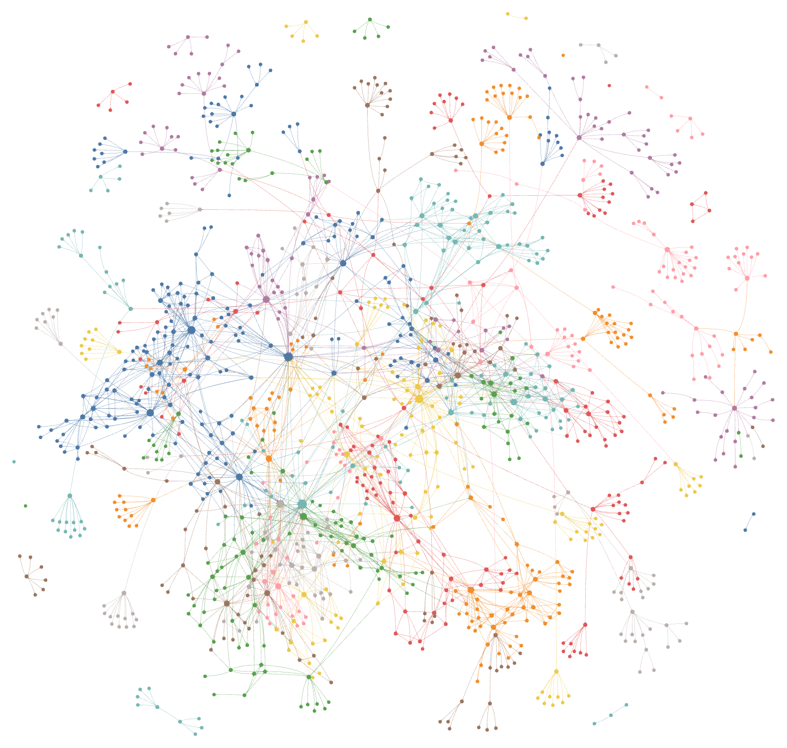
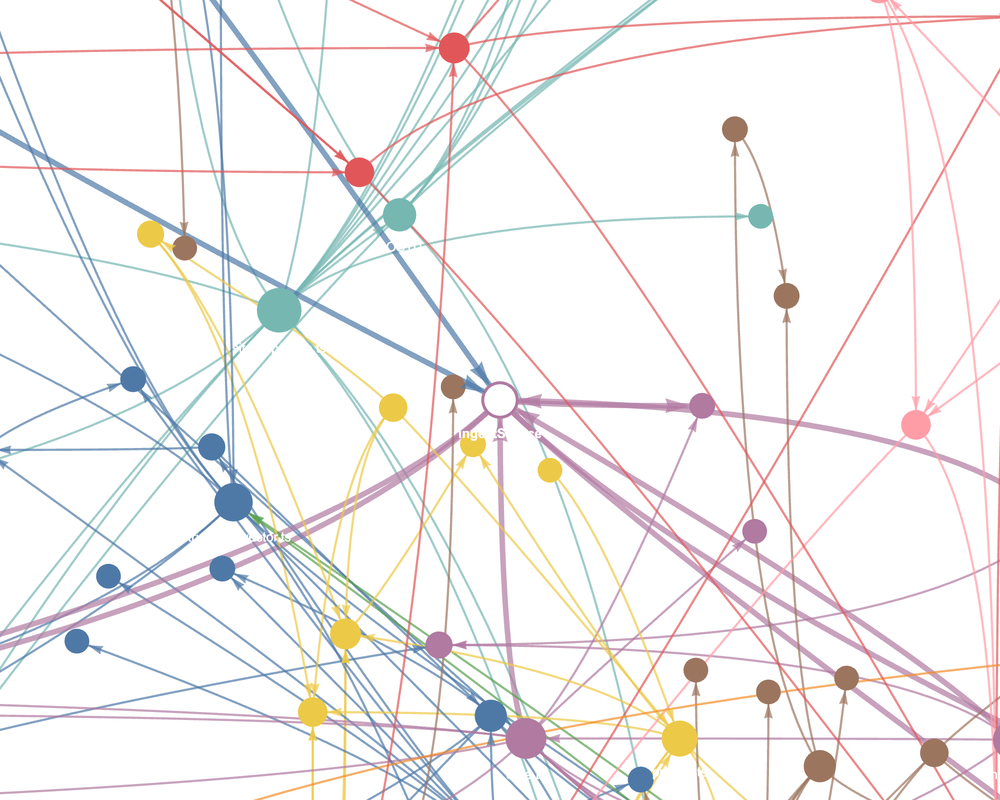

# Cadre AI Support Chatbot

A customer-support chatbot for **Cadre AI** (an applied-AI consultancy), grown from a small, explainable **RAG** core into a client-ready product: an embeddable widget, per-client conversation history, token/cost tracking, and a sitemap-to-embeddings ingestion pipeline — all behind a read-only admin dashboard.

The chatbot answers **only** from a knowledge base (bundled docs, or a live pgvector store fed by uploads/crawls), **refuses to invent** facts it cannot ground (pricing, services, certifications), and **escalates** — book a strategy call, hand off to a human, capture a lead — whenever retrieval is weak or the request is out of scope.

**Live:** <https://cadre-ai-chatbot-gules.vercel.app> · **System map (interactive graph):** [cadre-ai-chatbot-gules.vercel.app/architecture.html](https://cadre-ai-chatbot-gules.vercel.app/architecture.html) (or open [`public/architecture.html`](public/architecture.html) locally)

> Deep-dive docs: [ARCHITECTURE.md](ARCHITECTURE.md) (design of record) · [SPEC.md](SPEC.md) (frozen contracts) · [DECISIONS.md](DECISIONS.md) (build log, DEC-1 → DEC-8) · [TRADEOFFS.md](TRADEOFFS.md) (right-sizing) · [plan.md](plan.md) / [IMPLEMENTATION_PLAN.md](IMPLEMENTATION_PLAN.md) (original contract) · [docs/product/](docs/product/) (architecture + implementation plans for every pillar below).

## System map

**[→ Open the interactive dependency graph](public/architecture.html)** (or the live copy at `/architecture.html` on the deploy above) — every real symbol in the codebase as a node, every real import/call/reference as an edge, clustered into labeled communities (Budget Management, Widget Host Configuration, Data Ingestion and Retrieval, Chat API Operations, …) you can pan, zoom, search, and click through. Companion prose summary: **[docs/GRAPH_REPORT.md](docs/GRAPH_REPORT.md)** (hub list + community breakdown).

Generated with **[Graphify](https://github.com/safishamsi/graphify)** (`uv tool install graphifyy[openai]`) — local, deterministic tree-sitter AST parsing over all 185 source files (1,339 nodes, 2,378 edges, 98% extracted / 2% inferred), with an LLM pass only to *name* the resulting communities (`graphify label .`, ~$0.001 in tokens against the project's own OpenAI key). It's a **living** artifact, not a one-off export: re-run `graphify update .` after code changes and `graphify label .` to refresh the labels, then copy `graphify-out/graph.html` → `public/architecture.html` and `graphify-out/GRAPH_REPORT.md` → `docs/GRAPH_REPORT.md`. The raw `graphify-out/` working directory (cache, full `graph.json`) is gitignored and regenerable; only the two rendered artifacts are committed.

<table>
<tr><td width="55%">

**Full graph** — 1,339 nodes across 85 labeled communities (color = community), the entire dependency structure of the app in one view.

</td><td>

**Zoomed on a hub node** — `ingestSource()` (the shared chunk→embed→upsert core), showing its real weighted in/out edges: every ingestion front-end (files, sitemap) converges on this one function.

</td></tr>
<tr><td>

[](public/architecture.html)

</td><td>

[](public/architecture.html)

</td></tr>
</table>

---

## The headline design choice, preserved through every pillar

**The core still runs fully with zero API keys and zero infra.** A deterministic lexical embedder backs retrieval and the route returns grounded/escalation text straight from the bundled KB — demoable and gradeable offline. Every pillar built on top (pgvector, the admin dashboard, the widget, usage tracking, the sitemap crawler) is **flag-gated and additive**: absent its env vars, the app behaves exactly as the offline core does. Nothing above the core is required to run it.

---

## What's built

| Pillar | What it does | Status |
|---|---|---|
| **RAG core** | Chunk → embed → cosine top-k retrieval, deterministic guardrail (`decide()`), streamed LLM answer or offline grounded stub, 3 escalation paths. | ✅ offline + online |
| **pgvector retrieval** | Supabase Postgres + pgvector as a second retrieval backend behind `RETRIEVAL_BACKEND`, real-embeddings-only, same `Retrieved[]` contract as the bundled artifact. | ✅ live in prod |
| **Admin dashboard** | Signed-cookie gated `/admin`: conversation review + full retrieval-trace panel, bad-answer flagging + review queue, KB-gap view, per-client/per-session scoping. | ✅ |
| **Embeddable widget** | Vanilla-TS, Shadow-DOM `widget.js` (~21 KB) — floating launcher or inline mode, streams the same wire protocol as the first-party UI, per-client tenant id + session id. `/admin/embed` generates the copy-paste snippet (script or iframe) with a live themed preview. | ✅ |
| **Usage & cost tracking** | Prompt/completion/embedding tokens logged per turn, rolled up per client/day/month, cost computed from confirmed OpenAI per-token pricing (or the provider-reported cost when on OpenRouter), a real balance check where the provider exposes one, configurable spend ceilings with pre-request soft-block. `/admin/usage`. | ✅ verified against the live API |
| **Sitemap → embeddings** | Paste a sitemap URL; the crawler respects `robots.txt` + `noindex`, extracts readable text (`@mozilla/readability`), dedupes/re-embeds only changed pages (content-hash), and lands chunks in the **same** `kb_chunks` store as everything else — reusing the one chunk/embed/upsert core, not a second pipeline. Per-URL status in `/admin/sitemap`. | ✅ verified against a live site |
| **Maker-configurable starters** | Suggested-question chips resolvable per client (snippet override → DB → built-in defaults), editable at `/admin/questions`. | ✅ |

Each pillar has a full architecture + implementation-plan doc in [`docs/product/`](docs/product/) and was verified against real infrastructure (a live Supabase project, the live OpenAI API, a live crawl target) before being called done — see [DECISIONS.md](DECISIONS.md) for the build log.

---

## Quickstart

Package manager is **pnpm**. Node **>= 20**.

```bash
pnpm install

# Generate the RAG artifact once (data/embeddings.json).
# Required before `pnpm dev`, because lib/kb.ts statically imports it.
pnpm embed

pnpm dev          # → http://localhost:3000
```

That's the whole setup for the core. **No keys required** — with nothing configured the app runs fully offline: the lexical embedder powers retrieval and the chat route returns a grounded stub (the top retrieved chunk, quoted and cited) or a deterministic refusal/escalation. Click a starter chip or type a question.

Everything else (pgvector, `/admin`, the widget, usage tracking, the sitemap crawler) is optional and additive — see [`.env.example`](.env.example) for the full, commented list of env vars and what each one unlocks. Nothing above the core needs to be configured to run or grade the chatbot itself.

### The two-minute upgrade path

```bash
cp .env.example .env.local
```

| To get… | Set… |
|---|---|
| Real embeddings + streamed LLM answers | `EMBEDDINGS_API_KEY`, `AI_CHAT_API_KEY` (+ `AI_MODEL`, base URLs for non-OpenAI providers) |
| The pgvector retrieval backend | the above, **plus** `DATABASE_URL` (Supabase) → apply [`db/schema.sql`](db/schema.sql) → `pnpm ingest` → `RETRIEVAL_BACKEND=pgvector` |
| The admin dashboard (`/admin`) | `ADMIN_PASSWORD` (+ optional `ADMIN_SESSION_SECRET`) |
| The embeddable widget | nothing extra to build it — `pnpm build:widget` (chained into `prebuild`) emits `public/widget.js`; `ALLOWED_ORIGINS`/`CLIENT_REGISTRY` to lock down which sites can embed it |
| Usage & cost tracking + budgets | works automatically once `DATABASE_URL` + a chat/embeddings key are set; `USAGE_MONTHLY_CEILING_USD`/`USAGE_SOFT_BLOCK` to enforce a ceiling |
| The sitemap crawler | `DATABASE_URL` + real embeddings, then paste a sitemap URL into `/admin/sitemap`; `CRAWL_WORKER_SECRET` only if you wire the (optional) Vercel Cron — a session-gated "Process now" button works with no secret |

> **Invariant:** the KB and the live query must be embedded by the **same** model at the same dimensions, or cosine scores are meaningless. Both the bundled artifact (`retrieveText`) and pgvector (`retrieveTextWithUsage`) enforce this by construction — see [DECISIONS.md](DECISIONS.md).

---

## Offline vs online modes (the core)

The mode is chosen per-key at runtime; there is no separate "demo build."

| `EMBEDDINGS_API_KEY` | `AI_CHAT_API_KEY` | Retrieval embedder | Answer path |
|---|---|---|---|
| — | — | `lexical-hash-512` (deterministic, no network) | grounded stub / deterministic refusal + escalation |
| set | — | `text-embedding-3-small` (dim 512) | grounded stub (still no generative model) |
| — | set | `lexical-hash-512` | **streamed LLM answer**, grounded in retrieved context |
| set | set | `text-embedding-3-small` | **streamed LLM answer**, grounded in retrieved context |

Setting `RETRIEVAL_BACKEND=pgvector` on top of real embeddings swaps the in-memory bundled scan for a live Supabase query with the identical `Retrieved[]` contract — nothing downstream (guardrail, prompt, streaming) changes.

**Why this exists.** Retrieval, thresholds, guardrails, escalation, and the eval harness all exercise the same pipeline regardless of keys or backend. Cosine scores stay comparable because *the same embedder runs at build/ingest time and query time* on either backend. The lexical embedder is signed feature-hashing over word tokens (FNV-1a → 512-dim, L2-normalized): cosine similarity approximates shared-token overlap, enough to rank a few-dozen-chunk KB. It is **lexical, not semantic** — that trade-off, and the lower calibrated threshold it needs, are covered in [TRADEOFFS.md](TRADEOFFS.md).

The guardrails never depend on the LLM. Pricing questions, explicit human requests, weak retrieval, and **unsupported claims** are decided by a **deterministic function** (`lib/guardrail.ts` → `decide()`) before any model is called, so refusals and escalations behave identically in every mode and on either retrieval backend. The unsupported check is a **grounding-coverage guard**: even when a query clears the retrieval threshold, if its distinctive terms are not actually present in the retrieved chunk text, the bot refuses rather than confirm — see DEC-7 in [DECISIONS.md](DECISIONS.md).

---

## Architecture at a glance

```
Public visitor / widget embed
        │
        ▼
  POST /api/chat ──▶ resolveClient (tenant) ──▶ checkBudget (usage ceiling)
        │                                            │
        ▼                                            ▼ over ⇒ escalate, zero spend
  retrieveText[WithUsage](query)
   ├─ bundle backend: in-memory cosine over data/embeddings.json
   └─ pgvector backend: Supabase query, same Retrieved[] contract
        │
        ▼
  guardrail decide() ── refuse / escalate → deterministic text
                     │  (pricing · human · weak retrieval · unsupported)
                     └─ answer → streamText (LLM) or grounded stub
        │
        ▼
  plain-text stream (+ x-cadre-* metadata headers)
        │
        └─ after(): logTurn() + recordUsage()  →  Supabase (best-effort, never blocks the reply)

Admin (signed-cookie gated) ──▶ /admin/{conversations,queue,gaps,usage,embed,sitemap,questions}
                                  (read-mostly; server-verified auth on every route, not middleware-only)

Sitemap crawl:  discover (202) → drained queue (sitemap_pages) → robots/noindex gate
                → readability extract → content-hash dedup → ingestSource()
                                                                    │
File/content ingest (pnpm ingest) ─────────────────────────────────┘
                (ONE shared chunk → embed → upsert core; both write the SAME kb_chunks)
```

| Module | Job |
|---|---|
| `content/*.md` | Human-authored knowledge base (frontmatter `title`/`tags`). |
| `scripts/embed.ts` | Build-time ingest into the bundled artifact (`data/embeddings.json`). |
| `scripts/ingest.ts` | Seeds the same content into pgvector via the shared ingest core. |
| `lib/chunk.ts` | Markdown chunker (by heading, ~300–500 tokens, ~15% overlap, never splits tables/code) — the ONE chunker every ingestion path (files, sitemap pages) uses. |
| `lib/ingest/core.ts` | `ingestSource()` — the ONE chunk → embed → atomic upsert path shared by `pnpm ingest` and the sitemap crawler. |
| `lib/ingest/{sitemap,robots,extract,fetch-page,crawl-worker,ssrf}.ts` | The sitemap crawl front-end: discovery, robots/noindex gating, readability extraction, SSRF-hardened fetch, the drained-queue worker. |
| `lib/retrieval.ts` / `lib/retrieval-pgvector.ts` | Pure cosine top-k, in-memory or over Supabase — same output contract. |
| `lib/kb.ts` | Binds the bundled artifact + backend selection to the retrieval core. |
| `lib/llm.ts` | The one provider seam: offline lexical embedder, real embeddings, chat model factory, usage-capturing variants. |
| `lib/guardrail.ts` | Deterministic `decide()` — pricing → refuse, human → escalate, weak → escalate, unsupported → refuse, else answer. |
| `lib/clients.ts` | Resolves an untrusted widget `client` id fail-closed against a server registry — never trusted from the request body alone. |
| `lib/admin/*` | Auth (`requireAdmin`, server-verified per route, not middleware-only), repositories, Server Actions for every admin mutation. |
| `lib/usage/*` | Token capture, nano-USD cost math (confirmed provider pricing), budgets, balance, reporting. |
| `lib/starters.ts` | One shared source of truth for suggested-question chips, consumed by the first-party page and the widget. |
| `app/api/chat/route.ts` | The orchestrator + custom plain-text streaming endpoint (tenant resolution, budget gate, retrieval, guardrail, streaming, best-effort logging). |
| `app/api/{health,widget-config,admin/*}/route.ts` | Health probe, public per-client widget config, admin mutations/crawl endpoints. |
| `app/page.tsx` | First-party chat UI: streaming transcript, starter chips, escalation CTA. |
| `app/admin/(protected)/*` | The dashboard: conversations, review queue, KB gaps, usage & cost, embed panel, sitemap. |
| `widget/src/*` | The embeddable widget (vanilla TS, esbuild → `public/widget.js`, Shadow DOM, launcher or inline mode). |

See [ARCHITECTURE.md](ARCHITECTURE.md) for the original C4 view and failure modes, and [`docs/product/`](docs/product/) for the architecture + implementation plan of every pillar layered on top.

---

## Evals and tests

The core is built **eval-first**: "correct" is defined before features. The golden set (`evals/golden.json`) is 9 cases — 6 core support scenarios (`grounded`) plus 3 adversarial cases (`adv-pricing` → refuse, `adv-offtopic` → escalate, `adv-hallucination` → refuse) — asserted against `expect`, `mustCite`, and `mustNotSay` (typed as `GoldenCase` in `lib/types.ts`; full table in [SPEC.md](SPEC.md)).

```bash
pnpm eval         # golden set through the real decision pipeline → 9/9 PASS
pnpm test         # Vitest over the pure cores + every pillar → 280/280 pass
pnpm typecheck    # tsc --noEmit → clean
pnpm build        # prebuild (embed + widget) → next build
```

The eval runner (`evals/run.ts`) reproduces the real request path — embed the question, retrieve top-k, run the same deterministic `decide()` the route uses, materialize the exact user-facing text — without spending a token. Tests cover the pure cores (retrieval, chunking, guardrail, the lexical embedder) plus every pillar's repositories, cost math, crawl gating (robots/noindex/dedup/SSRF), and Server Action boundaries.

---

## Verification

The build is green end to end and every pillar was checked against real infrastructure, not mocks:

| Check | Result |
|---|---|
| `pnpm typecheck` | clean |
| `pnpm test` | **280/280 pass** |
| `pnpm eval` | **9/9 PASS** |
| `next build` | succeeds |
| Bundled RAG artifact | `data/embeddings.json`: 8 docs → **36 chunks**, dim 512 |
| pgvector (live Supabase) | same 36 chunks seeded; retrieval parity confirmed against the bundled backend |
| Usage & cost | a real OpenAI chat call (1291 in / 90 out tokens) priced to the exact confirmed per-token rate; over-budget request blocked before any model/embedding spend |
| Sitemap crawler | run against a live site: pages discovered → embedded into the same `kb_chunks`; a re-crawl of unchanged pages produced zero re-embeddings (content-hash dedup confirmed) |
| Live smoke test | grounded answer streams with its source header; a pricing question refuses with no dollar figure; an off-topic question escalates |

---

## Deploy to Vercel

1. Import the repo. Framework preset: **Next.js**. Build command: `pnpm build`.
2. `pnpm build` runs `prebuild` first (`scripts/embed.ts` then `build:widget`), regenerating `data/embeddings.json` and `public/widget.js`, then `next build`. Both artifacts are bundled read-only into the deployment.
3. **With no env vars set, the deploy still works** in fully offline mode. Layer in capability by adding env vars as needed — see [`.env.example`](.env.example) for the complete, commented list (chat/embeddings keys, `DATABASE_URL` for pgvector + the dashboard, `ADMIN_PASSWORD`, widget/tenancy controls, usage ceilings, crawl secrets).
4. `/api/chat` and every dashboard/API route pin the Node runtime.
5. Vercel Hobby's cron limit (1/day) is below what continuous sitemap crawling wants — the shipped fallback is a session-gated "Process now" button in `/admin/sitemap` that needs no secret and works identically locally and in prod (see DEC-8 in [DECISIONS.md](DECISIONS.md)). Upgrading to Pro re-enables the higher-frequency cron in `vercel.json`.

---

## Why this stack — and what was rejected (and later revisited)

**Chosen:** Next.js (App Router) + Vercel AI SDK v7 on Vercel; `@ai-sdk/openai` as an OpenAI-compatible client; `postgres` (the lightweight serverless-friendly client) for Supabase; `zod` for boundary validation everywhere untrusted input crosses into the system (chat body, Server Actions, the crawl SSRF gate); `@mozilla/readability` + `linkedom` for pure-JS HTML extraction (no headless browser); `gray-matter` for frontmatter; `tsx`/`vitest` for scripts and tests; `esbuild` for the framework-free widget bundle; `@phosphor-icons/react` for the admin UI.

**RAG without a vector DB — the original call, since revisited on purpose.** At ~8–10 docs an in-memory brute-force cosine scan is sub-millisecond and exact. That's still the **default** (`RETRIEVAL_BACKEND=bundle`) and needs zero infrastructure. Once the product grew a dashboard that needed durable, queryable state anyway (conversation logs, usage events, crawl jobs), **Supabase Postgres + pgvector** stopped being over-engineering for retrieval specifically and became the natural extension of infrastructure the dashboard already required — one database serves both, not two services. It is flag-gated and opt-in; the bundled path remains the zero-infra default.

| Rejected | Why not (and what changed) |
|---|---|
| **A dedicated vector DB** (Pinecone, etc.) | Still rejected — external SaaS + cost + network latency for a corpus that fits in memory or in one Postgres table with pgvector. |
| **Local vector DBs** (Chroma, LanceDB, FAISS-on-disk) | Still rejected — serverless has an ephemeral filesystem; nothing to durably host. |
| **Upstash Redis for logging/usage** | Superseded by Supabase once pgvector was adopted — one datastore for retrieval, conversation logs, usage events, and crawl state, instead of two justified external services. |
| **Cross-session end-user identity / full auth+RBAC** | Still out of scope. The admin dashboard uses a single signed-cookie password gate (server-verified per route, not middleware-only) — right-sized for one internal reviewer, not a multi-seat portal. Documented upgrade path in `docs/product/shared-infra-and-tenancy.md`. |
| **AI-Maturity-Index scoring engine** | Still out of scope — the KB *describes* the framework; computing scores is a separate product. |
| **A headless browser for the sitemap crawler** | Rejected as the default — 50–100 MB cold-start cost for content that's almost always server-rendered. `readability` + `linkedom` handles it in pure JS; a headless-render escalation path is documented, not built, for JS-only SPAs. |

The provider is kept swappable behind `lib/llm.ts`, mirroring Cadre's own model-agnostic stance.

---

## Scale thresholds — when I would change the design further

| Signal | Rough threshold | What I would add |
|---|---|---|
| KB size (bundle backend) | Beyond ~200–500 chunks, or the artifact exceeds a few MB | Already have the answer: flip `RETRIEVAL_BACKEND=pgvector` — it's built, tested, and live. |
| Query volume | Sustained concurrency where cost/latency shows up | The usage dashboard already tracks this per client/day; add the distributed-rate-limit upgrade noted in `docs/product/widget.md` if a single-instance limiter isn't enough. |
| Multi-tenant / auth | More than one internal reviewer, or per-client admin logins | `docs/product/shared-infra-and-tenancy.md` documents the RLS-policy + per-tenant-auth upgrade path; today's single-password gate + application-level `client_id` scoping is the right size for one operator. |
| KB freshness at scale | Sitemap crawling many large sites regularly | Move off the manual "Process now" button to Vercel Pro cron (already wired, just gated by the Hobby cron limit) or Upstash QStash, per `docs/product/admin-embed-and-sitemap.md`. |
| Answer quality at scale | Retrieval precision drops as the corpus grows | Add reranking, hybrid keyword+vector search, and metadata filtering on the `tags` already stored in both retrieval backends. |

---

## What's genuinely still open

- The widget bundle doesn't yet fetch a client's DB-configured starter questions at runtime (`/api/widget-config`) — only the admin preview reflects them live; production embeds show the built-in defaults until that wiring lands. Tracked, not silently claimed done.
- Distributed rate limiting (today's limiter is best-effort, per-instance).
- Per-tenant admin logins (today: one shared password for the single internal admin).
- Real end-user portal/auth, live booking/Calendly API, fine-tuning — all explicitly out of scope per the original plan.

See [DECISIONS.md](DECISIONS.md) for the full build log, including what was verified against real infrastructure (Supabase, the live OpenAI API, a live crawl target) versus assumed.
