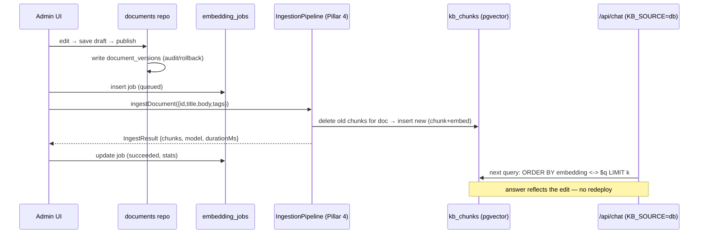

# Admin Dashboard

Product plan for an internal admin dashboard over the Cadre AI support chatbot. Two halves, as required: a full **Architecture** description, then a full **Implementation Plan**. It is written against the code as built today (`app/api/chat/route.ts`, `lib/kb.ts`, `lib/guardrail.ts`, `lib/retrieval.ts`, `lib/llm.ts`), and it stays inside the project ethos: **right-sized, one deploy, add infrastructure only where a capability genuinely requires it.**

The dashboard delivers five capabilities:

1. **Conversation review** — list and drill into conversations and messages (requires persistence; nothing is stored today).
2. **Source-citation visibility** — per answer, show which chunks were retrieved and their cosine scores, so a reviewer sees *why* the bot answered.
3. **Bad-answer flagging** — a reviewer marks an answer bad with a category and note; it feeds a review queue and, later, an eval / KB-gap loop.
4. **Doc management without a redeploy** — edit the knowledge base at runtime, trigger re-embedding, and publish, instead of rebuilding the bundled artifact.
5. **Admin auth** — protect the dashboard with roles (reviewer vs admin).

Two of these (2 and 4) force real architectural change: persistence, and moving the KB from a build-time artifact to a runtime store. Both are specified in detail below.

> **Coordination with Pillar 4 (ingestion).** The file-embedding pipeline — chunking, embedding, upserting vectors — is owned by Pillar 4. This document owns the **admin UI and the orchestration around it** (doc CRUD, publish, triggering a re-embed, showing job status). It references the pipeline through a single interface (`IngestionPipeline`, [§ Interfaces](#4-interfaces-frozen-seams)) and does not re-specify the pipeline internals. Where this plan says "trigger re-embed," Pillar 4 does the embedding.

---

## Architecture

### 1. Where we are today (the starting point)

The chatbot is **stateless**. `POST /api/chat` embeds the query, does in-memory cosine top-k over the bundled read-only `data/embeddings.json`, runs the deterministic `decide()` guardrail, streams plain text, and returns a **lossy projection of the retrieval trace in response headers**:

| Header | Source in code | Meaning |
|---|---|---|
| `x-cadre-mode` | `decision.mode` | `answer` \| `refuse` \| `escalate` |
| `x-cadre-reason` | `decision.reason` | `grounded` \| `pricing` \| `human_request` \| `weak_retrieval` \| `unsupported` (+ runtime `embed_error`, `grounded_offline`, `grounded_fallback`) |
| `x-cadre-sources` | `decision.citations` | **deduped source filenames** only |
| `x-cadre-topscore` | `decision.topScore` | top cosine score, 4 dp |

The important architectural fact: **the rich trace already exists server-side but is thrown away.** `retrieveText()` returns `Retrieved[]` (`{ chunk, score }` per chunk — id, section, title, tags, per-chunk score), and `decide()` returns a full `Decision` (`mode`, `reason`, `citations`, `topScore`, `coverage`). The headers collapse that to filenames + one score. Nothing is durable.

**Consequence for design:** the trace must be **logged server-side at the decision point**, where `results: Retrieved[]` and `decision: Decision` are both in scope — *not* reconstructed on the client from the lossy headers. The headers stay as-is for the live chat UI; persistence captures the full object. This is the single most important architectural decision in this document.

### 2. Components

```
                          ┌───────────────────────────────────────────────┐
                          │                Next.js app (one deploy)         │
                          │                                                 │
 Public visitor  ─────────▶  app/(chat)  ──▶  POST /api/chat                │
                          │                     │  retrieve → decide → stream│
                          │                     │  after(): logTurn() ───────┼──┐
                          │                                                 │  │
 Reviewer / Admin ────────▶  middleware.ts (coarse gate)                    │  │
   (authenticated)        │      │                                          │  │
                          │      ▼                                          │  │
                          │  app/admin/*  (RSC, requireRole in every route) │  │
                          │      │  server actions / app/api/admin/*        │  │
                          │      ▼                                          │  │
                          │  lib/db/repositories  ◀───────────────────────────┘
                          │      │        │            │                    │
                          │      ▼        ▼            ▼                    │
                          │  conversations  traces   documents             │
                          │  + messages   + chunks   + versions + kb_chunks │
                          │                            │                    │
                          │                 publish ──▶ IngestionPipeline   │
                          │                            (Pillar 4)  ─────────┼──▶ re-embed → kb_chunks
                          └───────────────────────────────────────────────┘
                                              │
                                     ┌────────▼─────────┐
                                     │  Neon Postgres   │  (+ pgvector)
                                     │  logs + KB store │
                                     └──────────────────┘
```

Modules this plan adds (each small and focused, per the coding-style rules):

- `lib/db/client.ts` — Neon serverless connection + Drizzle instance.
- `lib/db/schema.ts` — Drizzle table definitions (the data model in § 3).
- `lib/db/repositories/*.ts` — one repository per aggregate (`conversations`, `traces`, `flags`, `documents`, `kbChunks`), following the `Repository<T>` pattern from the coding rules. Business/UI code depends on these interfaces, never on raw SQL.
- `lib/trace.ts` — `logTurn()`: maps `Decision` + `Retrieved[]` + messages into rows.
- `lib/kb-store.ts` — DB-backed retrieval (the runtime replacement for the static `data/embeddings.json` import), selected by the `KB_SOURCE` flag.
- `lib/ingest/pipeline.ts` — the **Pillar 4 seam** (interface only; implementation is Pillar 4's).
- `auth.ts` + `middleware.ts` — Auth.js v5 config and the coarse route gate.
- `lib/authz.ts` — `requireRole()`, the real (defense-in-depth) authorization check used inside every admin route/action/RSC.
- `app/admin/*` — the dashboard pages (§ Implementation Plan).
- `app/api/admin/*` (or server actions) — mutations (flagging, doc CRUD, publish/re-embed).
- `drizzle/*` — SQL migrations.

### 3. Data model

Postgres (Neon). One store serves **both** the observability log **and** the live KB vector store — see § 6 for why that consolidation is the whole reason we pick Postgres over the plan's original Upstash Redis.

```
users                         auth (Auth.js) ──── conversations ───< messages
  id            pk              accounts             id       pk        id           pk
  email  unique                 sessions             session_id (cookie) conversation_id fk
  name                          verificationTokens   started_at         turn_index
  role  enum(admin|reviewer|viewer)                  last_mode          role enum(user|assistant)
  created_at                                         message_count      content text
                                                     metadata jsonb     created_at
                                                                          │
                                                                          │ 1:1 (assistant turns)
                                                                          ▼
retrieval_traces ───< retrieval_chunks          answer_flags
  id            pk       id            pk          id            pk
  message_id fk         trace_id  fk              message_id    fk
  query_text            chunk_id (e.g. services.md#3)  reviewer_id fk → users
  mode                  source (services.md)      category enum(hallucination|
  reason                section                     wrong_source|missed_escalation|
  top_score             title                       tone|incomplete|other)
  coverage              tags text[]                note text
  threshold             score  (cosine)            status enum(open|triaged|resolved|wontfix)
  embedder_model        rank   (0..k-1)            created_at
  created_at            cited  bool                resolved_at

documents ───< document_versions          kb_chunks (pgvector; runtime retrieval store)
  id        pk    id           pk            id            pk
  slug unique     document_id  fk            document_id   fk
  title           version int               chunk_index
  tags text[]     title / tags / body       section / title / tags
  body markdown   created_by fk → users     text
  status enum(draft|published|archived)     embedding  halfvec(512)   -- or vector(512)
  version int     created_at                model      -- MUST match query embedder (store-wide)
  updated_by fk                             created_at
  updated_at
  published_at    embedding_jobs
                    id          pk
                    document_id fk (null = full rebuild)
                    trigger enum(manual|publish|embedder_change)
                    status  enum(queued|running|succeeded|failed)
                    stats   jsonb   -- { chunks, model, durationMs }
                    error   text
                    created_at / finished_at
```

Notes that come straight from the current code:

- **`retrieval_chunks` is the "why."** It is the durable form of `Retrieved[]`. `cited` mirrors the `CITATION_FLOOR` logic in `guardrail.ts` (a chunk is "cited" when `score >= 0.05`), so the dashboard can show *retrieved-but-not-cited* chunks too, which is exactly what a reviewer needs to diagnose a weak answer.
- **`retrieval_traces.embedder_model`** records whether the turn used real embeddings or the offline `lexical-hash-512` embedder. Scores are only comparable within a model, so every trace carries its model — the same invariant `lib/kb.ts` already enforces with `KB_IS_LEXICAL`.
- **`kb_chunks.model` is a store-wide invariant.** Query and chunk embedders must match (today's `KB_IS_LEXICAL` guard). Therefore re-embedding a *single* doc with a different embedder than the rest is illegal; changing the embedder means a **full rebuild** (`embedding_jobs.trigger = embedder_change`). The dashboard enforces this.
- **PII lives here.** Escalation turns capture a visitor's email/intent; `messages.content` and `retrieval_traces.query_text` may contain personal data. This drives the retention + access rules in § 8.

### 4. Interfaces (frozen seams)

Lock these before parallel build, the same way `lib/types.ts` freezes the retrieval contracts today.

```ts
// lib/trace.ts — called from the chat route via after()/waitUntil(); never blocks the stream.
export async function logTurn(input: {
  sessionId: string;                 // from the httpOnly `cadre_sid` cookie
  userMessage: string;
  assistantMessage: string;          // accumulated as the stream is piped
  query: string;
  decision: Decision;                // from lib/guardrail.ts — unchanged
  results: Retrieved[];              // from lib/kb.ts retrieveText() — the full trace
  embedderModel: string;             // getKB().model
  threshold: number;                 // EFFECTIVE_THRESHOLD at decision time
}): Promise<void>;

// lib/authz.ts — the REAL authorization gate (defense-in-depth; not middleware).
export type Role = "admin" | "reviewer" | "viewer";
export async function requireRole(min: Role): Promise<Session>;  // throws/redirects if unmet

// lib/kb-store.ts — runtime retrieval when KB_SOURCE=db (drop-in for lib/kb.ts retrieveText).
export async function retrieveTextDb(query: string, k?: number): Promise<Retrieved[]>;

// lib/ingest/pipeline.ts — OWNED BY PILLAR 4. Admin calls it; does not implement it.
export interface IngestionPipeline {
  ingestDocument(input: {                     // one doc → chunk → embed → upsert kb_chunks
    documentId: string; title: string; body: string; tags: string[];
  }): Promise<IngestResult>;
  rebuildAll(): Promise<IngestResult>;        // full corpus (embedder change / integrity repair)
}
export type IngestResult = { chunks: number; model: string; durationMs: number };

// Repositories (lib/db/repositories/*) follow the coding-rules Repository<T> pattern:
//   findAll(filters) / findById(id) / create(dto) / update(id, dto) / delete(id)
// plus a few aggregate queries, e.g.:
export interface ConversationRepo {
  list(f: { page: number; limit: number; mode?: DecisionMode; flagged?: boolean }): Promise<Page<ConversationSummary>>;
  getWithMessagesAndTraces(id: string): Promise<ConversationDetail | null>;
}
export interface FlagRepo {
  queue(f: { status?: FlagStatus; page: number }): Promise<Page<FlagWithContext>>;
}
```

The admin **orchestrates**, Pillar 4 **executes**: on publish, the doc repository writes the version, then the dashboard inserts an `embedding_jobs` row (`queued`), calls `pipeline.ingestDocument(...)`, and updates the job (`succeeded`/`failed`, with stats). The dashboard never touches chunking or embedding math.

### 5. Data flow

**Write path — logging a turn (chat side, unchanged behavior for the visitor):**

```mermaid
sequenceDiagram
    participant V as Visitor
    participant R as /api/chat
    participant KB as retrieve + decide (existing)
    participant S as stream (accumulating tee)
    participant DB as Neon (after())
    V->>R: POST messages [+ cadre_sid cookie]
    R->>KB: retrieveText(query) → Retrieved[]; decide() → Decision
    R-->>V: stream text + x-cadre-* headers (unchanged)
    Note over S: assistant text accumulated while piping
    R->>DB: after(): logTurn(decision, results, messages)
    Note over DB: conversations, messages,<br/>retrieval_traces, retrieval_chunks
```

The write happens **after the response is flushed**, via Next.js `after()` (or Vercel `waitUntil`), so streaming latency is untouched. If the DB is down, `logTurn` swallows the error and the chat still works — logging is best-effort, never on the critical path.

**Read path — admin review:** `middleware.ts` does a coarse authenticated-only redirect for `/admin/*` (UX, not security); each admin RSC / route handler independently calls `requireRole()` before reading; repositories page over `conversations` and join in `retrieval_traces` + `retrieval_chunks` for the trace panel.

**Doc-management path — the KB shift:**



### 6. Tech choices, rejected alternatives, tradeoffs

#### 6.1 Persistence store — **Neon (serverless Postgres) + pgvector**

The plan originally reserved **Upstash Redis** for the Tier-1 observability stretch. This dashboard's requirement set has outgrown that pick, and the change is deliberate:

| Requirement | Why Redis is the wrong shape | Why Postgres fits |
|---|---|---|
| Conversation review | `conversations ↔ messages ↔ traces ↔ chunks` joins, pagination, filter-by-mode | Native relational queries |
| Review queue | Flags joined to messages, status filters, sort by recency | SQL `WHERE/ORDER BY/JOIN` |
| Doc versioning | Ordered version history + rollback | Rows + `document_versions` |
| **Live KB vector store** | Redis has no first-class vector similarity for our access pattern | **pgvector** in the *same* database |

That last row is decisive: doc-management-without-redeploy needs a **runtime vector store**, and pgvector lets the KB live in the *same* Postgres instance as the logs. **One dependency, not two.** That is more in keeping with the "one justified external service" ethos than adding Redis *and* a vector DB.

**Why Neon specifically** (vs Supabase / Vercel Postgres):

- **Neon** — serverless Postgres, **scales to zero even on paid plans** (a support bot is idle most of the time, so this is real cost savings), native Vercel integration + a serverless driver built for the open/close-per-request cycle, database **branching** (a throwaway DB per PR/preview makes migrations safe), pgvector built in. ([Neon vs Supabase 2026](https://designrevision.com/blog/supabase-vs-neon), [Neon pgvector docs](https://neon.com/docs/extensions/pgvector))
- **Supabase** — a *full* backend (auth, storage, realtime, edge functions). Excellent, but most of it is capability we don't want; and because we run Auth.js we don't need Supabase Auth. On the free tier it *pauses* after inactivity rather than scaling to zero on paid. More platform than this job needs. ([Bytebase: Neon vs Supabase](https://www.bytebase.com/blog/neon-vs-supabase/))
- **Vercel Postgres** — now Neon-powered under the hood; going direct to Neon keeps branching and portability without the passthrough. ([Neon vs Vercel](https://www.buildmvpfast.com/compare/neon-vs-vercel))

**Rejected:** Upstash Redis (shape mismatch above; keep only if we ever want a pure append-only event log and nothing relational — we don't). A dedicated vector DB (Pinecone/Qdrant/Weaviate) — a second service for ~8–15 docs / dozens of chunks; pgvector in the DB we already run is the right size.

**pgvector index:** at this corpus size an index is **optional** — an exact sequential scan over dozens-to-hundreds of `halfvec(512)` rows is sub-millisecond, and building an approximate index would only *cost* recall for no latency win. When the KB crosses ~10k chunks, add **HNSW** with `halfvec_cosine_ops` (better speed/recall than IVFFlat, and 512 dims is well within `halfvec`'s 4,000-dim ceiling). ([pgvector README](https://github.com/pgvector/pgvector), [Supabase HNSW docs](https://supabase.com/docs/guides/ai/vector-indexes/hnsw-indexes)) This mirrors the "brute force is correct at this scale" argument the app already makes for the bundled artifact.

#### 6.2 Data access — **Drizzle ORM + drizzle-kit migrations**

SQL-first, fully typed, tiny runtime, works cleanly with Neon's serverless driver, and generates migrations we can review as plain SQL. **Rejected:** Prisma (heavier, ships a query engine binary that is awkward on serverless, though it has a fine Auth.js adapter) and hand-rolled SQL (loses type safety and migration discipline). Auth.js has a first-class Drizzle adapter, so auth tables and app tables share one migration story.

#### 6.3 Observability tooling — **build the minimal trace store; do not add Langfuse yet**

The obvious reach is Langfuse / Arize Phoenix / Opik. For a **single-tenant** support bot, the dashboard *is* the observability layer, and the trace data is a table we already need for conversation review — bolting on an external tracing platform would duplicate storage and add a service for capabilities (multi-project tracing, cost dashboards, automated LLM-judge evaluators, team RBAC) we don't need at Tier 1. **Right-sized: own the trace table.** To keep the scale-up path clean, the trace schema is designed to map onto the **OpenTelemetry GenAI** semantic conventions, so exporting to Langfuse/Phoenix/Opik later is a straight projection, not a rewrite. Note this explicitly as the "when I'd scale up" trigger. ([Langfuse alternatives 2026](https://www.zenml.io/blog/langfuse-alternatives), [Open-source LLM observability 2026](https://openobserve.ai/blog/llm-observability-tools/))

#### 6.4 Auth — **Auth.js v5 (NextAuth v5), JWT sessions, role in the token, allowlisted sign-in**

See § 7 for the full security treatment. In one line: Auth.js v5 is the framework-native, zero-vendor-lock-in choice for App Router ([Auth.js v5 + Next.js 15 guide](https://codevoweb.com/how-to-set-up-next-js-15-with-nextauth-v5/)). **Rejected:** Clerk (superb DX, but an external identity vendor + cost for a handful of internal reviewers is exactly the over-build the project ethos flags); middleware-only Basic Auth (no roles, no audit, and unsafe on its own after CVE-2025-29927 — § 7); rolling our own crypto (never).

### 7. Security and auth

**Model:** two roles that matter — `reviewer` (read conversations + traces, create flags) and `admin` (everything, plus doc CRUD / publish / re-embed and user management); optional `viewer` (read-only). Roles live on `users.role` and are copied into the JWT at sign-in.

**Sign-in:** Auth.js v5 with one provider (Google OAuth or email magic-link), **restricted to an allowlist** — the `signIn` callback rejects any email not in `ADMIN_EMAILS` / not present in `users`. No open sign-up; this is an internal tool. Role is read from the `users` row (or an env allowlist for the very first admin, then DB thereafter).

**Sessions:** JWT strategy with `role` in the token → fast, stateless checks in RSCs and route handlers with no per-request DB hit (right-sized). Tradeoff noted: JWTs are not instantly revocable; short expiry (e.g. 1 hour) plus the ability to flip `users.role` bounds the exposure. If revocation ever becomes a hard requirement, switch to the database-session strategy (the Drizzle adapter already provides the `sessions` table).

**Defense-in-depth — the CVE-2025-29927 lesson.** That vulnerability let attackers skip Next.js middleware entirely via a forged `x-middleware-subrequest` header, turning middleware-only auth into no auth. ([Datadog analysis](https://securitylabs.datadoghq.com/articles/nextjs-middleware-auth-bypass/), [official advisory summary](https://www.picussecurity.com/resource/blog/cve-2025-29927-nextjs-middleware-bypass-vulnerability)) The takeaway, and now-standard Next.js guidance, drives our layout:

1. **Middleware (`middleware.ts`) is UX only** — redirect unauthenticated users away from `/admin/*`. It is *not* the security boundary.
2. **The real gate is a Data Access Layer check** — every admin RSC, server action, and `app/api/admin/*` handler calls `requireRole(...)` itself, verifying the session server-side before any read/write. If middleware is bypassed, the page and the API still refuse. Never assume "the page was protected, so the API is safe."
3. **Pin Next.js ≥ 15.2.3** — the project is on `^15.5.0`, so it is already patched; the layered design is belt-and-suspenders regardless.

**Other controls:** all admin mutations validated with Zod at the boundary (matching the existing `route.ts` pattern); `logTurn` errors are swallowed and never surface secrets; the chat side stays anonymous (no visitor auth) but sets an httpOnly, `SameSite=Lax`, non-identifying `cadre_sid` cookie purely to group turns. **PII:** because logs contain visitor emails/questions, access is role-gated, a **retention job** prunes conversations older than N days (configurable; default 90), and no secret or API key is ever written to a log row.

### 8. How this changes the current app (the persistence shift, precisely)

Nothing about the visitor experience changes; the changes are additive and flag-gated.

1. **Chat route becomes logged, not stateful.** Wrap `iterableStream` so it accumulates the streamed assistant text, and in `finally` schedule `after(() => logTurn(...))`. For the non-answer paths the text is already known, so logging is trivial. The stream, headers, and guardrail logic are untouched. Logging is best-effort.
2. **Conversation identity.** Server sets/reads a `cadre_sid` httpOnly cookie and passes it to `logTurn`; turns with the same `sid` group into one `conversations` row. Still no visitor login.
3. **Retrieval gains a second backend behind `KB_SOURCE`.** `KB_SOURCE=bundle` (default) keeps today's static `data/embeddings.json` import in `lib/kb.ts`. `KB_SOURCE=db` routes `retrieveText` through `lib/kb-store.ts` (pgvector query). The two share the `Retrieved[]` contract, so `decide()`, `route.ts`, headers, and evals do not change. The migration **seeds `kb_chunks` from the current `content/` + artifact**, runs both paths in parallel to diff results, then cuts over — the riskiest step, so it is explicitly gated and canaried (§ Rollout).
4. **New protected surface area** — `app/admin/*`, `app/api/admin/*` (or server actions), `auth.ts`, `middleware.ts`, `lib/authz.ts`, `lib/db/*`, `lib/trace.ts`, `lib/kb-store.ts`, `drizzle/*`. All net-new; none rewrites existing chat code beyond the logging hook and the retrieval flag.

---

## Implementation Plan

Phased so that **data starts accumulating before the UI exists** (Phase 1 ships logging first, so by the time review screens land there is real history to review), and so the two risky changes — auth and the KB cutover — are isolated. Each phase is independently shippable and independently reversible via feature flags. Sizes are relative (S/M/L), not calendar promises.

### Phase 0 — Foundations (S/M) · blocks everything

- Provision **Neon**; enable `pgvector` (`CREATE EXTENSION vector`). Add `DATABASE_URL` to `.env.example` and Vercel (per-environment).
- Add deps: `drizzle-orm`, `drizzle-kit`, `@neondatabase/serverless`, `next-auth@5`, `@auth/drizzle-adapter`.
- `lib/db/client.ts`, `lib/db/schema.ts` (users + Auth.js tables + `conversations`, `messages`, `retrieval_traces`, `retrieval_chunks`). Generate migration `0000_init` with drizzle-kit.
- **Do not** add UI. Deploy; confirm migrations apply on a Neon branch.
- **Tests:** repository unit tests against a disposable Neon branch (or `pg-mem`); migration up/down.

### Phase 1 — Turn logging (M) · depends on Phase 0

- `lib/trace.ts` `logTurn()` mapping `Decision` + `Retrieved[]` → rows.
- Wire into `app/api/chat/route.ts`: accumulate streamed text, set/read `cadre_sid`, `after(() => logTurn(...))` on every path (answer, refuse, escalate, offline, error).
- **Verify no latency regression** (log happens after flush); verify a turn produces one `conversations`, two `messages`, one `retrieval_traces`, N `retrieval_chunks`.
- **Tests:** integration — POST `/api/chat` writes the expected rows and `cited` matches the `CITATION_FLOOR` rule; failure-injection — DB down ⇒ chat still streams.

### Phase 2 — Admin auth (M) · depends on Phase 0

- `auth.ts` (Auth.js v5, one provider, allowlisted `signIn`, `role` in JWT), `middleware.ts` (coarse `/admin/*` redirect), `lib/authz.ts` `requireRole()`.
- `app/admin/login`, `app/admin/layout.tsx` (calls `requireRole("reviewer")`), seed-admin script.
- **Tests:** `requireRole` unit matrix; e2e (Playwright) — unauthenticated ⇒ redirect; reviewer blocked from admin-only mutation; forged `x-middleware-subrequest` still cannot reach a protected route handler (regression guard for the CVE class).

### Phase 3 — Conversation review + retrieval trace (M) · depends on 1, 2

- `app/admin/conversations` — paginated list (time, first question, turn count, last mode, flagged badge; filter by mode).
- `app/admin/conversations/[id]` — full transcript; per assistant turn a **trace panel**: mode/reason/coverage/threshold, and the ranked chunk table (`source`, `section`, `score`, `rank`, `cited`) — the durable form of what only leaks through headers today. Read-only; `requireRole("reviewer")` in the page and every data call.
- **Components:** `ConversationTable`, `TranscriptTurn`, `RetrievalTracePanel`, `ScoreBar`.
- **Tests:** repo query (list + `getWithMessagesAndTraces`); component render from fixtures; e2e drill-in.

### Phase 4 — Bad-answer flagging + review queue (M) · depends on 3

- Migration `0001_flags` (`answer_flags`).
- Flag action on an assistant turn (category + note); `app/admin/queue` (filter by status, resolve/triage/wontfix).
- Server action `createFlag` / `updateFlagStatus`, both `requireRole("reviewer")`, Zod-validated.
- **Tests:** repo (`queue` filters/pagination); e2e (flag → appears in queue → resolve); authz (viewer cannot flag).

### Phase 5 — Live doc management + KB→DB shift (L) · depends on Phase 0 **and Pillar 4 ingestion being ready**

The big one. Sequence *within* the phase:

1. Migration `0002_kb` (`documents`, `document_versions`, `kb_chunks` with `halfvec(512)`, `embedding_jobs`).
2. **Seed** `documents` + `kb_chunks` from current `content/*.md` + `data/embeddings.json` (one-off script; `kb_chunks.model` = the artifact's model).
3. `lib/kb-store.ts` `retrieveTextDb()`; add `KB_SOURCE` flag to `lib/kb.ts` (default `bundle`). Same `Retrieved[]` contract.
4. **Shadow-read**: with `KB_SOURCE=bundle`, also run the DB path and log diffs; confirm parity on the golden set before trusting the DB path.
5. Admin UI: `app/admin/docs` (list + status), `app/admin/docs/[id]` (markdown editor, tags, draft/publish, version history + rollback). All `requireRole("admin")`.
6. **Publish orchestration** (this plan's job): write `document_versions` → insert `embedding_jobs (queued)` → call `pipeline.ingestDocument(...)` (**Pillar 4**) → update job with `IngestResult`. Single-doc re-embed runs synchronously in a route with `maxDuration` (matches the existing 60s pattern); full rebuild (`rebuildAll`, embedder change) runs as a tracked job. Enforce the **single-model invariant**: block a single-doc re-embed whose model would differ from the store; require a full rebuild instead.
7. **Cutover**: flip `KB_SOURCE=db` in preview, run the golden eval, canary in production, keep `bundle` as instant rollback.
- **Tests:** seed idempotency; `retrieveTextDb` parity vs bundled on the golden set; publish→re-embed→answer-reflects-edit e2e; job failure ⇒ status `failed` + previous chunks intact (transactional swap); model-mismatch guard.

### Phase 6 — KB-gap view, eval hook, ops (S/M) · depends on 3–5

- `app/admin/gaps` — aggregate low-`top_score` / `weak_retrieval` / flagged queries into "what the KB is missing" (closes the loop into doc management).
- One-click **"add flagged turns to `evals/golden.json`"** to grow the golden set from real misses.
- Retention job (prune old conversations/PII), CSV/JSON export, basic dashboards (volume, escalation rate, mean top-score over time).

### Dependencies & sequencing

```
Phase 0 ──┬── Phase 1 (logging)   ─────────────┐
          └── Phase 2 (auth) ── Phase 3 (review) ── Phase 4 (flagging) ── Phase 6
                                Phase 5 (docs/KB)  ── needs Phase 0 + Pillar 4 ──┘
```

Phase 1 and Phase 2 are parallelizable. Phase 5 is the only phase with an **external dependency (Pillar 4)** and the only one that touches the live retrieval path — hence flag-gated, shadow-read, and canaried.

### Rollout

- **Migrations** via drizzle-kit, one numbered SQL file per phase, applied on a **Neon branch per PR/preview** (branching makes this safe and disposable), promoted to production on merge.
- **Feature flags:** `KB_SOURCE=bundle|db` (retrieval backend), admin routes dark until Phase 2. Cutover to `db` is a flag flip with `bundle` as instant rollback.
- **Verification gates:** the existing `pnpm eval` golden set must pass on `KB_SOURCE=db` before cutover; `pnpm test` (unit/integration) + Playwright e2e green; no chat-latency regression measured against Phase 0 baseline.
- **Monitoring:** watch escalation rate and mean `top_score` after any KB edit (a bad re-embed shows up as a scoring cliff); `embedding_jobs.status` surfaced in the docs UI.

### Testing summary (against the 80% bar)

- **Unit** — repositories, `requireRole`, `logTurn` mapping, model-mismatch guard.
- **Integration** — chat route writes correct rows; admin APIs enforce roles + Zod; publish→re-embed transaction.
- **E2E (Playwright)** — login gate, review drill-in, flag→queue→resolve, doc publish→answer reflects edit, CVE-class middleware-bypass regression.
- **Eval** — reuse `evals/golden.json`; gate the KB cutover on it; grow it from flagged turns (Phase 6).

---

## Sources

- Auth.js v5 + Next.js 15 App Router: [codevoweb guide](https://codevoweb.com/how-to-set-up-next-js-15-with-nextauth-v5/), [RBAC with Auth.js v5](https://dev.to/huangyongshan46a11y/how-to-add-role-based-access-control-to-nextjs-16-with-authjs-v5-e92)
- CVE-2025-29927 (middleware bypass) and the defense-in-depth / Data-Access-Layer response: [Datadog Security Labs](https://securitylabs.datadoghq.com/articles/nextjs-middleware-auth-bypass/), [Picus Security](https://www.picussecurity.com/resource/blog/cve-2025-29927-nextjs-middleware-bypass-vulnerability), [JFrog](https://jfrog.com/blog/cve-2025-29927-next-js-authorization-bypass/)
- Serverless Postgres for Next.js/Vercel (Neon vs Supabase vs Vercel Postgres): [designrevision](https://designrevision.com/blog/supabase-vs-neon), [Bytebase](https://www.bytebase.com/blog/neon-vs-supabase/), [Neon vs Vercel](https://www.buildmvpfast.com/compare/neon-vs-vercel), [Neon pgvector docs](https://neon.com/docs/extensions/pgvector)
- pgvector indexing (HNSW vs IVFFlat, halfvec, cosine): [pgvector README](https://github.com/pgvector/pgvector), [Supabase HNSW docs](https://supabase.com/docs/guides/ai/vector-indexes/hnsw-indexes), [dbi-services pgvector guide](https://www.dbi-services.com/blog/pgvector-a-guide-for-dba-part-2-indexes-update-march-2026/)
- RAG/LLM observability landscape (why not to add Langfuse yet, and the OTel-GenAI scale path): [ZenML: Langfuse alternatives](https://www.zenml.io/blog/langfuse-alternatives), [OpenObserve: OSS LLM observability 2026](https://openobserve.ai/blog/llm-observability-tools/)
