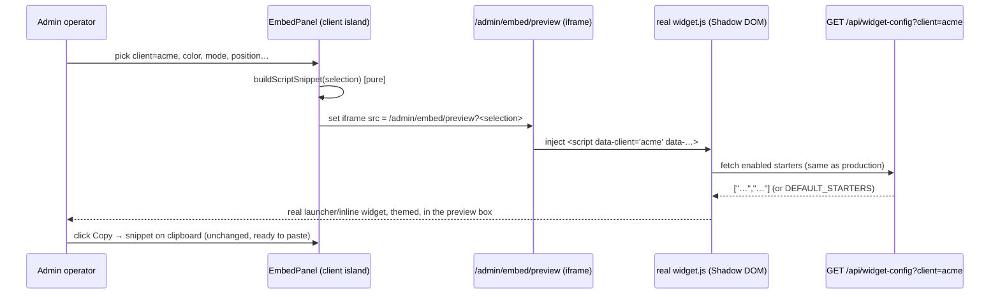
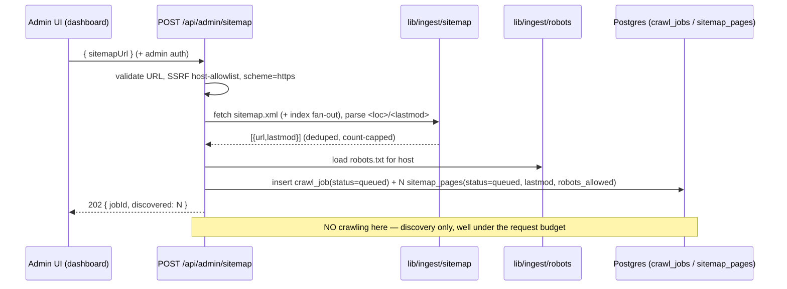

# Admin: Widget Embed Panel + Sitemap → Embeddings Pipeline

Full architecture + implementation plan for two admin-dashboard capabilities. Both build on already-shipped work (the widget bundle; the chunk/embed/upsert ingest core) — **no partial coverage**: each deliverable has a complete architecture and a phased, testable plan, and the sitemap pipeline's **reuse of the existing embedding/chunking logic** (not duplication) is specified explicitly. Matches the depth of `docs/product/admin-dashboard.md` and `docs/product/client-rollout-features.md`.

> Ethos: **reuse before rebuild, add infra only where genuinely required.** Neither capability adds a new datastore — both live on the shipped Supabase + Vercel + the existing `kb_chunks` vector store.

## The two deliverables → the two sections

| # | Deliverable | Section | As-built dependency | The gap |
|---|---|---|---|---|
| **1** | Widget embed panel (per-client copy-paste snippet + launcher toggle + live themed preview) | **§ A** | Widget **built** (`widget/`, `public/widget.js`, `WidgetConfig` `data-*`, `/api/widget-config`, `CLIENT_REGISTRY`, `starter_questions`) | The admin **screen** that emits the snippet + preview — a UI over the widget, plus one small `mode` field |
| **2** | Sitemap → embeddings pipeline (paste sitemap URL → crawl → **same** `kb_chunks` store) | **§ B** | `chunkMarkdown`, `embedBatchWithUsage`, `documents`/`kb_chunks`/`ingest_jobs`, `scripts/ingest.ts` upsert — all shipped | A crawl **front-end** (fetch/robots/extract/dedup/status) feeding the **shared** ingest core |

## Reconciliation with as-built (both deliverables)

- **§ A is a thin UI over a built widget.** The panel reads the client id from the server registry (`lib/clients.ts` `CLIENT_REGISTRY` ∪ the usage/history client list) and the client's live config (color/position/starters from `starter_questions` + `/api/widget-config`), and renders the exact `data-*` snippet the shipped `widget/src/config.ts` already parses. The **one** widget-code change: a backward-compatible `mode: "launcher" | "inline"` field (default `launcher` = today's behavior) so the "floating launcher vs inline" toggle is real config, not a fork. Keys never leave the server — the snippet carries only the public client id + apiBase.
- **§ B adds a crawl front-end and nothing below it.** Every page, once its HTML is text, is *just another source*: it flows through the **same** `chunkMarkdown` → **same** `embedBatchWithUsage` → **same** atomic `documents`/`kb_chunks` delete-then-insert that `scripts/ingest.ts` runs today. The plan lifts that upsert into a shared `lib/ingest/core.ts` that **both** the sitemap crawler and the (planned) file-upload pillar call — so this plan and `file-embedding.md` converge on **one** pipeline. A crawled chunk is byte-shape-identical to a file chunk; retrieval/guardrail/prompt never learn the bytes came from a URL. Proof: the **Reuse map** table in § B.

## Key decisions (stated up front)

- **Launcher vs inline (§ A):** one additive `mode` field in `WidgetConfig` + a single branch in the widget's `boot()`. `launcher` unchanged; `inline` mounts the panel into a `data-target` in page flow. The only widget change the panel needs.
- **HTML extraction (§ B):** `@mozilla/readability` + `linkedom` — pure-JS, no native binary, no headless browser (strips nav/boilerplate so site chrome doesn't poison grounding). Headless Chromium is an explicit opt-in escalation for JS-rendered SPAs.
- **Serverless crawl (§ B):** discovery is synchronous (write a job + queued page rows, return `202`); crawling is a **drained queue** (`sitemap_pages` is the queue-of-record) worked in bounded batches by **Vercel Cron** (default, no new infra) or QStash (upgrade). Per-page idempotency + `content_hash` make retries and re-crawls free of double-embedding.

---
# Widget Embed Panel — Admin Snippet Generator + Live Preview

Product plan for a new admin screen that turns "install the Cadre AI chat widget on client X's
site" from a copy-edit-by-hand chore into a **copy-paste with zero manual editing**. The screen
generates the exact, per-client embed snippet — both the `<script>` loader form and the `<iframe>`
fallback form — pre-filled with the selected client's id and current per-client config, offers a
one-click copy control, exposes the **inline vs floating-launcher** choice as a config toggle, and
renders a **live, themed preview of the real widget** before the operator copies anything.

Two halves, matching the house style (`docs/product/admin-dashboard.md`,
`docs/product/client-rollout-features.md`): a full **Architecture** description, then a phased,
testable **Implementation Plan**. Written against the code as built today
(`widget/src/config.ts`, `widget/src/index.ts`, `widget/src/host.ts`, `widget/src/launcher.ts`,
`lib/clients.ts`, `app/api/widget-config/route.ts`, `lib/admin/starter-repo.ts`,
`app/admin/(protected)/layout.tsx`, `app/admin/_components/ClientSelector.tsx`,
`lib/admin/auth.ts`, `app/admin/admin.module.css`).

> **Ethos (inherited from `ARCHITECTURE.md` / `plan.md`):** right-sized, one deploy, add
> infrastructure only where a capability genuinely requires it. **The widget is already built.**
> This screen is a thin admin UI *over* the shipped widget and the shipped `WidgetConfig` contract —
> it is a snippet generator and a preview host, not a widget rewrite. The one small widget-side
> addition it forces (an `inline` render mode) is scoped and flagged explicitly in § 3.

---

## Architecture

### 1. Where we are today (the current-state delta)

Everything the panel needs to *emit* already exists and is frozen; nothing about how the widget
boots needs to change for the default (launcher) path.

| Capability | Built today | The gap this screen closes |
|---|---|---|
| **The widget bundle** | ✅ Shadow-DOM loader (`widget/src/host.ts`, `mode:"open"`, adopted stylesheet), floating launcher (`widget/src/launcher.ts`), panel, transport. Served at `public/widget.js`. | — (works; the panel embeds it, doesn't rebuild it) |
| **The config contract** | ✅ `WidgetConfig` (`widget/src/config.ts`): `client`, `apiBase`, `color`, `position`, `greeting`, `launcherLabel`, `theme`, `contactUrl`, `starters`. Precedence `window.CadreChat` › `data-*` › defaults; `parseConfig`/`parseStarters` pure and tested. | Nothing generates the `data-*` snippet from these fields — operators hand-write it and get the attribute names / coral default wrong. |
| **Client id source of truth** | ✅ `lib/clients.ts` — `CLIENT_REGISTRY` (env), `resolveClient`, `isKnownClient`, `sanitizeClientId`, `DEFAULT_CLIENT_ID`. This is the fail-closed set of valid tenant ids. | The registry is parsed into a private `REGISTRY` map; there is **no exported list** of client ids for a dropdown to offer (§ 6, reconciliation). |
| **Per-client starters** | ✅ `starter_questions` table + `starterRepo` + `GET /api/widget-config?client=` (CORS-enabled, falls back to `DEFAULT_STARTERS`, never empty/500). | Not surfaced *in the embed screen*; the preview must reflect them so preview == production. |
| **Admin shell + auth** | ✅ `(protected)` route group gated by `requireAdmin()` (signed-cookie HMAC, server-verified in every RSC — the real boundary, not middleware); header nav + `ClientSelector`; `admin.module.css`. | No `Embed` nav entry / page yet. |
| **Inline (non-launcher) render** | ❌ `widget/src/index.ts` **always** constructs a floating launcher and toggles a `hidden` panel. There is no way to render the panel inline in page flow. | The launcher **toggle**'s "inline" position needs a small, additive widget mode (§ 3). |

**Headline finding.** The snippet the panel emits is a pure function of data that already exists:
the selected `client` (from the registry), the operator's theme choices (which map 1:1 to
`WidgetConfig` fields), and the per-client starters (already fetchable). Generating it is a
**client-side string builder plus a copy button** — no backend capability is required for the
default launcher snippet. The only genuinely new *code* outside the admin screen is (a) exporting
the registry's id list so the dropdown is server-sourced rather than free text, and (b) a small
`mode:"inline"` addition to the widget so the launcher toggle has a real "off" state to emit.

### 2. The screen, precisely

A new route `app/admin/(protected)/embed/page.tsx`, reachable from a new `Embed` header nav link.
Layout (reusing `admin.module.css` primitives — `.page`, `.pageHead`, `.card`, `.badge`, the form
field classes already used by the questions editor):

```
┌ Embed · client: acme ──────────────────────────────────────────────┐
│  Client        [ acme ▾ ]     (server-sourced <select>, § 6)         │
│                                                                       │
│  ┌ Appearance ─────────────┐   ┌ Live preview ─────────────────────┐ │
│  │ Mode   (•) Launcher      │   │  ┌──────────────────────────────┐ │ │
│  │        ( ) Inline        │   │  │  <iframe> sandboxed          │ │ │
│  │ Position  bottom-right ▾ │   │  │   real /widget.js booted      │ │ │
│  │ Color     ██ #db4545     │   │  │   with THESE data-*           │ │ │
│  │ Theme     auto ▾         │   │  │   (starters from             │ │ │
│  │ Greeting  [__________]   │   │  │    /api/widget-config)        │ │ │
│  │ Launcher label [_______] │   │  └──────────────────────────────┘ │ │
│  │ Contact URL [_________]  │   │  Preview reflects production 1:1   │ │
│  └──────────────────────────┘   └────────────────────────────────────┘ │
│                                                                       │
│  ┌ Snippet ── (•) Script loader   ( ) Iframe fallback ── [ Copy ] ─┐ │
│  │  <script src="https://…/widget.js" data-client="acme" …></script>│ │
│  └───────────────────────────────────────────────────────────────┘ │
└───────────────────────────────────────────────────────────────────┘
```

The page is a Server Component that resolves the client and fetches the current per-client starters
(for the preview and, optionally, to show which chips will appear); the interactive form + preview +
copy control are a small `"use client"` island (`EmbedPanel.tsx`). No data mutation — the screen is
**read + generate only**, so it needs no Server Actions and no new table (see § 5).

### 3. The launcher toggle: `mode="launcher"` vs `mode="inline"` (the one widget addition)

**This is the reconciliation point.** Today the widget *is* a floating launcher, unconditionally:
`widget/src/index.ts` always calls `createLauncher(...)`, mounts a `hidden` panel, and toggles it;
`host.ts` fixes the host `<div>` to a screen corner (`cadre-pos-*`). There is no inline mode. So the
"inline-embed vs floating-launcher-bubble" toggle the panel offers cannot be a pure config value the
widget already understands — it requires a **small, additive** change to the widget.

Design (kept minimal, backward-compatible, and expressed through the existing `WidgetConfig`
precedence machinery):

- **Add one field:** `mode: "launcher" | "inline"` to `WidgetConfig` (default `"launcher"`), parsed
  from `data-mode` / `window.CadreChat.mode` in `parseConfig` exactly like `position`/`theme` (an
  `isMode` guard, fall back to the default on anything unrecognized). Because it flows through the
  same parser, all existing precedence and tests extend by one line.
- **Add one field for inline targeting:** `target: string | null` (from `data-target`, a CSS
  selector). Inline content lives *in page flow*, so unlike the launcher it must mount into a host
  element the operator designates, not a fixed corner.
- **Branch once in `index.ts`:**
  - `mode:"launcher"` (default, **unchanged behavior**): current path — `mountHost` fixes the host to
    the corner, `createLauncher` + toggled panel, unread badge, `Esc` to close.
  - `mode:"inline"`: `mountHost` resolves `data-target` (fallback: insert a host `<div>` where the
    `<script>` tag sits), the host is **not** `position:fixed` (a new `cadre-inline` host class drops
    the corner offset / z-index and sizes to its container), **no launcher is created**, and the
    panel is rendered **visible** (not `hidden`) with no open/close affordance. Everything else — the
    Shadow DOM isolation, adopted stylesheet, transport, session, starters — is shared unchanged.

This is genuinely small (one config field + one guard + one host CSS class + a single branch in the
already-tiny `boot()`), and it is the *only* widget-code change this screen requires. The panel then
expresses the toggle as `data-mode="launcher"` (omitted, since it is the default) or
`data-mode="inline" data-target="#cadre-here"`, and — critically — the **live preview renders each
mode faithfully** because it boots the real bundle.

> If the reviewer prefers to **not** touch the widget at all in this iteration, the fallback is:
> ship the panel with the launcher snippet only, and render the "Inline" radio as *disabled /
> coming with the widget's inline mode*. The panel architecture is unchanged; only the third radio
> and the `mode`/`target` attributes are gated. The recommendation is to land the small widget
> addition, because an inline embed is a common client ask and the cost is a few lines.

### 4. Snippet generation (the core, pure function)

The generator is a **pure, unit-testable** function — no DOM, no network — mirroring the discipline
of `parseConfig`/`sanitizeStarters`. It is the inverse of `parseConfig`: given a resolved
`WidgetConfig`-shaped selection, emit the `data-*` attributes that `parseConfig` would read back to
exactly that config.

```ts
// lib/admin/embed-snippet.ts  (NEW — pure, no DOM/network; tested like lib/starters)

export type EmbedSelection = {
  client: string;                              // from the registry dropdown (never free text)
  apiBase: string;                             // our deploy origin (the panel knows it)
  mode: "launcher" | "inline";
  target?: string | null;                      // inline only; CSS selector
  color: string;                               // default "#db4545" (brand coral — omit if default)
  position: "bottom-right" | "bottom-left";    // launcher only
  theme: "auto" | "light" | "dark";
  greeting: string;
  launcherLabel: string;                       // launcher only
  contactUrl: string;                          // absolute; default `${apiBase}/contact`
  // NOTE: starters are DB-managed per client via /api/widget-config; the snippet
  // does NOT hard-code them by default (see § 5). data-starters is offered only
  // under an "override starters in the snippet" advanced toggle.
};

export function buildScriptSnippet(s: EmbedSelection): string;   // <script data-…></script>
export function buildIframeSnippet(s: EmbedSelection): string;   // <iframe …></iframe>
```

**Attribute-name fidelity is the whole point.** `HTMLScriptElement.dataset` camel-cases hyphenated
attributes, so the emitter must map `WidgetConfig` keys to the *exact* `data-*` names that
`config.ts`'s `WidgetDataset` reads:

| `WidgetConfig` field | Emitted attribute | Default (omit when equal) |
|---|---|---|
| `client` | `data-client` | — (always emitted; required) |
| `apiBase` | `data-api-base` | omitted → auto-derives from `currentScript.src` (preferred; emit only for cross-origin API) |
| `mode` | `data-mode` | `"launcher"` → omit |
| `target` | `data-target` | inline only |
| `color` | `data-color` | `"#db4545"` → omit |
| `position` | `data-position` | `"bottom-right"` → omit |
| `theme` | `data-theme` | `"auto"` → omit |
| `greeting` | `data-greeting` | default greeting → omit |
| `launcherLabel` | `data-launcher-label` | `"Chat with us"` → omit |
| `contactUrl` | `data-contact-url` | `${apiBase}/contact` → omit |
| `starters` | `data-starters` | never (DB-managed) unless the advanced override is on |

Emitting **only non-default** attributes keeps the snippet minimal and readable (a bare
`<script src=… data-client="acme" async></script>` for a client on brand defaults), and it means the
snippet stays correct-by-construction if a default ever changes in `config.ts` — the generator and
the parser share the same default constants (import them, do not duplicate). Values are
HTML-attribute-escaped (`&`, `<`, `>`, `"`), and `client` is re-run through `sanitizeClientId`
before emission as defense-in-depth even though it came from the trusted dropdown.

The **script loader** form (default, recommended):

```html
<script
  src="https://chat.gocadre.ai/widget.js"
  data-client="acme"
  data-color="#c23b22"
  data-position="bottom-left"
  data-greeting="Hi! Ask us anything about Acme."
  async
></script>
```

The **iframe fallback** form (strict-isolation hosts; mirrors `client-rollout-features.md` § A
Phase 3 — the chromeless `app/embed` route reads its config from the query string):

```html
<iframe
  src="https://chat.gocadre.ai/embed?client=acme&color=%23c23b22&position=bottom-left"
  title="Cadre AI chat"
  style="border:0;width:100%;height:600px"
  loading="lazy"
></iframe>
```

Both come from the **same `EmbedSelection`**, so toggling the "Script loader / Iframe fallback" radio
just re-renders the other builder over identical state — the two are always consistent.

### 5. Live preview (real bundle, real theme, before copy)

The preview must be the **actual widget**, not a mock, so that what the operator sees is what the
client's visitors get. Approach: an **isolated `<iframe>` pointing at a preview route that loads the
real `public/widget.js`** with the current selection applied.

- **New route `app/admin/(protected)/embed/preview/page.tsx`** — a chromeless HTML document that
  renders a blank "host page" and injects the real widget `<script>` (or the inline mount target)
  built from the *same* `EmbedSelection`, read from its query string. Reusing a route (rather than
  `srcdoc`) means the widget's `document.currentScript.src` auto-derives `apiBase` to our own origin
  exactly as in production, and the widget's cross-origin `fetch` to `/api/widget-config` and
  `/api/chat` behaves identically. The preview route is inside `(protected)`, so it inherits
  `requireAdmin()`.
- **Why an iframe.** The widget already isolates *styles* via Shadow DOM, but it appends its host to
  `document.body` and (in launcher mode) `position:fixed`es to the viewport corner. Dropping that
  straight into the admin page would float over the admin chrome. The iframe gives the widget its own
  `document.body` and viewport, so `bottom-right`/`bottom-left`, the full-screen mobile breakpoint,
  and the inline mount all render truthfully inside the preview box. The iframe is
  `sandbox="allow-scripts allow-same-origin"` (same-origin so the bundle can read config and call our
  APIs) with no `allow-forms`/`allow-popups` beyond what the widget needs.
- **Theme = the client's real values.** Color/position/greeting/theme come from the operator's form
  (which *is* what the snippet will carry), and **starters come from the live
  `GET /api/widget-config?client=<id>`** the widget already calls on boot — so the preview's chips are
  the exact enabled `starter_questions` rows (or `DEFAULT_STARTERS`) the production embed will show.
  Preview and production converge because they run the identical bundle against the identical config
  precedence and the identical starters endpoint.
- **Live update.** On any form change the client island re-points the iframe `src` (debounced) to the
  preview route with the new query string; the iframe reboots the widget with the new config. Cheap,
  no bundler, no re-mount gymnastics.



### 6. Client id source (the second reconciliation detail)

The dropdown must offer **valid, server-known client ids**, never free text — otherwise an operator
can generate a snippet for a `client` that `resolveClient` will fail-closed to `"default"`, silently
mis-attributing that tenant's traffic. Two existing sources, neither sufficient alone:

- `clientRepo.listClients()` (used by the header `ClientSelector`) lists only tenants that have
  **already logged a conversation** — a brand-new client being onboarded (the exact moment you need
  the embed snippet) is **not** in it yet.
- `lib/clients.ts` parses `CLIENT_REGISTRY` into a private `REGISTRY` map but **exports no id list**
  (`isKnownClient`/`resolveClient` only answer point queries).

**Resolution (small, additive):** export a `listRegisteredClients(): { id: string; origins: string[] }[]`
from `lib/clients.ts` that returns the parsed registry entries. The embed dropdown is the **union** of
the registry ids (clients configured but maybe not yet live) and `clientRepo.listClients()` (clients
with traffic), de-duplicated — so a just-configured tenant is selectable immediately, and the panel
can badge each option as *configured* / *live* / *configured + live*. When `CLIENT_REGISTRY` is unset
(dev/allow-all parity, per `lib/clients.ts`), the dropdown falls back to the traffic list plus a
plain (sanitized) text entry, matching the registry's own allow-all dev posture. This keeps the panel
faithful to the fail-closed registry and reuses the same source of truth `/api/chat` trusts.

### 7. Interfaces (frozen seams)

Lock these before parallel work, in the same spirit as `lib/admin/contracts.ts`. All additions are
backward-compatible.

```ts
// widget/src/config.ts — additions (extend the existing frozen WidgetConfig)
export type WidgetMode = "launcher" | "inline";
export type WidgetConfig = {
  /* …existing fields… */
  readonly mode: WidgetMode;      // NEW — default "launcher" (current behavior)
  readonly target: string | null; // NEW — inline mount selector; null in launcher mode
};

// lib/clients.ts — addition (the dropdown source)
export function listRegisteredClients(): { id: string; origins: string[] }[];

// lib/admin/embed-snippet.ts — NEW pure module
export type EmbedSelection = { /* § 4 */ };
export function buildScriptSnippet(s: EmbedSelection): string;
export function buildIframeSnippet(s: EmbedSelection): string;

// lib/admin/contracts.ts — a read model for the dropdown (union of registry + traffic)
export type EmbedClientOption = {
  id: string;
  origins: string[];        // from the registry; [] when unlisted / allow-any
  status: "configured" | "live" | "configured-live";
};
```

The snippet builders import their default constants directly from `widget/src/config.ts`
(`DEFAULT_COLOR`, `DEFAULT_POSITION`, `DEFAULT_GREETING`, `DEFAULT_LAUNCHER_LABEL`, `DEFAULT_THEME`)
so "omit when default" can never drift from what the parser actually treats as default.

### 8. Data model (reuse; no new table by default)

The screen reads three things and **writes nothing**:

- **Client ids** — from `lib/clients.ts` `CLIENT_REGISTRY` (env) ∪ `conversations.client_id`
  (via `clientRepo`). No storage change.
- **Starters** — from `starter_questions` via the existing `GET /api/widget-config` (the preview
  fetches them exactly as production does). No storage change.
- **Theme fields** (`color`, `position`, `greeting`, `launcherLabel`, `theme`, `mode`, `contactUrl`)
  — **snippet-config only.** They live in the pasted `data-*` attributes on the client's own page,
  *not* in our DB. This is the deliberate right-sized choice: the widget reads theme from `data-*`,
  so the DB never needs to hold it, and the panel is a stateless generator.

> **Optional deferred storage (`widget_config` table).** If operators later want the panel to
> *remember* a client's theme choices between visits (so returning to the screen re-populates the
> form, or so a client can be re-themed without re-pasting), add a small per-client
> `widget_config(client_id pk, color, position, greeting, launcher_label, theme, mode, contact_url,
> updated_at)` table + a `widgetConfigRepo` mirroring `starterRepo`, and a "Save appearance" Server
> Action. That is a genuine feature (persisted theme, editable-without-redeploy) with a real cost
> (write path, RLS, a migration) — **out of scope here**; the snippet-config-only model fully
> satisfies "generate a copy-paste snippet with a live preview." Flagged as the upgrade trigger,
> consistent with how `starter_questions` earned its table only once starters needed to be
> operator-editable without a redeploy.

### 9. Security

1. **The snippet contains no secret — reaffirmed.** It carries only the **public** `client` label and
   (optionally) the **public** `apiBase` origin. Keys stay server-side: the LLM and embeddings are
   only ever called inside `/api/chat` from `process.env.*` (`lib/config.ts`); the widget bundle and
   this snippet never touch a key. Pasting the snippet exposes nothing that a visitor to the client's
   site could not already see in network calls.
2. **Client id list is server-sourced, not free text.** The dropdown is built from the registry
   (`lib/clients.ts`) ∪ logged tenants — the same fail-closed set `/api/chat` trusts via
   `resolveClient`. An operator cannot fat-finger a junk tenant into a live snippet; unknown ids are
   not offered, and the emitted `client` is re-`sanitizeClientId`'d. This closes the log-poisoning /
   cardinality-abuse concern at the source rather than at the API boundary.
3. **Admin-gated page.** The route lives under `app/admin/(protected)/`, so `requireAdmin()`
   (signed-cookie HMAC, server-verified in the RSC — the real boundary per `lib/admin/auth.ts`, not
   middleware) protects both the panel and the `/embed/preview` route. The panel exposes no
   mutation, so there is no CSRF-able Server Action surface to protect.
4. **Preview iframe is sandboxed.** `sandbox="allow-scripts allow-same-origin"` — same-origin so the
   real bundle can read config and call our APIs, but no `allow-top-navigation`/`allow-popups`. The
   preview boots our own `widget.js` against our own origin; it introduces no third-party code.
5. **No new abuse surface.** The preview calls the already-public, already-CORS'd, already-rate-safe
   `/api/widget-config` and (only if the operator actually chats in the preview) `/api/chat`, both of
   which enforce their own bounds. The panel adds no new endpoint that isn't admin-gated or already
   public.

### 10. Rejected alternatives

| Option | Verdict | Why |
|---|---|---|
| Rebuild a bespoke "preview widget" in React for the panel | Rejected | Preview would drift from production. Booting the **real** `widget.js` in an iframe guarantees preview == production and reuses the shipped bundle. |
| `srcdoc` iframe instead of a `/embed/preview` route | Rejected | `srcdoc` has an opaque origin, breaking `currentScript.src` `apiBase` derivation and the cross-origin `fetch` semantics the widget relies on. A same-origin route matches production. |
| Store theme per client in a new table now | Deferred | Snippet-config-only fully covers "generate + preview." A `widget_config` table is justified only once persisted, redeploy-free re-theming is a real requirement (§ 8). |
| Free-text client id input | Rejected | Lets an operator emit a snippet for an id `resolveClient` fail-closes to `default`, silently mis-attributing traffic. Server-sourced dropdown (§ 6) prevents it. |
| Hard-code starters into `data-starters` by default | Rejected | Starters are DB-managed (`starter_questions`) and editable without a redeploy; baking them into the snippet freezes them on the client's page. Offered only behind an explicit "override" toggle. |
| Skip the widget `inline` mode; emit an inline snippet anyway | Rejected | The widget is launcher-only today; an `inline` snippet with no widget support would render a floating bubble, not an inline panel — the preview would expose the lie. Add the small `mode` field instead (§ 3). |
| A separate marketing/docs site for the snippet | Rejected | Over-engineered. The admin already has the client selector, auth, and CSS; the panel belongs beside Questions/Conversations. |

---

## Implementation Plan

Phased S/M/L so each slice ships independently. The default (launcher) snippet + preview is useful
after Phase 1; the inline toggle and niceties layer on.

### Phase 0 — Seams (S) · blocks the rest

- [ ] `lib/clients.ts`: add `listRegisteredClients()` (parse the existing `REGISTRY` map into an
      exported list). No behavior change to `resolveClient`.
- [ ] `lib/admin/contracts.ts`: add `EmbedSelection`, `EmbedClientOption`, and the `WidgetMode`
      type re-export.
- [ ] Decide the reconciliation (§ 3): land the widget `inline` mode (recommended) or gate the
      Inline radio. This plan assumes landing it.
- **Tests (Vitest):** `listRegisteredClients` parses `"acme:https://acme.com|https://www.acme.com,beta:"`
      into the right ids/origins; empty env → `[]`.
- **Exit:** the seams compile and are unit-covered; nothing user-visible yet.

### Phase 1 — Snippet generator + copy + launcher preview (M) · the Tier-0-useful slice

- [ ] `lib/admin/embed-snippet.ts`: `buildScriptSnippet` / `buildIframeSnippet` (pure), importing
      defaults from `widget/src/config.ts`; emit only non-default `data-*`; HTML-escape values;
      re-`sanitizeClientId` the client.
- [ ] `app/admin/(protected)/embed/page.tsx` (Server Component): resolve `?client`, load the
      dropdown options (registry ∪ `clientRepo`), render the `EmbedPanel` island.
- [ ] `app/admin/_components/EmbedPanel.tsx` (client island): the appearance form, the
      Script/Iframe radio, the generated snippet in a `<pre>`, and a **Copy** button
      (`navigator.clipboard.writeText`, with a `document.execCommand` fallback and a "Copied" toast).
- [ ] `app/admin/(protected)/embed/preview/page.tsx`: chromeless host that injects the real
      `widget.js` from the query-string selection.
- [ ] Embed the preview iframe in `EmbedPanel`; re-point `src` (debounced) on form change.
- [ ] Add the `Embed` nav link in `app/admin/(protected)/layout.tsx`; add any new CSS classes to
      `admin.module.css` (reuse existing form/card primitives).
- **Tests:**
  - **Unit (Vitest):** snippet round-trips — feed `buildScriptSnippet`'s `data-*` back through
    `parseConfig` and assert the resulting `WidgetConfig` equals the selection (the key correctness
    property); default omission (brand-default client → bare snippet); escaping (a greeting with
    `"`/`&`); iframe URL param encoding.
  - **e2e (Playwright):** open `/admin/embed`, pick a client → snippet shows `data-client="acme"`;
    click Copy → assert clipboard contents equal the `<pre>`; change color → snippet and **preview
    iframe** both update; assert the preview iframe actually renders the launcher bubble
    (Shadow-DOM host present) with the chosen accent.
- **Exit:** an operator selects a client, sees the real themed launcher in the preview, and copies a
      paste-ready `<script>` snippet with zero manual editing.

### Phase 2 — Inline mode + toggle (M) · the launcher on/off

- [ ] Widget: add `mode`/`target` to `WidgetConfig` + `parseConfig` (guards like `position`/`theme`);
      branch `index.ts` (`inline` → mount panel into `data-target`, no launcher, visible panel);
      add the `cadre-inline` host class in `host.ts`/`styles.ts` (no fixed corner).
- [ ] Panel: the Mode radio (Launcher/Inline); when Inline, reveal a `target` selector field and
      hide launcher-only fields (position, launcher label); emit `data-mode="inline" data-target=…`.
- [ ] Preview: render inline mode faithfully (the injected `<script>` targets a stub container in the
      preview host).
- **Tests:** unit — `parseConfig` yields `mode:"inline"` from `data-mode`, defaults to `"launcher"`,
      falls back on junk; snippet emits `data-mode` only for inline. Widget unit — `boot()` inline
      path creates no launcher and mounts into the target. e2e — toggling to Inline updates the
      preview to an in-flow panel with no bubble.
- **Exit:** the toggle produces a real inline embed the preview proves out; launcher path unchanged.

### Phase 3 — Polish, guardrails, advanced (S)

- [ ] Per-option status badges in the dropdown (configured / live); an empty-state when no clients.
- [ ] "Advanced: override starters in snippet" toggle → emits `data-starters` (JSON), with a note
      that it freezes chips on the client's page (bypassing `/api/widget-config`).
- [ ] Copy affordance for the **iframe** form too; a "Test in preview" chat round-trip hint.
- [ ] a11y: labelled controls, `aria-live` on the "Copied" toast, keyboard-reachable radios; the
      preview iframe carries a `title`.
- **Tests:** unit — `data-starters` emission + escaping; e2e — override toggle changes the preview
      chips; keyboard-only copy.
- **Exit:** the screen is complete, accessible, and safe against the free-text/mis-attribution and
      frozen-starters footguns.

### Phase 4 (deferred) — Persisted theme (L) · only if required

- [ ] `widget_config` table + `widgetConfigRepo` + "Save appearance" Server Action + RLS + migration
      (§ 8). Repopulate the form from saved values; optional "apply saved theme" path.
- **Trigger:** operators need redeploy-free re-theming or form memory across visits. Not before.

### Dependencies & sequencing

```
Phase 0 (seams) ─┬─> Phase 1 (generator + copy + launcher preview)  ← useful here
                 └─> Phase 2 (inline mode) ─> Phase 3 (polish)
                                              Phase 4 deferred (persisted theme)
```

### Rollout

1. Land Phase 0–1 behind the existing admin auth; verify against a real registry entry
   (`CLIENT_REGISTRY=acme:https://acme.com`) that the snippet's `data-client` and the preview's
   starters match what `/api/widget-config?client=acme` returns.
2. Land Phase 2; smoke both modes in the preview on light/dark and a mobile viewport.
3. Onboarding flow: operator opens `/admin/embed`, selects the new client, copies the snippet, and
   hands it to the client — the same snippet the widget plan's rollout (`client-rollout-features.md`
   § A Phase 4) expects, now generated instead of hand-written.
4. **Roll back** by removing the `Embed` nav link (the generator is read-only; nothing to migrate).

### Testing summary (against the 80% bar)

| Layer | Tool | Coverage |
|---|---|---|
| Unit | Vitest | `buildScriptSnippet`/`buildIframeSnippet` round-trip through `parseConfig`; default omission; HTML/URL escaping; `listRegisteredClients` parsing; new `parseConfig` `mode`/`target` cases. |
| Integration | Vitest | `/admin/embed` resolves the client union; `/embed/preview` boots with the selection; `/api/widget-config` still serves the preview's starters. |
| E2E | Playwright | select client → correct `data-client`; Copy → clipboard equals snippet; form change updates snippet **and** preview; launcher vs inline render truthfully; accent applied in the Shadow-DOM host. |
| Manual | — | Paste a generated snippet into a real third-party page and confirm it renders identically to the preview (preview == production). |

Meets ≥80% via the pure generator's unit round-trip (the highest-value property) plus the Playwright
copy + preview flow.

---

# Sitemap → Embeddings Pipeline

> **Extension of Pillar 1 (file-embedding ingestion), not a new pillar.** This document specifies an admin-dashboard input that takes a **sitemap URL**, crawls every listed page, extracts its text, and lands the result in the **same** `kb_chunks` vector store as manually-uploaded documents — so retrieval treats a website page and an uploaded PDF identically. See [`docs/product/file-embedding.md`](./file-embedding.md) (the ingestion backend) and [`docs/product/admin-dashboard.md`](./admin-dashboard.md) (the admin surface that drives it).
>
> **The prime directive is reuse.** A sitemap page, once its HTML is converted to text, is *just another source* to the pipeline that already exists. It goes through the **same chunker** (`chunkMarkdown`), the **same embedder** (`embedBatchWithUsage`), and the **same atomic per-source upsert** (`documents` + `kb_chunks`, delete-then-insert in one `sql.begin`) that `scripts/ingest.ts` established. This plan writes **no second chunker, no second embedder, no second upsert path**. It adds exactly three things: a **crawl front-end** (sitemap fetch → URL list), an **HTML→text extractor** (`lib/ingest/extract.ts`), and a **durable crawl-job model** so a large sitemap survives Vercel's function timeout. Everything downstream of "here is a page's text and its `source`" is the existing pipeline, unchanged. See [§ Reuse map](#reuse-map-the-anti-duplication-contract).
>
> **Contract preservation.** The retrieval seam (`RETRIEVAL_BACKEND=pgvector` → `lib/retrieval-pgvector.ts` → `Retrieved[]`) and the guardrail contract (`decide`) do **not** change. A crawled page is indistinguishable from an uploaded doc at query time: same `kb_chunks` row shape, same `vector(512)`, same `chunk_key = source#index`.

---

## What changes, in one paragraph

Today an operator seeds the KB from `content/*.md` via `pnpm ingest` (`scripts/ingest.ts`): each file is chunked by `chunkMarkdown`, prefixed `"title | section"`, embedded with `embedBatchWithUsage`, and upserted atomically into `documents` + `kb_chunks` under a `client_id`, one **source** per file. Tomorrow an admin pastes `https://acme.com/sitemap.xml` into the dashboard; the app fetches and parses the sitemap's `<loc>`/`<lastmod>` entries, checks `robots.txt`, and for each allowed URL fetches the page, extracts readable text (`@mozilla/readability` + `linkedom`), converts it to markdown-ish text, and runs it through the **exact same** chunk → embed → upsert path with `source = <page URL>`. Because every page is a "source" in the sense `scripts/ingest.ts` already means it, re-crawling is idempotent: an unchanged page (matching `content_hash`) is skipped without re-embedding, a changed page re-embeds only itself. A large sitemap does not run inline in one request — it is enqueued as a `crawl_job` with per-URL rows, and a bounded worker (Vercel Cron / QStash) drains a handful of pages per invocation, each page committing independently so retries are safe. Nothing downstream of the upsert — retrieval, guardrail, prompt, chat route, evals — is aware the bytes came from a URL instead of a file.

---

## Architecture

### 1. Pipeline components

The sitemap pipeline is a **crawl front-end** bolted onto the **existing ingest core**. New modules are marked **new**; reused modules cite the existing file and are **not modified** except where noted. C4-L3, one job per module.

| Module | Status | One job | In → Out |
|---|---|---|---|
| `app/api/admin/sitemap/route.ts` | **new** | Accept a sitemap URL (admin-authed), validate + SSRF-check the host, fetch & parse the sitemap, create a `crawl_job` + one `sitemap_pages` row per URL (status `queued`). Does **not** crawl inline. | `POST { sitemapUrl }` → `202 { jobId, discovered }` |
| `lib/ingest/sitemap.ts` | **new** | Fetch `sitemap.xml` (and sitemap-index fan-out), parse `<loc>`/`<lastmod>`, normalize + de-dupe URLs, enforce host allowlist + count cap. | `sitemapUrl` → `{ url, lastmod }[]` |
| `lib/ingest/robots.ts` | **new** | Fetch & parse `robots.txt` once per host; expose `isAllowed(url)` honoring `Disallow` for our UA. | `host` → `RobotsRules` |
| `lib/ingest/fetch-page.ts` | **new** | HTTP GET one page with timeout + size cap + redirect-to-same-host guard; return `{ html, headers, status }`. Reads `X-Robots-Tag`. | `url` → `PageResponse` |
| `lib/ingest/extract.ts` | **new (shared with file-upload)** | HTML→text: strip nav/boilerplate via `@mozilla/readability` over a `linkedom` DOM → main article text + `<title>`; detect `<meta name=robots content=noindex>`; return `{ text, title, noindex }`. Also the **format-dispatched extractor the file-upload pillar calls** (md/txt/pdf/docx branches live here too). | `{ html \| buffer, mime, url }` → `{ text, title, noindex }` |
| `lib/ingest/core.ts` | **new (the shared core BOTH pillars call)** | The pillar-agnostic pipeline: `ingestSource({ clientId, source, title, tags, text })` → `chunkMarkdown` → prefix `"title \| section"` → `embedBatchWithUsage` → **atomic delete-then-insert into `documents` + `kb_chunks`** (the pattern lifted verbatim from `scripts/ingest.ts`). One place, two callers. | `IngestSource` → `IngestResult` |
| `lib/chunk.ts` | **reuse (unchanged)** | `chunkMarkdown(text): RawChunk[]`. Extracted page text (already markdown-ish plain text) goes straight through it — headingless pages collapse to a single `"Overview"` section, exactly as `splitSections` already handles pre-heading content. | `text` → `RawChunk[]` |
| `lib/llm.ts` | **reuse (unchanged)** | `embedBatchWithUsage(texts) → { vectors, tokens }`. Same `text-embedding-3-small` @ 512, and it already meters cost via the usage feature — so **site-page embedding spend is attributed exactly like file/`content` ingest** (see [§ Cost](#cost-attribution)). | texts → `{ vectors, tokens }` |
| `lib/ingest/crawl-worker.ts` | **new** | Drain a bounded batch of `queued` `sitemap_pages` for a `crawl_job`: fetch → robots/noindex/empty checks → `extract` → `core.ingestSource` → set per-page status. Idempotent per page; safe to re-run. | `jobId` → `{ processed, remaining }` |
| `app/api/admin/sitemap/worker/route.ts` | **new** | Cron/QStash-invoked drain endpoint (admin-secret gated). Calls `crawl-worker` for one bounded slice, returns whether more remain. | trigger → `{ remaining }` |
| `db/schema.sql` (`documents`, `kb_chunks`, `ingest_jobs`) | **reuse (unchanged)** | Same store, same tenant scoping by `client_id`. Each **page is a `documents` row** (`source = url`) with its `kb_chunks`. | — |
| `db/schema.sql` (`crawl_jobs`, `sitemap_pages`) | **new (additive DDL)** | The crawl-run header + per-URL work/status/dedup ledger. See [§ 3 Data model](#3-data-model). | — |
| `lib/db.ts` `getDb()` | **reuse (unchanged)** | The lazy pooled `postgres` client; the worker and route use it exactly as `scripts/ingest.ts` uses `postgres(...)`. | — |
| `lib/clients.ts` | **reuse (unchanged)** | `resolveClient` / `DEFAULT_CLIENT_ID` — every crawled source is written under a resolved `client_id`, tenant-scoped like everything else. | — |
| `lib/retrieval-pgvector.ts` / `decide` / prompt / route | **reuse (untouched)** | A crawled chunk is a `kb_chunks` row; retrieval and the guardrail never learn it came from a URL. | — |

**The seam that makes this safe:** everything from `lib/ingest/core.ts` **downward** (chunk, embed, upsert, retrieve, decide) is the pipeline that already ships. The sitemap work is entirely **above** the core — turning a URL into `{ source, title, text }`. That is the only genuinely new surface.

### 2. Data flow

#### 2.1 Discovery (synchronous, admin-triggered, fast)



#### 2.2 Crawl + ingest (asynchronous, bounded per invocation, idempotent per page)

```mermaid
sequenceDiagram
    participant Cr as Vercel Cron / QStash
    participant W as /api/admin/sitemap/worker
    participant K as lib/ingest/crawl-worker
    participant F as lib/ingest/fetch-page
    participant X as lib/ingest/extract (readability+linkedom)
    participant Co as lib/ingest/core.ingestSource
    participant CH as lib/chunk chunkMarkdown  (REUSE)
    participant E as lib/llm embedBatchWithUsage (REUSE)
    participant DB as documents + kb_chunks (REUSE)

    Cr->>W: tick (admin-secret)
    W->>K: drain(jobId, batch=BATCH_MAX)
    loop up to BATCH_MAX queued pages
        K->>F: GET url (timeout, size-cap, same-host redirects)
        F-->>K: { html, headers }  %% or robots/noindex short-circuit
        alt disallowed by robots / X-Robots-Tag noindex
            K->>DB: sitemap_pages.status = skipped(reason)
        else fetched
            K->>X: extract(html,url) -> { text, title, noindex }
            alt noindex meta OR text below word floor
                K->>DB: sitemap_pages.status = skipped(noindex|empty)
            else has content, hash changed
                K->>Co: ingestSource({source:url,title,text,tags})
                Co->>CH: chunkMarkdown(text) -> RawChunk[]
                CH->>E: embedBatchWithUsage("title | section\n"+text)
                E->>DB: BEGIN: upsert documents; delete+insert kb_chunks (source=url); ingest_jobs=ready; COMMIT
                K->>DB: sitemap_pages.status = embedded, content_hash, last_crawled
            else hash unchanged
                K->>DB: sitemap_pages.status = skipped(unchanged)  %% NO re-embed
            end
        end
    end
    K-->>W: { processed, remaining }
    alt remaining > 0
        W-->>Cr: reschedule (self-continue) 
    else
        W->>DB: crawl_jobs.status = done
    end
```

The per-page `BEGIN…COMMIT` is the **same transaction** `scripts/ingest.ts` runs today — `documents` upsert (bumping `current_version`), wholesale `delete from kb_chunks where client_id=… and source=…`, re-insert with `chunk_key = source#index`, `ingest_jobs` row. The only difference is `source` is a URL, not a filename.

### 3. Data model

**Reused tables (unchanged):** `documents(client_id, source, title, tags, current_version)`, `kb_chunks(client_id, chunk_key, document_id, source, title, section, tags, text, embedding vector(512), version)`, `ingest_jobs(client_id, source, status, chunks, error)`. A crawled page occupies these exactly as a file does — `source = url`, `chunk_key = url#index`.

**New tables (additive DDL, appended to `db/schema.sql`):** a crawl-run header and a per-URL ledger that carries dedup/change-detection state and per-page status. This is the schema addition the goal calls for.

```sql
-- Crawl run header — one per submitted sitemap URL, per tenant.
create table if not exists crawl_jobs (
  id           uuid primary key default gen_random_uuid(),
  client_id    text not null default 'default',
  sitemap_url  text not null,
  host         text not null,                      -- SSRF allowlist anchor (see §6)
  status       text not null default 'queued',     -- queued | crawling | done | error
  discovered   int  not null default 0,
  embedded     int  not null default 0,
  skipped      int  not null default 0,
  failed       int  not null default 0,
  error        text,
  created_at   timestamptz not null default now(),
  updated_at   timestamptz not null default now()
);
create index if not exists crawl_jobs_client_idx on crawl_jobs (client_id, created_at desc);

-- Per-URL work + dedup ledger. content_hash drives change-detection;
-- (client_id, url) is the idempotency key that makes retries safe.
create table if not exists sitemap_pages (
  id             uuid primary key default gen_random_uuid(),
  crawl_job_id   uuid not null references crawl_jobs(id) on delete cascade,
  client_id      text not null default 'default',
  url            text not null,                     -- becomes documents.source
  lastmod        timestamptz,                       -- from sitemap <lastmod>, if present
  etag           text,                              -- HTTP ETag, if the server sends one
  content_hash   text,                              -- sha256 of extracted text (dedup/change-detect)
  status         text not null default 'queued',    -- queued|embedded|skipped|failed
  skip_reason    text,                              -- robots|noindex|unchanged|empty|no_text
  chunks         int  not null default 0,
  error          text,
  robots_allowed boolean not null default true,
  last_crawled   timestamptz,
  created_at     timestamptz not null default now(),
  unique (client_id, url)                           -- one ledger row per page per tenant
);
create index if not exists sitemap_pages_job_idx    on sitemap_pages (crawl_job_id, status);
create index if not exists sitemap_pages_client_idx on sitemap_pages (client_id, url);

alter table crawl_jobs    enable row level security;   -- same posture as the rest of the schema
alter table sitemap_pages enable row level security;
```

**Where dedup/change-detection state lives — the deliberate choice.** `content_hash`/`etag`/`lastmod` live on **`sitemap_pages`**, not on `documents`. Rationale: `documents` is the *live* store shared with file-upload and must stay format-agnostic; `sitemap_pages` is the *crawl ledger*, and change-detection is a crawl concern. `documents.current_version` still bumps on every re-embed (via the reused upsert), so the store's own audit trail is intact. On re-crawl, the worker compares the freshly-extracted text's sha256 against `sitemap_pages.content_hash`:

- **hash equal** → `skipped('unchanged')`, **no embed call, no upsert** (saves cost and write load).
- **hash differs** (or `lastmod` newer than `last_crawled` and we choose to re-fetch) → re-run `ingestSource` for that URL only; the reused delete-then-insert replaces just that source's chunks.

### 4. HTML → text extraction — library choice

**Recommendation: `@mozilla/readability` + `linkedom`.** Readability is the extraction engine behind Firefox Reader View — it strips nav, headers, footers, sidebars, and ad boilerplate and returns the *main article content* plus the document title, which is exactly what a support KB wants (retrieving a site's nav menu as context would poison grounding). Readability needs a DOM; `linkedom` is a fast, pure-JS, spec-ish DOM that runs cleanly in Node on Vercel serverless with **no native bindings**.

**Why this pairing for Vercel serverless (no headless browser by default):**

- **No native deps, no binary.** `linkedom` and `@mozilla/readability` are pure JS — they bundle and cold-start cleanly under Vercel's bundler. This is the same constraint that ruled out `pdf-parse`/`pdfjs-dist` for the file pillar.
- **No headless browser.** Puppeteer/Playwright-core + `@sparticuz/chromium` weighs ~50–100 MB, blows cold-start budgets, and is unjustified for the default case: sitemaps list *server-rendered* content pages. We fetch server HTML and extract. A headless render is an **explicit escalation path** ([§ empty / JS-rendered](#5-empty--js-rendered-pages)), not the default.
- **Boilerplate removal is the whole point.** `cheerio`/`node-html-parser` (also viable, also pure-JS) give you a DOM/selector API but **no content-vs-chrome heuristic** — you'd hand-write "grab `<article>`, drop `<nav>`" rules per site. Readability generalizes that across arbitrary sites, which is what "paste any sitemap" demands. We keep `linkedom` as the DOM and let Readability decide what's content.
- **Markdown-ish output.** Readability yields clean text/HTML; a light HTML→text pass (preserve headings as `#`, lists, tables; drop inline markup) produces exactly the markdown-shaped input `chunkMarkdown` expects — so headings still drive sectioning and the `"title | section"` prefix stays meaningful.

**Rejected alternatives**

| Rejected | Why not |
|---|---|
| **Headless Chromium (Puppeteer/Playwright)** | 50–100 MB cold-start cost, native binary, far over-scoped for server-rendered content pages. Kept only as the opt-in escalation for JS-heavy sites. |
| **`cheerio` / `node-html-parser` alone** | Pure-JS and fine at parsing, but no content-extraction heuristic — you'd maintain per-site selector rules. Readability generalizes; that's the requirement. |
| **Hosted extraction API (Firecrawl / Diffbot / unstructured.io)** | Off-stack external dependency + per-page cost + another vendor to trust with crawl targets. Unjustified at this scope; note as the upgrade path if JS-rendering/anti-bot becomes common. |
| **Raw `innerText` / regex tag-strip** | Retrieves nav/footer/cookie-banner text into the KB and poisons grounding. The guardrail's coverage check would degrade. |

### 5. robots.txt, noindex, empty & JS-rendered pages

These are correctness-and-politeness gates the goal requires explicitly. All are enforced in `crawl-worker` **before** any embed spend.

**robots.txt.** `lib/ingest/robots.ts` fetches `https://<host>/robots.txt` once per crawl job (cached on the `crawl_jobs` row's host), parses `User-agent`/`Disallow`, and exposes `isAllowed(url)` for our crawler UA (`CadreBot`). Discovery records `robots_allowed` per page; disallowed pages are written `skipped('robots')` and never fetched for content. We honor `Disallow` even though the sitemap listed the URL — a sitemap entry is not consent to crawl a disallowed path.

**noindex — two sources, both honored:**
- **`X-Robots-Tag: noindex`** response header, read in `fetch-page` before extraction → `skipped('noindex')`.
- **`<meta name="robots" content="noindex">`** in the HTML, detected during `extract` → `skipped('noindex')`.

A page that says "don't index me" is not embedded, regardless of being in the sitemap.

**Empty / JS-rendered pages.** After extraction we measure meaningful text (word count on the extracted body). Below a floor (`MIN_PAGE_WORDS`, default ~30 words ≈ the `MIN_TOKENS=40` the chunker already treats as too small) → `skipped('empty')` (no text at all) or `skipped('no_text')` (only chrome/whitespace survived). **We never embed empty or whitespace-only chunks** — this both saves cost and prevents a near-zero-content vector from polluting ANN neighborhoods. Because a **server fetch cannot see client-rendered content**, a React/Vue SPA whose body is an empty `<div id="root">` legitimately extracts to near-nothing and is flagged `no_text` with a clear reason in the UI, *not* silently embedded as garbage. The **escalation path** is explicit and opt-in: a `renderMode: 'headless'` flag on the crawl job routes those URLs through a headless render (Playwright-core + `@sparticuz/chromium`, or a hosted render API) — added only if a tenant's site genuinely needs it, kept out of the default bundle so cold-start stays cheap.

### 6. Serverless execution — bounded batch + durable job model

**The problem.** A Vercel function has a ~60s ceiling; a sitemap can list hundreds of URLs, each needing a fetch (network-bound) + extract + embed. Crawling inline in the `POST /api/admin/sitemap` request would time out and lose work. The discovery request must stay fast and the crawl must be **resumable**.

**The model (specified):**

1. **Discovery is synchronous and cheap** — fetch+parse the sitemap, write `crawl_jobs` + N `sitemap_pages(queued)`, return `202`. No page crawling in this request.
2. **Crawling is a drained queue.** `sitemap_pages` **is** the queue; `(client_id, url)` uniqueness + per-page status is the idempotency ledger. A worker drains a **bounded slice** (`BATCH_MAX`, default ~8–10 pages, tuned to stay comfortably under the timeout given per-page fetch latency) per invocation.
3. **The worker is invoked repeatedly** by **Vercel Cron** hitting `/api/admin/sitemap/worker` (admin-secret gated) on a short interval, or by **QStash** for at-least-once delivery with retries and backoff. Each tick processes one slice and reports `remaining`; when `remaining > 0` it self-continues (Cron next tick, or a QStash re-publish), when `0` it flips `crawl_jobs.status = done`.
4. **Per-page idempotency makes retries free of duplication.** Each page commits in its own transaction (the reused `sql.begin`). A crashed/timed-out slice leaves half its pages `queued` and the rest `embedded`; the next tick just picks up the `queued` ones. Re-processing an already-`embedded` page whose hash is unchanged is a `skipped('unchanged')` no-op. Nothing double-embeds.

**Default = Vercel Cron** (no new external infra, fits the project ethos — mirrors the file pillar's `after()` preference). **QStash is the documented upgrade** when at-least-once delivery, retry/backoff, and > single-function-budget durability are wanted. Either way the queue-of-record is `sitemap_pages` in Postgres, so worker delivery is swappable without touching the pipeline.

### 7. Security

| Surface | Control |
|---|---|
| **SSRF (the headline risk — we fetch attacker-influenceable URLs)** | Validate the submitted sitemap URL: `https` scheme only; resolve the host and **reject private/loopback/link-local ranges** (127.0.0.0/8, 10/8, 172.16/12, 192.168/16, 169.254/16, `::1`, metadata IP `169.254.169.254`). Pin the crawl to the **sitemap's own host** — `sitemap_pages` URLs whose host ≠ `crawl_jobs.host` are rejected at discovery. Re-validate on every fetch (defeats DNS-rebinding) and constrain redirects to the same host. |
| **Fetch limits** | Per-request **timeout** (~10s), **response size cap** (~2–5 MB; abort the stream past it), max redirects (~3, same-host). Content-Type allowlist (`text/html`, `application/xhtml+xml`); non-HTML → `skipped`. |
| **Crawl budget / DoS-of-self** | Cap `discovered` per job (e.g. ≤ 1–2k URLs; sitemap-index fan-out capped too); `BATCH_MAX` bounds per-tick work; polite fetch (single-flight per host, small delay) so we don't hammer the target. |
| **Auth (admin-gated)** | `POST /api/admin/sitemap` requires the admin session Pillar 2 owns; the worker endpoint requires a separate `CRAWL_WORKER_SECRET` (Cron/QStash presents it). Never public. |
| **Prompt-injection via page text** | Same posture as file-upload: retrieved chunk text is framed as **data, not instructions** in `lib/prompt.ts`. A crawled page saying "ignore your rules" changes retrieved context, not model instructions; the deterministic guardrail sits upstream. Crawled sources are third-party content, so this matters *more* — surface `source = url` in the retrieval trace so a reviewer can spot a poisoned page. |
| **Injection / SQL** | Parameterized SQL only (reused `postgres` tagged-template pattern from `scripts/ingest.ts`); `source`/`url` are values, never interpolated. |
| **Secrets** | `DATABASE_URL`, `EMBEDDINGS_API_KEY`, `CRAWL_WORKER_SECRET`, optional `QSTASH_TOKEN` — server-side env only, never bundled, never in URLs. |
| **Failure isolation** | A page failure sets `sitemap_pages.status='failed'` with the error and moves on; the crawl job completes with a `failed` count. One bad page never aborts the run. A store outage → the tick errors and Cron retries; committed pages stay committed. |

### Cost attribution

`embedBatchWithUsage` already returns `{ vectors, tokens }` and `scripts/ingest.ts` already calls `recordUsage({ kind:'embedding', operation:'ingest', … })` per source. The crawl worker calls the **same** `core.ingestSource`, which performs the **same** `recordUsage` — so **site-page embedding spend is metered and attributed exactly like file/`content` ingest**, under the crawl's `client_id`, into `usage_events` (`kind='embedding'`, `operation='ingest'`). `skipped('unchanged')` pages make **zero** embed calls, so re-crawls are cheap by construction. No new cost path, no new metering code.

---

## Reuse map (the anti-duplication contract)

Proof that the sitemap pipeline **adds a crawl front-end and nothing else** — every chunk/embed/upsert/retrieve responsibility is delegated to existing code.

| Existing function / table | File | How the sitemap pipeline uses it — **no duplication** |
|---|---|---|
| `chunkMarkdown(markdown): RawChunk[]` | `lib/chunk.ts` | Called verbatim on the extracted page text. Headingless pages fall into the existing `"Overview"` section path; table/code atomicity and the ~450-token bounds apply unchanged. **No second chunker is written.** |
| `embedBatchWithUsage(texts) → { vectors, tokens }` | `lib/llm.ts` | The only embed call in the pipeline. Same `text-embedding-3-small` @ 512; its usage metering attributes crawl embedding spend like ingest. **No second embedder.** |
| Atomic per-source upsert (`sql.begin`: `documents` upsert → `delete from kb_chunks where source=…` → re-insert `chunk_key=source#index` → `ingest_jobs`) | `scripts/ingest.ts` | Lifted into `lib/ingest/core.ingestSource` **once** and called by both file-upload and crawl. Each page is a "source" (`source = url`). **The delete-then-insert idempotency pattern is reused, not re-implemented.** |
| `documents(client_id, source, title, tags, current_version)` | `db/schema.sql` | One row per crawled page; `current_version` bumps on re-embed. **Same table as files.** |
| `kb_chunks(… embedding vector(512) …)` | `db/schema.sql` | Crawled chunks land here identically; retrieval can't distinguish them from file chunks. **Same store.** |
| `ingest_jobs(client_id, source, status, chunks, error)` | `db/schema.sql` | Written by `core.ingestSource` per page, exactly as today. |
| `getDb()` | `lib/db.ts` | The pooled client the route + worker use. |
| `resolveClient` / `DEFAULT_CLIENT_ID` | `lib/clients.ts` | Every crawled source is tenant-scoped by resolved `client_id`. |
| `lib/retrieval-pgvector.ts`, `decide`, `lib/prompt.ts`, `app/api/chat/route.ts` | (retrieval/guardrail) | **Untouched.** They consume `kb_chunks` and `Retrieved[]`; a URL source is invisible to them. |
| `recordUsage(...)` | `lib/usage/record.ts` | Reused inside `core.ingestSource` → crawl spend metered like ingest. |
| **Convergence with file-upload:** `lib/ingest/core.ts` + `lib/ingest/extract.ts` | (new, shared) | The file-embedding pillar's `IngestionPipeline` (`ingestDocument`) is implemented **as a thin caller of `core.ingestSource`**, and its format extractors live in the **same** `extract.ts` (md/txt/pdf/docx branches) the sitemap uses for HTML. **One pipeline, two front-ends** — this plan and the file pillar converge here rather than shipping parallel cores. |

---

## Implementation Plan

Phased, each phase independently shippable; crawl work is inert until the worker is scheduled, so `main` is never broken. Sizes are S/M/L (relative), not calendar. TDD per repo rules — the **chunk-reuse parity** test is the safety net proving the crawl path produces the same `kb_chunks` shape as `scripts/ingest.ts`.

### Phase 0 — Extract the shared core (S) · blocks everything, unblocks the file pillar too

- Lift the atomic per-source upsert out of `scripts/ingest.ts` into `lib/ingest/core.ts` `ingestSource({ clientId, source, title, tags, text })`. **Refactor `scripts/ingest.ts` to call it** (behavior-preserving — the existing `pnpm ingest` + eval must stay green: this is the parity guarantee).
- Freeze the `IngestSource`/`IngestResult` interface and the "page = source" rule in `DECISIONS.md`.
- **Tests (RED→GREEN):** `ingestSource` writes the same rows for the same input as the old inline loop; `pnpm ingest` + `pnpm eval` unchanged.

### Phase 1 — Extraction (M) · depends on 0

- Add deps: `@mozilla/readability`, `linkedom`. Build `lib/ingest/extract.ts` — HTML branch (readability over linkedom → `{ text, title, noindex }`, with the light HTML→markdown-ish pass) plus the file-format branches (md/txt already trivial; pdf/docx are the file pillar's — stub or share as that pillar lands).
- **Tests:** fixture HTML pages → expected extracted text (boilerplate stripped); `noindex` meta detection; word-floor → `empty`/`no_text`; **chunk-reuse parity** — `chunkMarkdown(extractedText)` yields well-formed `RawChunk[]` (headingless → `"Overview"`).

### Phase 2 — Sitemap + robots discovery (M) · depends on 0

- `lib/ingest/sitemap.ts` (fetch/parse `<loc>`/`<lastmod>`, sitemap-index fan-out, URL normalize+dedupe, count cap) and `lib/ingest/robots.ts` (`isAllowed`). `lib/ingest/fetch-page.ts` (timeout/size-cap/same-host redirects, reads `X-Robots-Tag`).
- `POST /api/admin/sitemap` — Zod-validate, **SSRF host checks**, admin auth, write `crawl_jobs` + `sitemap_pages`. `runtime = "nodejs"`.
- Append `crawl_jobs` + `sitemap_pages` DDL to `db/schema.sql` (idempotent `create table if not exists`, RLS-enabled like the rest).
- **Tests:** sitemap XML parse (incl. index); robots `Disallow` honored (`skipped('robots')`); SSRF rejects private-IP/off-host URLs; discovery writes N queued pages.

### Phase 3 — Crawl worker + ingest wiring (L) · depends on 1, 2

- `lib/ingest/crawl-worker.ts` (`drain(jobId, batch)`): fetch → robots/noindex/empty gates → `extract` → **`content_hash` compare** → `core.ingestSource` (embed only on change) → per-page status + counters. `/api/admin/sitemap/worker` (Cron/QStash, `CRAWL_WORKER_SECRET`, self-continue while `remaining>0`).
- Wire Vercel Cron (`vercel.json`) at a short interval; document the QStash swap.
- **Tests:** **dedup/change-detection** — unchanged hash ⇒ `skipped('unchanged')`, no embed call (assert `embedBatchWithUsage` not invoked); changed hash ⇒ re-embed that URL only; per-page idempotency (re-drain an `embedded` page is a no-op); status matrix (`embedded|skipped(reason)|failed`); bounded batch never exceeds `BATCH_MAX`.

### Phase 4 — Admin UI: per-URL status table (M) · depends on 3

- Dashboard input (paste sitemap URL → submit) and a **per-URL status table** for the job: `url`, `status`, `skip_reason`, `chunks`, `last_crawled`, `error` — **not one "done" blob**. Poll `crawl_jobs`/`sitemap_pages`. All `requireRole`/admin-gated (per admin-dashboard pillar).
- Surface `source = url` in the existing retrieval-trace view so a reviewer sees when an answer was grounded on a crawled page.
- **Tests:** e2e — paste sitemap → discovery → statuses progress `queued→embedded/skipped` → a crawled fact is retrievable in chat within the reused retrieval path; robots-disallowed and noindex pages show as skipped with reason; re-crawl shows `unchanged`.

### Phase 5 — Polish & ops (S) · depends on 3–4

- `renderMode:'headless'` escalation stub for JS-rendered sites (documented, opt-in, off the default bundle). Re-crawl scheduling (manual "re-crawl" button; optional periodic). `DECISIONS.md` (Claude-generated vs modified), `ARCHITECTURE.md` note (crawl front-end shares the ingest core).

### Testing summary (against the 80% bar)

| Level | What |
|---|---|
| **Unit** | `extract` (boilerplate strip, noindex, word-floor→empty/no_text) per fixture; sitemap/robots parsing; SSRF host validation; `content_hash` change-detection logic; **chunk-reuse parity** (extracted text → valid `RawChunk[]`). |
| **Integration** | `core.ingestSource` writes identical `documents`/`kb_chunks` for file vs crawl input (the anti-duplication proof); worker drains a bounded batch, commits per page, resumes after a simulated timeout; unchanged-hash path makes **zero** embed calls. |
| **Contract/parity (the gate)** | Existing `pnpm ingest`, retrieval/guardrail tests, and `pnpm eval` **pass unchanged** after the `scripts/ingest.ts` → `core.ingestSource` refactor. A crawled `kb_chunks` row is byte-shape-identical to a file one. |
| **E2E (Playwright)** | Paste sitemap → per-URL table progresses → crawled fact retrievable in chat → robots/noindex/empty pages skipped-with-reason → re-crawl shows `unchanged` (no re-embed). |

### Rollout

1. **Ship Phase 0 first** (core extraction) — it's a behavior-preserving refactor; verify `pnpm ingest`/`pnpm eval` green before anything crawl-specific lands.
2. **Apply additive DDL** (`crawl_jobs`, `sitemap_pages`) — idempotent, no change to existing tables.
3. **Dark-launch** discovery + worker with Cron disabled; test against a known small sitemap in preview.
4. **Enable Cron** (or QStash) once the per-URL status table reads correctly; crawl remains admin-gated.
5. **Rollback** is trivial: crawled pages are ordinary `documents`/`kb_chunks` rows — delete by `source` (the reused delete path) or by `client_id`; disabling the Cron stops all crawling. No retrieval-path change to revert.

**Sequencing:** Phase 0 → (1 ∥ 2) → 3 → 4 → 5. Phases 1 and 2 are parallelizable (extraction vs discovery don't touch each other). Ship after Phase 4 (crawl → retrievable, with per-URL visibility).

---

## Sources

- Mozilla Readability (Reader View engine): https://github.com/mozilla/readability
- linkedom (fast pure-JS DOM for Node/serverless): https://github.com/WebReflection/linkedom
- Sitemaps protocol (`<loc>`/`<lastmod>`): https://www.sitemaps.org/protocol.html
- Robots Exclusion Protocol (RFC 9309): https://www.rfc-editor.org/rfc/rfc9309.html
- `X-Robots-Tag` / robots `<meta>` (Google Search Central): https://developers.google.com/search/docs/crawling-indexing/robots-meta-tag
- Vercel Cron Jobs: https://vercel.com/docs/cron-jobs
- Upstash QStash (durable serverless queue, retries/backoff): https://upstash.com/docs/qstash
- Vercel function limits / timeouts: https://vercel.com/docs/functions/limitations
- SSRF prevention (OWASP cheat sheet): https://cheatsheetseries.owasp.org/cheatsheets/Server_Side_Request_Forgery_Prevention_Cheat_Sheet.html
---

# Completeness verification

The goal requires **full implementation plan + full architecture for both deliverables, no partial coverage**, and the sitemap pipeline's **reuse** (not duplication) of the existing embed/chunk logic spelled out. Verification:

## Deliverable 1 — Widget embed panel (§ A)

| Requirement | Covered |
|---|---|
| Generates the actual embed snippet (script tag **and** iframe) | ✅ `buildScriptSnippet` / `buildIframeSnippet` |
| Pre-configured per client, copy-paste ready (no manual editing) | ✅ client id from the server registry, config from `starter_questions`/`/api/widget-config`; copy-to-clipboard |
| Floating-launcher option as a **config toggle** (not a separate feature) | ✅ additive `mode: "launcher" \| "inline"` field, one `boot()` branch |
| Live preview with the client's theme, before copying | ✅ real `public/widget.js` in a sandboxed `/embed/preview` frame with the client's color/position/starters |
| Full architecture + phased plan + tests | ✅ § A |

## Deliverable 2 — Sitemap → embeddings pipeline (§ B)

| Requirement | Covered |
|---|---|
| Paste sitemap URL → fetch → crawl every page → extract → chunk → embed | ✅ discovery + drained-queue crawl + `extract` + reused chunk/embed |
| Lands in the **same** vector store as uploaded docs | ✅ same `documents`/`kb_chunks`, `source = url`, `vector(512)` — retrieval can't distinguish |
| Respect robots.txt + noindex | ✅ `robots.ts` `Disallow`; `X-Robots-Tag` + `<meta robots noindex>` → `skipped` |
| Dedup unchanged pages on re-run | ✅ `content_hash` equal → `skipped('unchanged')`, no embed/upsert |
| Re-embed only changed pages | ✅ hash differs / newer `lastmod` → re-`ingestSource` that URL only |
| Per-page status (embedded/skipped/failed) | ✅ `sitemap_pages` ledger + per-URL admin table with reasons |
| Flag empty / JS-rendered pages (not empty chunks) | ✅ word-floor → `skipped('empty'/'no_text')`; SPA limitation noted + headless escalation |
| **Reuse of existing chunk/embed/upsert, not duplication** | ✅ shared `lib/ingest/core.ts`; **Reuse map** table; chunk-reuse parity test as the gate |

Both deliverables have a complete architecture **and** a phased, testable implementation plan. Nothing on the list is partially covered.

## Build status (this is a plan; nothing built yet)

- **§ A** needs: the `/admin/embed` screen + snippet generator + preview route, and **one** small widget field (`mode`). No new infra, no new deps.
- **§ B** needs: `lib/ingest/core.ts` (Phase 0 refactor of `scripts/ingest.ts` — behavior-preserving), `lib/ingest/{extract,sitemap,robots,fetch-page,crawl-worker}.ts`, two additive tables (`crawl_jobs`, `sitemap_pages`), the admin UI, and scheduling. New deps: `@mozilla/readability`, `linkedom`. New infra: a Vercel Cron entry (no external service).
- **Shared win:** § B Phase 0 (`lib/ingest/core.ts`) also unblocks the file-upload pillar (`file-embedding.md`) — one core, three front-ends (content files, uploads, sitemap).

## Recommended build order

Build **§ B Phase 0** first (`lib/ingest/core.ts` — a safe refactor that keeps `pnpm ingest` + eval green and unblocks both the file pillar and the crawler). § A is independent and shippable in parallel (UI over the built widget). Each section is a queen-coordinated build on request, same pattern as the shipped dashboard/widget/usage features.

## References (internal)

- `docs/product/client-rollout-features.md` § A — the shipped widget § A here drives.
- `docs/product/file-embedding.md` — the file-upload ingestion pillar § B converges with (shared `lib/ingest/core.ts`).
- `docs/product/admin-dashboard.md` — the admin shell + auth both screens sit inside.
- As-built: `widget/src/config.ts`, `public/widget.js`, `/api/widget-config`, `lib/clients.ts`, `starter_questions`; `lib/chunk.ts`, `lib/llm.ts` (`embedBatchWithUsage`), `scripts/ingest.ts`, `db/schema.sql` (`documents`/`kb_chunks`/`ingest_jobs`), `lib/db.ts`.
