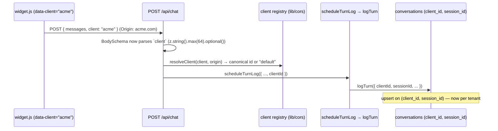
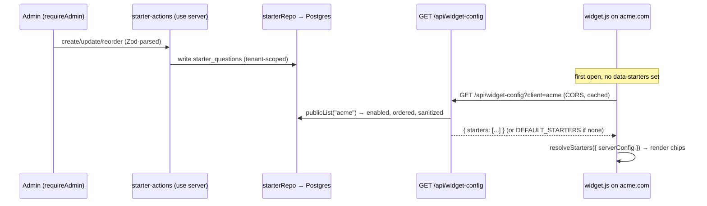

# Client-Rollout Features — the four deployment gaps

Client rollout is blocked by four **deployment-facing** features, not by the core chatbot logic (RAG, guardrails, streaming — built and QA'd, out of scope here). This document is the **full architecture + full implementation plan** for all four, written against the code as built today and matching the depth of the existing pillar plans (`docs/product/admin-dashboard.md`, `docs/product/widget.md`). It consolidates three self-contained plan sections (below); each gap has a complete architecture and a phased, testable implementation plan — **no partial coverage**.

> Ethos (inherited from `ARCHITECTURE.md` / `plan.md`): **right-sized, one deploy, add infrastructure only where a capability genuinely requires it.** None of the four gaps needs a new service — Supabase + Vercel, already live, cover all of them.

## The four gaps → the three plan sections

| # | Gap (as stated) | Covered by | Reality vs as-built |
|---|---|---|---|
| **1** | No embeddable widget (script/iframe snippet) | **§ A — Widget (embeddable)** | Fully planned; **backend Phase 0 already shipped** (`lib/cors.ts`, `lib/ratelimit.ts`, CORS/OPTIONS/403/rate-limit + `cadre_sid` in the route). Client bundle unbuilt. |
| **2** | No popup/floating launcher mode | **§ A — Widget (embeddable)** | The launcher bubble is part of the widget (`launcher.ts`); the current app is inline-only. Planned, unbuilt. |
| **3** | No conversation-history page (per user / per client) | **§ B — Conversation History** | Admin review **shipped** (Phases 1-3, session-grouped via `cadre_sid`); `client_id` in schema. Missing: the `client` hop from the widget, client-scoped reads, a client selector. |
| **4** | No suggested/starter ("maker") questions | **§ C — Maker Starter Questions** | Starter chips **exist but are hardcoded** (`SCENARIOS` in `app/page.tsx`), first-party-only, not in the widget, not configurable. |

## "Maker questions" — interpretation (you asked to confirm)

**Confirmed:** "maker questions" = the **starter/suggested prompt chips** shown when the chat first opens, **configured by the maker** — the client/operator who deploys the widget (or Cadre itself for the hosted page) — rather than hardcoded. The current six `SCENARIOS` chips become the built-in *default* tier of a precedence chain every maker can override. **If you instead meant** admin-authored Q&A pairs, or starters **auto-generated from the KB**, that is a different feature (a generator over `content/*.md`) — flag it and § C is re-scoped. This plan assumes operator-curated starters.

## The cross-cutting foundation (why the three sections rhyme)

Two shared seams unblock most of the list — the sections were written to converge on them, and two agents independently found the first:

1. **One backend hop unlocks per-tenant everything (gaps 1, 2, 3).** The widget is designed to send a `client` id in the request body, and `conversations.client_id` / `logTurn({ clientId })` already exist to store it — but `app/api/chat/route.ts` **never parses `client`** and `scheduleTurnLog()` **never passes `clientId`**, so every conversation collapses to `'default'`. Threading `client` (resolved fail-closed against the `lib/cors.ts` registry + `Origin`, never trusted raw) through the route → `logTurn` is the single highest-value change; it makes embed traffic auditable per tenant and is the prerequisite for the history feature. **Do it once, first.**

2. **Cross-site sessions must be body-carried, not cookie-carried (gaps 1, 3).** The `cadre_sid` cookie is `SameSite=Lax`, so it **cannot** group a widget's cross-site turns (and third-party cookies are being phased out). The widget must own a `sessionId` (`crypto.randomUUID()` in `localStorage`, per host origin) and send it in the body; the route prefers `body.sessionId` over the cookie. This keeps conversation grouping — and therefore per-user history — working for embeds.

3. **One source of truth for starters (gap 4).** A pure `lib/starters.ts` (`DEFAULT_STARTERS` + `sanitizeStarters` + `resolveStarters`) is consumed by both the React page and the bundled vanilla widget — the same "share the definition, not the component" discipline the widget uses for the wire protocol. Render labels via `textContent` in the widget (the XSS boundary).

## Consolidated build order

The gaps share a foundation, so the efficient order is **foundation first, then per-gap**:

```
FOUNDATION (small backend, unblocks 1/2/3):
  • route: BodySchema += client, sessionId  →  scheduleTurnLog  →  logTurn({ clientId, sessionId })
  • lib/cors.ts (or lib/clients.ts): resolveClient(client, origin) — fail-closed registry
  • lib/starters.ts: shared DEFAULT_STARTERS + sanitize + resolve (gap 4 Phase 0, zero infra)

THEN, independently:
  §A Widget + launcher (gaps 1,2)  — client-side bundle over the ready backend
  §B History per user/client (gap 3) — client-scoped reads + selector (needs the client hop)
  §C Maker starters (gap 4)         — widget snippet config; optional DB+admin editor
```

Each section below carries its own phased plan, tests, and rollback. The three are otherwise independent and can be built in any order after the foundation.

---
# Widget (Embeddable) — Reconciled Rollout Plan

An embeddable version of the Cadre AI support chatbot: a one-line `<script>` snippet a client
pastes into their marketing site or app, which renders a **floating launcher bubble** in a
bottom corner and a chat panel that talks to **our** existing `/api/chat` endpoint. No Cadre
code, no API keys, and no RAG data ever ship to the client's page beyond a tiny UI bundle — the
model, the embeddings, and the guardrails all stay server-side on our Vercel deployment.

> Design ethos (inherited from [`ARCHITECTURE.md`](../../ARCHITECTURE.md) and
> [`plan.md`](../../plan.md)): **right-sized, not over-engineered.** The widget is a thin DOM
> client over the wire protocol we already ship. It adds no new infrastructure. Where this doc
> and `plan.md` disagree, `plan.md` wins.

**This document supersedes [`docs/product/widget.md`](../product/widget.md).** That plan was
written *before* three things shipped: (1) the backend cross-origin layer (`lib/cors.ts`,
`lib/ratelimit.ts`, the `OPTIONS`/CORS/`403`/rate-limit wiring in `app/api/chat/route.ts`),
(2) the `cadre_sid` session cookie, and (3) the admin dashboard with **per-tenant conversation
logging** (`conversations.client_id`, `retrieval_traces`, `ConversationRepo.list({ clientId })`).
Those changes make most of the prior plan's "Phase 0" already **done**, correct several details
it got wrong, and — most importantly — give the widget's `client` id a **real destination** it
did not have before. This is a reconciliation: what is done, what changed, what remains.

---

## Current-state delta (the reconciliation core)

Everything below is verified against the code as it exists today.

| Area | Prior plan (`docs/product/widget.md`) said | As-built reality | Status |
|---|---|---|---|
| CORS resolver | `lib/cors.ts` NEW; env `WIDGET_ALLOWED_ORIGINS`; strict exact-match, **deny by default** | `lib/cors.ts` **built**; env is **`ALLOWED_ORIGINS`**; **allow-all by default** (empty/`*` ⇒ `ALLOW_ALL`); same-origin + no-Origin always allowed; `(origin, host)` signature | **DONE, CHANGED** |
| Expose-Headers | Added only inside the allowed branch | `corsHeaders` **always** emits `Access-Control-Expose-Headers` + `Allow-Methods` + `Allow-Headers` + `Vary`; only `Access-Control-Allow-Origin` is conditional (echo origin, or `*` in allow-all) | **DONE, IMPROVED** |
| Rate limiter | `lib/ratelimit.ts` NEW as a **no-op seam** in Tier 0 | `lib/ratelimit.ts` **built** as a **real** in-memory sliding window, `rateLimit(key)` keyed by **IP**, `RATE_LIMIT_PER_MIN` (default 30, `0` disables) | **DONE, CHANGED** |
| `/api/chat` CORS wiring | Add `OPTIONS`, per-origin ACAO, Expose-Headers, `Vary`, `403` short-circuit, rate-limit hook | All **built**: `OPTIONS` (204), `403` for disallowed origin *before* retrieval, `429` w/ `Retry-After`, CORS merged into every response path incl. 400/403/stub | **DONE** |
| `cadre_sid` cookie | (not envisioned — predates it) | Route mints an httpOnly, `SameSite=Lax; Secure`, 1-yr `cadre_sid`; used to group turns for the admin trace | **DONE (with a cross-origin caveat — see §7)** |
| `.env.example` | Document the origins env var | Documents **`ALLOWED_ORIGINS`** + **`RATE_LIMIT_PER_MIN`** under "Widget embedding & abuse controls" | **DONE** |
| `client` in request body | Add `client: z.string().max(64).optional()` to `BodySchema`; widget sends it in the body | **NOT done.** `BodySchema` is `{ messages }` only. The route never reads `body.client` and never threads it to logging | **TODO (small backend delta)** |
| `client` → logging destination | "used for logging + tenant routing (Tier 1 admin)" — aspirational | **Real now.** `logTurn({ clientId })` → `conversations.client_id` (`unique (client_id, session_id)`, defaults `'default'`); `ConversationRepo.list({ clientId })` filters by tenant. Route currently passes **no** `clientId`, so every embed logs as `'default'` | **DESTINATION DONE; wire TODO** |
| Persistence backend | "Tier 1 Upstash Redis" for logs + distributed rate limit | Project adopted **Supabase Postgres** (`lib/db.ts` `getDb()`, `postgres` lib, `sql.begin`), flag-gated by `RETRIEVAL_BACKEND`. **Upstash was not adopted** | **CHANGED (infra pick)** |
| Brand accent default | `data-color` default **`#0B5FFF`** (blue) | Brand is coral-red **`#db4545`** on a warm "sand" canvas (`app/globals.css`); there is no blue anywhere | **CHANGED (correct the default)** |
| Widget source `widget/` | NEW (Phase 1) | Does **not** exist | **TODO** |
| `public/widget.js` + demo | NEW built bundle + demo host page | `public/` dir does **not** exist yet | **TODO** |
| esbuild build step | `build:widget` esbuild script chained into `prebuild` | No `esbuild` dep, no script; `prebuild` runs `scripts/embed.ts` only | **TODO** |
| Cache headers for `/widget.js` | `next.config.mjs` `headers()` block | `next.config.mjs` has no `headers()` (only `outputFileTracingRoot`) | **TODO** |
| iframe fallback | `app/embed/page.tsx` + `components/Chat.tsx` (Phase 3) | Neither exists | **TODO (optional)** |
| Escalation CTA link | (assumed fine) | Inline UI uses **relative** `href="/contact"` — resolves to `acme.com/contact` when embedded. Must be **absolute** to our origin in the widget | **NEW correction (TODO)** |

**Headline finding.** The backend cross-origin surface the prior plan called its critical
Phase 0 is **already shipped and correct** — a hand-written cross-origin `fetch` works against
`/api/chat` today (in the default allow-all mode). The one meaningful *remaining* backend gap is
tiny and specific: the route does not yet accept a **`client`** (and, per §7, a **`sessionId`**)
in the request body and thread them into `logTurn`. Both ends of that wire exist (the widget can
send them; `conversations.client_id`/`session_id` can store them) — they are simply not
connected. Wiring them is what turns "the widget works" into "the widget's traffic is auditable
per tenant in the admin dashboard."

---

## Architecture

### 1. Where we are today

`POST /api/chat` is a stateless streaming endpoint (custom **plain-text stream**, not the AI-SDK
UI protocol) that already treats cross-origin embeds as a first-class caller:

- **CORS is live.** `OPTIONS` returns `204` with `corsHeaders(origin, host)`. Every response
  (including `400`/`403`/`429`, the deterministic stub, and the streamed answer) carries
  `Access-Control-Expose-Headers: x-cadre-mode, x-cadre-reason, x-cadre-sources, x-cadre-topscore`
  and `Vary: Origin`, so a cross-origin reader can see the guardrail metadata — the exact
  correctness fix the prior plan flagged as most-easily-missed. It is done.
- **Access control is live but open by default.** `isOriginAllowed(origin, host)` returns `true`
  when `ALLOWED_ORIGINS` is unset/`*` (**allow-all**), when the request is **same-origin**, or
  when there is **no `Origin`** (curl/server-to-server). Otherwise it must be in the list. A
  disallowed browser origin is `403`'d *before* retrieval or the model runs.
- **Cost cap is live.** `rateLimit(ip)` — a real (per-instance, in-memory) sliding window,
  `RATE_LIMIT_PER_MIN` default 30 — returns `429 + Retry-After` when exceeded.
- **Turns are logged.** After the stream flushes, `after(() => logTurn(...))` writes a
  `conversations` row (upsert on `unique (client_id, session_id)`), two `messages`, one
  `retrieval_traces`, and N `retrieval_chunks` (the full ranked trace, incl. retrieved-but-not-
  cited). `logTurn` is best-effort: `getDb()` throwing (e.g. bundle backend, no `DATABASE_URL`)
  is caught and swallowed, so chat never breaks.
- **The wire contract is frozen and correct.** POST `{ messages }`, read `text/plain` via a
  `ReadableStream` reader + `TextDecoder`, read four `x-cadre-*` headers. This is exactly what
  `app/page.tsx` does and exactly what the widget will mirror.

The widget is therefore a **second client over an already-cross-origin-ready contract**. It adds
no backend capability; it needs one small backend *extension* (body-carried `client` +
`sessionId`) and an entirely client-side UI bundle.

### 2. Components

```
widget/                         # TODO — widget source (plain TS, esbuild → IIFE)
  src/
    index.ts                    # entry: reads data-* / window.CadreChat, boots the widget
    config.ts                   # WidgetConfig type + attribute/object parsing + defaults (§5)
    host.ts                     # host <div> + attachShadow({mode:"open"}) + adopted stylesheet
    launcher.ts                 # floating bubble: open/close state, unread badge, a11y
    panel.ts                    # chat panel: transcript, composer, scenario chips, escalation CTA
    transport.ts                # fetch → /api/chat, stream reader + x-cadre-* parsing
    session.ts                  # localStorage sessionId + history, PER host origin (§7)
    styles.ts                   # scoped CSS string echoing the brand tokens (§5)
  README.md

public/                         # TODO — dir does not exist yet
  widget.js                     # built bundle (stable URL the client pastes)
  widget-demo.html              # cross-origin local test harness (served on another port)

app/
  api/chat/route.ts             # CHANGE (small) — accept optional `client` + `sessionId` in
                                #   BodySchema; thread both into scheduleTurnLog → logTurn.
                                #   CORS / OPTIONS / 403 / rate-limit / cadre_sid: ALREADY DONE.
  embed/page.tsx                # TODO (Phase 3, optional) — chromeless route for the iframe fallback

lib/
  cors.ts                       # DONE — origin allowlist + corsHeaders (env: ALLOWED_ORIGINS)
  ratelimit.ts                  # DONE — in-memory sliding window (env: RATE_LIMIT_PER_MIN)
  trace.ts                      # DONE — logTurn() already accepts clientId (defaults "default")

components/
  Chat.tsx                      # TODO (Phase 3, optional) — chat UI extracted from app/page.tsx,
                                #   reused by the hosted page AND the /embed iframe route

next.config.mjs                 # CHANGE — add headers() for /widget.js caching (§9)
package.json                    # CHANGE — esbuild dev dep + build:widget, chained into prebuild
```

The **hosted app** (`app/page.tsx`, React) and the **widget** (`widget/`, vanilla) stay two thin
clients over one wire contract. The small duplication is deliberate: React is right for our own
first-party page; a zero-dependency vanilla bundle is right for code that runs on someone else's
page. The frozen shared thing is the **protocol**, not the component.

### 3. Delivery: `<script>` loader (default) vs `<iframe>` (fallback)

Unchanged from the prior plan and still correct. **Recommend the script-tag loader with Shadow
DOM** as the default; ship the **iframe** as a strict-isolation fallback (Phase 3, optional).

The one-line snippet a client pastes before `</body>`:

```html
<script src="https://chat.gocadre.ai/widget.js" data-client="acme" async></script>
```

The script: finds its own tag via `document.currentScript`, reads `data-*`, appends one host
`<div>` to `document.body`, calls `attachShadow({ mode: "open" })`, adopts a constructable
stylesheet, renders the launcher bubble, and on first open mounts the panel and wires the
composer to `fetch("https://chat.gocadre.ai/api/chat")`. Loading a cross-origin `<script>` needs
no CORS; only the later `fetch` is CORS-governed — and that path is already built.

Why the loader over the iframe as default (condensed): the loader gives us a **floating launcher
we fully control** (small when closed, large when open, animatable) — the exact interaction model
a support bubble needs — with strong-enough style isolation via Shadow DOM and no `postMessage`
resize SDK. The iframe wins only on hard JS-realm sandboxing and CSP shape (`frame-src` vs
`script-src`); we keep it as the escape hatch for hostile-CSS hosts.

### 4. Isolation: Shadow DOM

Unchanged and still the right call:

- **Open shadow root** (`mode: "open"`) — `closed` buys nothing against a hostile *host* (it can
  monkeypatch `attachShadow` before us) and costs debuggability. Nothing sensitive lives in the
  DOM; the secret is server-side.
- **Adopted stylesheet, not inline `<style>`** — build a `CSSStyleSheet`, `replaceSync(css)`,
  assign `shadowRoot.adoptedStyleSheets = [sheet]`. This is **CSP-friendly**: no `<style>`
  element, so the host does not need `style-src 'unsafe-inline'`. Fall back to a `<style>` node
  only where `adoptedStyleSheets` is unavailable.
- **`:host { all: initial }`** then re-declare, so the host cascade can't leak `font`,
  `line-height`, `color`, `box-sizing`, etc. into our tree.
- **System font stack** — no web-font request (would hit host CSP; a data-URI font would bloat
  the bundle). The brand ships Inter / Inter Tight, but a system stack is the right divergence for
  third-party code; documented.
- **Stacking:** host `<div>` at `position: fixed; z-index: 2147483000` with a fixed corner offset.
- Shadow DOM does **not** sandbox JS or globals — accepted; that's what the iframe fallback is for.

### 5. Config and theming (frozen interface)

Two optional inputs, precedence **`window.CadreChat` › `data-*` › built-in defaults**. Only
`client` is effectively required for per-tenant logging.

**(a) declarative `data-*`:**

```html
<script
  src="https://chat.gocadre.ai/widget.js"
  data-client="acme"
  data-color="#db4545"
  data-position="bottom-right"
  data-greeting="Hi! Ask me anything about Cadre AI."
  data-launcher-label="Chat with us"
  async
></script>
```

**(b) `window.CadreChat` object** (for runtime-computed values), set **before** the loader tag.

**Frozen `WidgetConfig` (corrected against the brand):**

```ts
// widget/src/config.ts
export type WidgetConfig = {
  client: string;                         // tenant id → sent in the POST body → conversations.client_id
  apiBase: string;                        // default: origin widget.js was served from (currentScript.src)
  color: string;                          // brand accent; DEFAULT "#db4545" (coral-red, NOT "#0B5FFF")
  position: "bottom-right" | "bottom-left";
  greeting: string;
  launcherLabel: string;
  theme: "auto" | "light" | "dark";       // default "auto" → prefers-color-scheme
  contactUrl: string;                     // ABSOLUTE escalation CTA; default `${apiBase}/contact`
};
```

Corrections vs the prior plan:

1. **Default `color` is `#db4545`** (coral-red), matching `app/globals.css` (`--red`). The prior
   plan's `#0B5FFF` blue does not appear anywhere in the product.
2. **`contactUrl` is new and required to be absolute.** The inline UI's escalation CTA is
   `href="/contact"` — a relative path that resolves to `acme.com/contact` inside an embed. The
   widget MUST resolve it to **our** origin (`${apiBase}/contact`), with `mailto:hello@gocadre.ai`
   as the secondary action (already absolute).
3. **`apiBase` auto-derives** from `document.currentScript.src`, so staging vs prod "just works"
   and clients never configure a URL. Unchanged and correct.

The **scoped CSS** in `styles.ts` should echo the brand tokens as literal values (it cannot read
the host's CSS variables): sand surfaces (`#faf9f6` / dark `#14110e`), ink text, the single coral
accent (`#db4545` / dark `#ef5a5a`), pill radius (`999px`) for interactive and `14px` for
cards/bubbles, and the tinted soft shadows — mirroring the look of `app/page.tsx` so an embed
reads as the same product. `theme:"auto"` follows `prefers-color-scheme`, same as the app.

### 6. Transport and data flow

The widget reuses the **exact** consumption logic proven in `app/page.tsx`: POST JSON, read the
streamed `text/plain` body with a `ReadableStream` reader + `TextDecoder`, and read the four
`x-cadre-*` headers to drive escalation UI. The metadata contract is unchanged:

| Header | Meaning | Widget use |
|---|---|---|
| `x-cadre-mode` | `answer` \| `refuse` \| `escalate` | escalation styling + CTA (mode ∈ {refuse, escalate}) |
| `x-cadre-reason` | e.g. `weak_retrieval`, `grounded_offline` | debug / admin trace |
| `x-cadre-sources` | JSON array of KB filenames | "Sources:" pills |
| `x-cadre-topscore` | top cosine score | admin trace |

**Request body — the one contract change.** Today `app/page.tsx` posts `{ messages }`. The widget
posts `{ messages, client, sessionId }`; the route must accept the two new optional fields and
thread them into `logTurn`. Concretely, in `app/api/chat/route.ts`:

```ts
const BodySchema = z.object({
  messages: z.array(/* unchanged */).min(1).max(40),
  client: z.string().min(1).max(64).optional(),      // ADD → conversations.client_id
  sessionId: z.string().min(8).max(128).optional(),  // ADD → grouping key for embeds (see below)
});
// …then in scheduleTurnLog(): pass clientId: parsed.client, and prefer parsed.sessionId over the cookie sid.
```

`logTurn` already takes `clientId` (defaults `"default"`) and `sessionId`, and
`conversations`'s `unique (client_id, session_id)` already scopes turns per tenant — so this is a
~3-line wiring change with a real, already-built destination. The `client` id is for **logging /
tenant routing only, never security** (§7).

**Sequence (as-built + the small delta):**

```mermaid
sequenceDiagram
    participant U as User on acme.com
    participant W as widget.js (Shadow DOM)
    participant R as /api/chat (nodejs, Vercel)
    participant K as retrieve → decide → stream
    participant DB as Supabase (after())

    Note over W: <script data-client="acme"> loads (no CORS on script)
    U->>W: click bubble, type question
    W->>R: OPTIONS /api/chat (preflight: JSON body)
    R-->>W: 204 + Allow-Origin/Methods/Headers + Expose-Headers + Vary   [DONE]
    W->>R: POST {messages, client:"acme", sessionId:"<localStorage>"}  (Origin: https://acme.com)
    R->>R: isOriginAllowed(origin, host)? → else 403 before model        [DONE]
    R->>R: rateLimit(ip)? → else 429 + Retry-After                       [DONE]
    R->>K: retrieveText → decide → (answer? streamText : deterministic text)
    K-->>R: text stream + {mode, reason, sources, topScore}
    R-->>W: 200 stream + x-cadre-* + Expose-Headers (readable X-origin)   [DONE]
    W->>U: render streamed answer; if mode∈{refuse,escalate} show CTA (→ absolute contactUrl)
    R->>DB: after(): logTurn(clientId:"acme", sessionId, decision, results)  [DESTINATION DONE; client/sessionId wire = TODO]
    W->>W: persist conversation to localStorage (keyed per acme.com origin)
```

### 7. Session identity across origins (a correction the prior plan could not have made)

The prior plan predated the `cadre_sid` cookie, so it never addressed a real cross-origin
problem: **the server-set `cadre_sid` cookie cannot group widget conversations.**

- The cookie is `SameSite=Lax; Secure`. A widget `fetch` from `acme.com` to `chat.gocadre.ai` is a
  **cross-site** request. The hosted app's `fetch` sends no `credentials`, so its default
  (`same-origin`) means cookies are **not sent** and the response `Set-Cookie` is **not stored**
  cross-origin. Even with `credentials:"include"`, a `SameSite=Lax` cookie is dropped in a
  cross-site context, and third-party cookies are being deprecated (Safari ITP, Chrome).
- Consequence if unaddressed: every widget turn arrives with **no cookie**, the route mints a
  **new** `sid` each time, and `logTurn` writes each turn as its **own** conversation — grouping
  breaks for exactly the traffic the admin dashboard most needs to see.

**Right-sized fix (no third-party cookies).** The widget owns its session id **client-side**:
`session.ts` generates `crypto.randomUUID()` on first use, persists it in `localStorage` **keyed
per host origin**, and sends it as `sessionId` in the POST body. The route **prefers
`body.sessionId`** when present and falls back to the `cadre_sid` cookie for the same-origin app.
This keeps conversation grouping working for embeds with zero cookie/CORS-credentials complexity,
and it composes cleanly with the existing `unique (client_id, session_id)` upsert. (We do **not**
switch to `SameSite=None` + `Access-Control-Allow-Credentials` — that fights cookie deprecation
and would forbid the `ACAO: *` allow-all default. Body-carried id is simpler and durable.)

### 8. Per-client `client` id → tenant logging (the admin-dashboard reconciliation)

This is the capability the prior plan promised but had no home for; it now has one:

- `conversations`, `messages`, `retrieval_traces`, `kb_chunks` are all **tenant-scoped**
  (`client_id text not null default 'default'`), and `ConversationRepo.list({ clientId })` already
  filters by tenant. The admin dashboard (a signed-cookie `ADMIN_PASSWORD` gate) can therefore
  show "conversations from acme" the moment embeds send a real `client`.
- Until the route threads `body.client` through, **all** embed traffic logs under `'default'` and
  is indistinguishable from the hosted app in the dashboard. Wiring `client` (§6) is what makes
  embeds auditable per tenant — the payoff that justifies the tiny backend change.
- Trust boundary is unchanged: `client` is a **routing label**, not a credential. Access control
  is the `Origin` allowlist (§9), which the browser sets and page JS cannot forge.

### 9. Security

1. **No secret exposure.** Keys are server-only env (`lib/config.ts` reads `process.env.*` inside
   route handlers). The widget bundle contains only the public API URL and the `client` label. The
   LLM is never called from the browser. Unchanged, verified.

2. **Origin allowlist — reality vs the plan.** The prior plan described a **deny-by-default**
   allowlist. The as-built default is **allow-all** (`ALLOWED_ORIGINS` unset ⇒ `ALLOW_ALL` ⇒ every
   origin allowed, `ACAO: *`). This is the correct dev default (nothing 403s before lockdown) but
   is a **rollout gate, not a finished control**:
   - **Before a pilot goes live, set `ALLOWED_ORIGINS`** to the client's exact origins (e.g.
     `https://acme.com,https://www.acme.com`). Then `corsHeaders` echoes the single matched origin
     (never `*`), same-origin app requests still pass (via `isSameOrigin`), and any other browser
     origin is `403`'d before the model runs.
   - Because CORS is browser-enforced, it does not stop a `curl`/server caller (no `Origin` ⇒
     allowed by design) from spending budget — which is why it is **paired with the rate limiter**,
     and why a signed per-client token remains the documented next hardening step if abuse appears.

3. **Rate limiting — reality vs the plan.** The prior plan said Tier 0 ships a **no-op**. It
   actually ships a **real** in-memory sliding window (`rateLimit(ip)`, `RATE_LIMIT_PER_MIN`
   default 30). Caveat unchanged: per serverless instance, so it caps a single hot instance, not a
   distributed flood. The distributed upgrade is a shared store — and note the project standardized
   on **Supabase**, not Upstash, so the distributed limiter should be a Supabase-backed counter (or
   Upstash if later justified), keyed by `(client, ip)`. Right-sized: keep the in-memory limiter
   for pilots; add the shared store only when a pilot's volume warrants it.

4. **CSP guidance for the client's site.**
   - Shadow-DOM widget: allow `script-src https://chat.gocadre.ai` and
     `connect-src https://chat.gocadre.ai`. Because we use **adopted stylesheets** (not inline
     `<style>`), no `style-src 'unsafe-inline'` is required.
   - iframe fallback: allow `frame-src https://chat.gocadre.ai` (or `child-src`) instead of
     `script-src`; styles live in our document, so host `style-src` is irrelevant.
   - We load no web fonts and no remote images (SVG inlined), so no `font-src`/`img-src` additions.

5. **Input bounds already enforced.** The Zod schema (`messages` ≤ 40, each `content` ≤ 4000) is
   untouched; we add only `client: z.string().max(64).optional()` and
   `sessionId: z.string().max(128).optional()`.

6. **No SRI on the stable loader URL** (it must stay mutable so we can ship fixes without clients
   editing their snippet). Offer version-pinned immutable bundles (`widget.v1.js`) for SRI-conscious
   clients instead (§10, Phase 4).

### 10. Build and hosting

- **Bundle:** plain TypeScript compiled by **esbuild** to a single minified IIFE — no React
  (~40 KB saved), no runtime deps; `crypto.randomUUID()` covers ids. Target < 20 KB gzipped.

  ```bash
  esbuild widget/src/index.ts --bundle --minify --format=iife \
    --target=es2020 --outfile=public/widget.js
  ```

  Add as `"build:widget"` in `package.json`, add `esbuild` as a dev dep, and **chain it into the
  existing `prebuild`** (which today runs only `tsx scripts/embed.ts`) so `pnpm build` emits both
  the RAG artifact and `public/widget.js`. Note `public/` does not exist yet — the build creates it.

- **Hosting:** serve straight from `public/` on the **same Vercel deployment** as the app, so the
  widget's origin equals the API origin and `apiBase` auto-derives. No separate CDN, no build
  service. Vercel's Edge Network caches static assets globally.

- **Cache + versioning (TODO — `next.config.mjs` currently has no `headers()`):**

  ```js
  // next.config.mjs — add to nextConfig (keep the existing outputFileTracingRoot)
  async headers() {
    return [
      { source: "/widget.js", headers: [
        { key: "Cache-Control", value: "public, max-age=300, s-maxage=3600, stale-while-revalidate=86400" },
        { key: "Content-Type", value: "text/javascript; charset=utf-8" },
      ]},
      { source: "/widget.:ver(v[0-9]+).js", headers: [
        { key: "Cache-Control", value: "public, max-age=31536000, immutable" },
      ]},
    ];
  }
  ```

  Stable `/widget.js` gets a short TTL (so fixes propagate); breaking changes ship as a new pinned
  `widget.v2.js` and clients migrate. `widget.js` always points at the current stable major.

### 11. Rejected alternatives (carried forward, still valid)

| Option | Verdict | Why |
|---|---|---|
| iframe as the default | Rejected (kept as fallback) | Can't auto-size the launcher; forces a `postMessage` SDK; heavier. Shadow DOM gives the bubble UX with strong-enough isolation. |
| Bundle React into the widget | Rejected | ~40 KB+ on a page we don't own. Vanilla DOM keeps it < 20 KB. React stays only for the `/embed` route (Phase 3). |
| Call the LLM from the browser | Rejected (hard rule) | Would expose the key. All model calls stay behind `/api/chat`. |
| `Access-Control-Allow-Origin: *` **in production** | Rejected for GA | Fine as the dev default; before a pilot, lock `ALLOWED_ORIGINS`. Any-site embed drains spend. |
| Third-party `cadre_sid` cookie for embed grouping | Rejected | `SameSite=Lax`/third-party-cookie deprecation makes it unreliable cross-site. Client-owned `sessionId` in the body instead (§7). |
| Per-client build / subdomain | Rejected | Over-engineered at this scale. One bundle + a `client` param + an env allowlist covers many tenants. |
| Signed per-client token (JWT/HMAC) now | Deferred | Origin allowlist + rate limit is right-sized. Tokens are the next hardening step if abuse appears. |
| New vector DB / infra for the widget | Rejected | The widget changes the transport surface, not retrieval. RAG stays as-is. |
| Upstash for the distributed rate limit | Reconciled | Project standardized on Supabase; use a Supabase counter (or Upstash only if later justified). |

---

## Implementation Plan

Phased so each slice ships independently. Phase 0 is **mostly done**; the remaining work is
client-side plus a tiny backend delta. Effort is rough solo-dev calendar time.

### Phase 0 — Backend cross-origin support — **~90% DONE**

Already shipped (verify, don't rebuild):

- [x] `lib/cors.ts` — `isOriginAllowed` / `corsHeaders` (env `ALLOWED_ORIGINS`, allow-all default,
      same-origin + no-Origin pass, always-Expose-Headers).
- [x] `lib/ratelimit.ts` — real in-memory sliding window (`RATE_LIMIT_PER_MIN`, default 30).
- [x] `app/api/chat/route.ts` — `OPTIONS` (204), `403` before model for disallowed origin, `429`
      w/ `Retry-After`, CORS merged into every response, `cadre_sid` cookie.
- [x] `.env.example` — documents `ALLOWED_ORIGINS` + `RATE_LIMIT_PER_MIN`.

Remaining backend delta (small):

- [ ] Extend `BodySchema` with `client` and `sessionId` (both optional, bounded).
- [ ] Thread `client` → `scheduleTurnLog` → `logTurn({ clientId })`; **prefer `body.sessionId`**
      over the `cadre_sid` cookie for the grouping key (§7).
- [ ] `next.config.mjs`: add the `headers()` block for `/widget.js` (§10).
- **Tests (Vitest, extends existing):** body parses with/without `client`+`sessionId`; `client`
      reaches `logTurn` (mock `getDb`); `sessionId` from body wins over cookie; re-confirm existing
      `OPTIONS`/`403`/`429`/Expose-Header tests stay green.
- **Exit:** a `curl` with `Origin: https://allowed.example` and a `{messages, client, sessionId}`
      body streams an answer and writes a `conversations` row with `client_id = "acme"`.

### Phase 1 — Vanilla widget MVP (1.5–2 days)

- [ ] `widget/src/`: `config.ts` (parse `data-*` + `window.CadreChat` + defaults, incl. `#db4545`
      accent and absolute `contactUrl`), `host.ts` (host div + open shadow root + adopted
      stylesheet), `styles.ts` (scoped CSS echoing the brand tokens), `launcher.ts` (bottom-corner
      bubble + open/close), `panel.ts` (transcript + composer + the six `SCENARIOS` chips +
      escalation CTA to the **absolute** contact URL, mirroring `app/page.tsx`), `transport.ts`
      (POST `{messages, client, sessionId}` + stream reader + `x-cadre-*` parsing), `session.ts`
      (localStorage `sessionId` + history, keyed per host origin), `index.ts` (boot).
- [ ] `package.json`: `esbuild` dev dep + `build:widget`; chain into `prebuild`.
- [ ] `public/widget-demo.html`: a fake host page served on a **different** origin/port to
      exercise real cross-origin + CORS locally.
- **Deps:** `esbuild` (dev) only. No runtime deps.
- **Exit:** paste the snippet into the demo page on another origin → bubble appears in the corner,
      panel opens, a question streams a grounded answer, sources pills render, escalation shows the
      CTA (pointing at `chat.gocadre.ai/contact`, not the host), refresh restores the conversation,
      and the turn appears in `/admin` under `client_id = "acme"`.

### Phase 2 — Launcher UX, theming, mobile, a11y, unread (1 day)

- [ ] Launcher: closed bubble ↔ open panel transition; `data-position` corner; `prefers-reduced-
      motion` respected.
- [ ] Apply `color`/`greeting`/`launcherLabel`/`theme` to CSS vars; `theme:"auto"` follows
      `prefers-color-scheme` (light/dark parity with the app).
- [ ] Mobile (< ~480px): full-screen panel (`position: fixed; inset: 0`), safe-area insets, lock
      host body scroll while open, larger tap targets.
- [ ] a11y: focus trap in the open panel, `Esc` to close, `aria-live="polite"` transcript,
      labelled launcher/close buttons.
- [ ] Unread badge: increment when an answer completes while the panel is closed.
- **Exit:** correct on light/dark host pages, keyboard-usable, usable on a phone viewport.

### Phase 3 — iframe fallback (0.5–1 day, optional)

- [ ] Extract `components/Chat.tsx` from `app/page.tsx`; render it in both `app/page.tsx` (full
      chrome) and a new chromeless `app/embed/page.tsx` (reads `?client=`).
- [ ] Loader `data-mode="iframe"` branch: inject the bubble + an `<iframe src="/embed?client=…">`
      with a minimal `postMessage` bridge (`open`/`close`/`unread`/`resize`).
- [ ] Document the CSP delta (`frame-src` instead of `script-src`).
- **Exit:** a client that blocks injected scripts embeds via the iframe path with the same UX.

### Phase 4 — Hardening + rollout (0.5 day)

- [ ] Distributed rate limit keyed on `(client, ip)` backed by **Supabase** (a counter table) —
      only if a pilot's volume warrants it; the in-memory limiter is the default.
- [ ] Publish version-pinned `widget.v1.js` (immutable cache) for SRI-conscious clients.
- [ ] Client-facing integration page (snippet + CSP + the `client` id) distilled from §5/§9.
- **Rollout:**
  1. Internal `widget-demo.html` on a second origin.
  2. Add the pilot's exact origins to **`ALLOWED_ORIGINS`** (a config change — instant, no widget
     redeploy) and set a real `data-client`.
  3. Verify the pilot's turns appear in `/admin` filtered by `client_id`.
  4. GA. **Roll back** by removing the origin from `ALLOWED_ORIGINS` (instant) or reverting
     `widget.js`.

### Testing summary

| Layer | Tool | Coverage |
|---|---|---|
| Unit | Vitest | config precedence/parsing (incl. `#db4545` default + absolute `contactUrl`); `isOriginAllowed`/`corsHeaders` (allow-all, same-origin, listed, disallowed); session (de)serialize; stream + header parsing. |
| Integration | Vitest | `/api/chat`: `OPTIONS` preflight, per-origin ACAO, Expose-Headers present, `403` for disallowed origin, `429` over the limit, `client`+`sessionId` parse and reach `logTurn`, `sessionId` (body) beats cookie. |
| E2E | Playwright | load `widget.js` on a **different-origin** host page → open, send, stream, sources, escalation CTA points at our origin, localStorage persistence across reload, mobile viewport, `Esc`/focus-trap; assert the turn is logged under the tenant. |
| Manual | — | Shadow-DOM isolation against a hostile-CSS host; light/dark; iframe fallback. |

Meets the ≥80% bar via Phase 0/1 unit + integration; Playwright covers the cross-origin flow.

### Sequencing and effort

```
Phase 0 (backend)  ── ~90% DONE; ~2h to wire client/sessionId + cache headers
Phase 1 (widget MVP)          2d   ← Tier-0-useful after this
Phase 2 (launcher/theme/a11y) 1d
Phase 3 (iframe fallback)     1d   (optional / on-demand)
Phase 4 (hardening + rollout) ½d
                        ─────────
                        ~4–5 days of client-side work; the backend is essentially ready.
```

---

## Sources

- Shadow DOM for third-party embeds / style isolation:
  [Courier](https://www.courier.com/blog/how-to-use-the-shadow-dom-to-isolate-styles-on-a-dom-that-isnt-yours),
  [dev.to](https://dev.to/smy/shadow-dom-the-ultimate-solution-for-embedding-third-party-html-without-css-conflicts-1g2g).
- CORS in Next.js (per-origin allowlist, avoid `*`, preflight):
  [LogRocket](https://blog.logrocket.com/using-cors-next-js-handle-cross-origin-requests/),
  [Wisp — Next.js 15 CORS](https://www.wisp.blog/blog/handling-common-cors-errors-in-nextjs-15).
- Cross-site cookies / `SameSite` + third-party cookie deprecation (why embed sessions must be
  body-carried): [MDN SameSite](https://developer.mozilla.org/en-US/docs/Web/HTTP/Headers/Set-Cookie/SameSite),
  [Chrome third-party cookie phase-out](https://developers.google.com/privacy-sandbox/3pcd).
- Vercel static-asset caching / immutable + versioned filenames:
  [Vercel Edge Network caching](https://vercel.com/docs/edge-network/caching).

---

# Conversation History — Per-User and Per-Client Review

Product plan for reviewing **past chat sessions after the fact**, scoped to a specific end-user *and* to a specific client tenant. Two halves, matching the house style: a full **Architecture** description, then a full **Implementation Plan**. It is written against the code as built today (`app/api/chat/route.ts`, `lib/trace.ts`, `lib/admin/repos.ts`, `lib/admin/contracts.ts`, `app/admin/(protected)/conversations/*`, `db/schema.sql`) and stays inside the project ethos: **right-sized, one deploy, add infrastructure only where a capability genuinely requires it.** Supabase Postgres (via the `postgres` lib, `lib/db.ts getDb()`) is already live; **this plan adds no new infrastructure.**

This is an **extension, not a greenfield build.** The persistence, the schema, the repositories, and the admin conversation list + detail all exist and ship today. Gap #3 is closed almost entirely by *connecting seams that are already cut* — the one meaningful new capability is that the widget's tenant id must actually reach the log.

> **Coordination with the widget plan and the tenancy plan.** The widget's `client` param and origin allowlist are owned by [`widget.md`](./widget.md); tenant-wide isolation posture (RLS, per-client keys) is owned by [`shared-infra-and-tenancy.md`](./shared-infra-and-tenancy.md). This document owns the **history/review surface**: how `client_id` flows from the widget into the conversation log, and how the admin browses that log per client and per session. It references those two through their existing seams and does not re-specify them.

---

## Architecture

### 1. Where we are today (the current-state delta)

The observability layer is **already built and logging.** Every chat turn is persisted best-effort via `logTurn()` (scheduled in `after()` so it never blocks the stream), writing `conversations → messages → retrieval_traces → retrieval_chunks`. The admin dashboard already lists conversations (`/admin/conversations`) and drills into a full transcript + retrieval-trace panel (`/admin/conversations/[id]`), plus a review queue and a KB-gap view. The schema was **tenant-scoped from day one**: `conversations` carries both `client_id` (the tenant) and `session_id` (the per-browser `cadre_sid` cookie), with `unique (client_id, session_id)`.

So the raw material for per-user and per-client history is present. What is missing is narrow and specific:

| Capability | Built today | The gap this plan closes |
|---|---|---|
| **Persist a session's turns** | ✅ `logTurn` upserts one `conversations` row per `(client_id, session_id)`; a browser's turns accumulate into it. | — (works) |
| **Review one session after the fact** | ✅ `/admin/conversations/[id]` renders the full transcript + per-turn trace. | Not labeled *as* a session; no way to find a conversation by its `session_id`. |
| **Group turns by end-user** | ⚠️ A conversation **is** a user session (1:1 with `cadre_sid`). | No cross-session identity: a cleared/rotated cookie becomes a new "user". No stable `end_user_id`. |
| **Scope history to a client tenant** | ⚠️ `conversationRepo.list()` **already accepts `clientId`** and filters on it. | Nothing ever writes a non-`default` `client_id`, the list page never passes `clientId`, and there is no client selector. |
| **Isolate detail/queue/gaps per client** | ❌ `getDetail()` fetches *across any tenant*; `flagRepo.queue()` and `gapRepo.gaps()` take no `clientId`. | Reads leak across tenants; needs client scoping for correctness and future per-client admins. |

**The root cause of the whole per-client gap is a single unplumbed hop.** `lib/trace.ts` computes `const clientId = input.clientId ?? DEFAULT_CLIENT` where `DEFAULT_CLIENT = "default"`. `input.clientId` is an *optional* field that the caller never supplies: `app/api/chat/route.ts` `scheduleTurnLog()` calls `logTurn({...})` **without** `clientId`, and the route's `BodySchema` does not even parse the widget's `client` field. The widget plan (`widget.md` §5) already specifies sending `client` in the request body — but that value is dropped on the floor at the API boundary. **Result: every conversation, from every tenant's widget, collapses into the `default` bucket.** Per-client history is impossible until that hop is connected. This is the single most important change in this document (§3).

The per-*user* dimension is in better shape: because `(client_id, session_id)` is unique and `logTurn` upserts, **one user session already maps 1:1 to one `conversations` row.** The "per user" view is therefore mostly the conversation detail we already ship — the work there is labeling it as a session, making it findable by `session_id`, and documenting the honest limit that anonymous `cadre_sid` ≠ an authenticated user.

### 2. The three dimensions, precisely

**Per user = per `session_id`.** The `cadre_sid` httpOnly cookie (minted in `readOrCreateSid()`, `SameSite=Lax; Secure; Max-Age=1y`) groups one browser's turns. A `conversations` row *is* a user session. This is the right primitive for "review what this visitor asked", and it is deliberately **anonymous** — no PII in the id, consistent with the app's no-visitor-auth stance.

- *Its limit:* a cleared cookie, a second device, or incognito starts a fresh session, so `session_id` is a *session* identity, not a durable *person* identity. We do not paper over this.
- *Upgrade path (deferred):* add a nullable `conversations.end_user_id text`. When a host page embeds the widget for a **logged-in** user, it can pass a stable id (`window.CadreChat.userId` / `data-user-id` → request body → `logTurn`), and the admin can then group multiple sessions under one end-user. Until an embedder supplies that, the column stays null and the session view is the user view. Documented, not built (Phase 4).

**Per client = per `client_id`.** The tenant that owns the widget. Today the column exists and defaults to `default`; once §3 lands, each tenant's turns land under their own id. The admin then needs (a) a client selector that scopes the whole dashboard, (b) client-scoped reads in every repo, and (c) a per-client history view (which is just the existing list, filtered).

**Optional end-user-facing history ("your past chats").** *Deferred, deliberately.* The widget already plans `localStorage` persistence per host origin (`widget.md` §2, `session.ts`) — that covers "resume my chat in this browser" with zero backend and zero PII exposure. A *server-backed* "your past chats across devices" would require authenticating the end-user (to prove which `session_id`/`end_user_id` is theirs) and a public read endpoint over the log — new auth surface, new PII-exposure surface, and cross-origin auth on a third-party page. That is a materially larger, riskier feature than admin-side review and is **out of scope for this gap**; localStorage covers the near-term need. If it is ever prioritized it rides on the `end_user_id` upgrade above plus a scoped, authenticated read API — noted as future work, not designed here.

### 3. The core change: `client_id` end to end

Everything per-client hinges on threading the widget's tenant id from the browser to the log. The path is short and every hop already exists except the wiring:



Two guards make this safe rather than a spoofing hole:

1. **Validate `client` against a registry, never trust the raw string.** A request body is attacker-controlled; an unbounded free-text `client` would let anyone poison another tenant's logs or explode `client_id` cardinality with junk tenants. `client` must be resolved against the **known-client registry** (the same set that backs the widget origin allowlist in `lib/cors.ts`) and, ideally, cross-checked against the request `Origin`. Unknown/mismatched → fall back to `default` (fail-closed to the single-tenant bucket, never to *another* tenant). This reuses the allowlist the widget plan already requires — no new config surface.
2. **`Origin` is the trust anchor, `client` is the label.** As `widget.md` §5/§7 already establishes, security lives on the browser-set `Origin` header (unforgeable by page JS); `client` is for routing/labeling. The registry ties them together: a given origin maps to its allowed client id(s).

Note on backfill: existing rows remain `client_id = 'default'`. That is correct and needs no migration — history simply becomes tenant-attributed from cutover forward. If a first real tenant's early traffic must be reattributed, a one-off `UPDATE ... WHERE session_id IN (...)` is available, but it is not required for the feature.

### 4. Components (small, focused, mostly edits to existing files)

Per the coding-style rules, every change is an edit to an existing focused module or a small new one:

- **`app/api/chat/route.ts`** — extend `BodySchema` with `client`, resolve it via the registry, thread `clientId` into `scheduleTurnLog` → `logTurn`. (The one write-path change.)
- **`lib/cors.ts`** (or a new `lib/clients.ts` seam if the registry outgrows CORS) — a canonical **client registry**: `resolveClient(client, origin)` and `listClients()`. Env-driven so adding a tenant is config, not a deploy (mirrors `WIDGET_ALLOWED_ORIGINS`).
- **`lib/admin/repos.ts`** — scope `getDetail()` to a `clientId`; keep `list()`'s existing `clientId` filter; add a `bySession()` lookup helper. Ranking/shaping stays in the existing pure mappers.
- **`lib/admin/flag-repo.ts`** — add `clientId` to `queue()` (join back to `conversations`, or use `answer_flags.client_id` which already exists).
- **`lib/admin/gap-repo.ts`** — add `clientId` to `gaps()` (scope via the `conversations` join).
- **`lib/admin/contracts.ts`** — extend the frozen seams: `clientId` on `getDetail`/`queue`/`gaps`, a `ClientSummary` read model, a `ClientRegistry` interface. (Coordinated change, same discipline as `lib/types.ts`.)
- **`app/admin/(protected)/layout.tsx`** — add a **client selector** in the header nav; it sets a `?client=` param consumed by every page.
- **`app/admin/(protected)/conversations/page.tsx` / `[id]/page.tsx` / `queue/page.tsx` / `gaps/page.tsx`** — read `client` from `searchParams`, pass it to the repos, and label the session on the detail page.
- **`app/admin/_components/ConversationTable.tsx`** — add a `Client` column shown only in the "All clients" view; reuse everything else.
- **`db/schema.sql`** — one composite index (`conversations (client_id, last_at desc)`); optional deferred `end_user_id` column (Phase 4).

No new services, no new deploy target, no new auth system.

### 5. Data model (reuse the existing tables)

The schema needs almost nothing new — it was built tenant-aware.

```
conversations                         (EXISTS — the session/user grain)
  id            pk
  client_id     text  default 'default'   ← the tenant dimension (already here)
  session_id    text                       ← the per-user/browser dimension (cadre_sid)
  started_at / last_at / last_mode
  message_count
  metadata      jsonb                       ← room for origin, user-agent class, etc.
  unique (client_id, session_id)            ← one row per (tenant, session)
  end_user_id   text  NULL   -- PHASE 4 ONLY: cross-session identity (deferred)

messages ─ retrieval_traces ─ retrieval_chunks   (EXIST; client-less, inherited via FK)
answer_flags                                      (EXISTS; already carries client_id)
```

**Index additions (the only required DDL):**

- `create index conversations_client_last_at_idx on conversations (client_id, last_at desc);` — the client-scoped list orders by `last_at desc` *within* a tenant; today's index is only `(last_at desc)`, which stops helping once a `WHERE client_id = $1` is added. This keeps the primary read fast. (`(client_id, session_id)` is already covered by the unique constraint, so session lookup is already indexed.)

**Deliberate non-change — keep `messages`/`retrieval_traces`/`retrieval_chunks` client-less.** They inherit their tenant via the `conversation_id` FK chain. Cross-tenant queries over flags/gaps therefore **join back to `conversations`** to filter by client. At this scale (dozens–hundreds of rows per tenant) the join is free, and *not* denormalizing avoids a write-time consistency burden and a wider migration. `answer_flags` is the one exception — it already stores `client_id` (so the queue can filter without a join). If the log ever grows to the point where those joins hurt, denormalizing `client_id` onto `retrieval_traces` is a clean, additive follow-up; flagged as future, not done now.

**Optional deferred column** — `conversations.end_user_id text` (nullable) + `create index conversations_client_user_idx on conversations (client_id, end_user_id)`. Phase 4 only, and only if an embedder commits to supplying a stable user id.

**Registry storage.** Keep the client registry **env-driven** (a small map alongside `WIDGET_ALLOWED_ORIGINS`) rather than a `clients` table for now — a handful of pilot tenants do not justify a table, and it keeps "add a client" a zero-migration config change. A `clients` table (id, label, retention_days, created_at) becomes worthwhile only when tenants need self-service or per-tenant settings; noted as the upgrade trigger, consistent with `shared-infra-and-tenancy.md`.

### 6. Interfaces (frozen seams — repo + registry additions)

Lock these before parallel work, exactly as `lib/admin/contracts.ts` does for the existing repos. Additions are backward-compatible (new optional fields / new methods), so nothing built in Phases 1–4 of the admin plan breaks.

```ts
// lib/admin/contracts.ts — additions

export type ClientId = string;                 // canonical tenant id; "default" when single-tenant

// A tenant as shown in the selector (id + human label + activity for sorting/empty-states).
export type ClientSummary = {
  id: ClientId;
  label: string;                               // display name from the registry
  conversationCount: number;                   // for the selector + "no history yet" states
  lastActivityAt: string | null;               // ISO; null when the tenant has no logged turns
};

// The canonical registry — the ONE place a raw body `client` becomes a trusted id.
export interface ClientRegistry {
  // Resolve an untrusted body value against known clients + origin; fail-closed to "default".
  resolveClient(input: { client?: string; origin: string | null }): ClientId;
  isKnownClient(id: string): boolean;
  listClients(): Promise<ClientSummary[]>;     // powers the admin selector
}

// ConversationRepo — getDetail gains tenant scoping; add a session lookup.
export interface ConversationRepo {
  list(f: {
    page: number; limit: number;
    mode?: DecisionMode;
    clientId?: ClientId;                        // ALREADY PRESENT — now actually passed by the page
    sessionId?: string;                        // NEW — deep-link to one session's history
  }): Promise<Page<ConversationSummary>>;
  getDetail(id: string, opts?: { clientId?: ClientId }): Promise<ConversationDetail | null>; // NEW opts — scope so a crafted id can't cross tenants
}

// FlagRepo.queue + GapRepo.gaps gain the same optional clientId scoping.
export interface FlagRepo {
  queue(f: { status?: FlagStatus; page: number; limit: number; clientId?: ClientId }): Promise<Page<FlagWithContext>>;
  // create/updateStatus/forMessages unchanged.
}
export interface GapRepo {
  gaps(f: { page: number; limit: number; maxScore?: number; clientId?: ClientId }): Promise<Page<GapRow>>;
}

// ConversationSummary gains client_id + session_id passthrough for the "All clients" column
// and the session label (both already selectable from the row; add to the read model).
export type ConversationSummary = {
  id: string;
  clientId: ClientId;                          // NEW — surfaced for the All-clients column
  sessionId: string;                           // already present in the row; now shown as the session label
  startedAt: string; lastAt: string;
  lastMode: string | null;
  messageCount: number;
  firstQuestion: string;
};

// LogTurnInput.clientId ALREADY EXISTS (contracts.ts) — no change; the fix is that
// app/api/chat/route.ts must finally SUPPLY it. That is the whole per-client unblock.
```

The `postgres`-lib query style already in `repos.ts` composes filters as fragments (`const modeFilter = mode ? sql\`and last_mode = ${mode}\` : sql\`\``); the `clientId` scoping on `getDetail`/`queue`/`gaps` follows the identical pattern, so these are additive, low-risk edits.

### 7. Security

The admin gate is already correct and reused unchanged: `requireAdmin()` (signed-cookie HMAC, verified server-side in every protected route and in the `(protected)` layout — defense-in-depth against the CVE-2025-29927 middleware-bypass class, per `lib/admin/auth.ts`). The history feature adds three tenant-specific concerns:

1. **Per-client read isolation.** `getDetail()` today fetches a conversation *across any tenant*. With a single internal admin that is merely loose; the moment there is ever a per-client admin login, a guessable/crafted `/admin/conversations/[id]` URL would cross tenants. We fix it now by making `getDetail(id, { clientId })` scope the query, and the detail page passes the active client. This is cheap future-proofing and also makes the current UI internally consistent (you cannot click into a row that the selector filtered out and then see it anyway).
2. **Write-path client spoofing.** Covered in §3: `client` from the request body is untrusted and MUST pass through `resolveClient()` (registry + origin cross-check) before it becomes a `client_id`. Fail-closed to `default`; never fail *open* to an arbitrary or attacker-named tenant. This prevents log poisoning and cardinality abuse.
3. **PII and retention are tenant-shaped.** The PII posture is unchanged from `admin-dashboard.md` §8 — `messages.content` and `retrieval_traces.query_text` may hold visitor emails/questions, so access is role-gated and no secret is ever logged. The retention prune job should become **client-aware**: if tenants ever carry different retention terms, prune per `client_id` on each tenant's schedule (env/registry-driven `retention_days`, defaulting to the global 90). Noted as a small extension of the existing job, not a new system.

**RLS note.** All observability tables have RLS **enabled with no policies**, and the app connects via the privileged role that bypasses RLS (`db/schema.sql`, `lib/db.ts`). That is the right posture for a single trusted admin. When/if per-client admin logins arrive, `client_id`-keyed RLS policies become the *enforced* isolation boundary (belt to the application-level scoping's suspenders) — this is owned by `shared-infra-and-tenancy.md` and called out here only as the upgrade path so the two plans stay coherent.

### 8. UI

Reuse the shipped components; add one selector and a few labels. Nothing here is a rewrite.

- **Client selector (new, small).** A server component in the `(protected)` layout header, rendered next to the existing nav links. It lists `registry.listClients()` plus an **"All clients"** option, and sets a `?client=<id>` search param. Every page already reads `searchParams`; they pass `client` straight to the repos. When only `default` exists (single-tenant deploy) the selector self-hides, so nothing changes visually until a real tenant is onboarded. Follows the existing `filterChips` markup/ARIA pattern (`role="group"`, `aria-current`) or a native `<select>` for many tenants.
- **Per-client history view = the existing list, scoped.** `conversations/page.tsx` gains a `client` param and passes `clientId` to `conversationRepo.list()`. When "All clients" is active, `ConversationTable` shows an extra **Client** column (hidden otherwise). The mode filter, pagination, and row-link behavior are untouched.
- **Per-session / per-user view = the existing detail, labeled.** `conversations/[id]/page.tsx` already renders the whole session transcript + trace. Add the `session_id` (and, later, `end_user_id`) to the detail header `<dl>` as a **"Session"** field, and make it a deep-link to `?session=<id>` on the list so a reviewer can pivot from a session to "all history for this session/user". `getDetail` receives the active `clientId` for isolation.
- **Cross-cutting:** the selector's chosen `client` threads through Conversations, Queue, and Gaps identically, so "I'm looking at Acme" is a single, consistent scope across the dashboard. Empty states reuse the existing `emptyState` styling ("No conversations logged for this client yet.").

Reused as-is: `ConversationTable`, `TranscriptTurn`, `RetrievalTracePanel`, `ModeBadge`, `ScoreBar`, `FlagForm`/`FlagBadge`, pagination, `admin.module.css`.

---

## Implementation Plan

Phased so the **write-path unblock ships first** (history starts accruing per-tenant immediately, before any UI depends on it), and the read/UI changes layer on additively. Each phase is independently shippable and reversible. Sizes are relative (S/M/L), not calendar promises.

### Phase 0 — Thread `client_id` end to end (S) · the unblock, do first

The single highest-value change; unlocks every per-client capability that follows.

- Extend `BodySchema` in `app/api/chat/route.ts` with `client: z.string().min(1).max(64).optional()` (the bound the widget plan already specifies).
- Add `resolveClient({ client, origin })` to `lib/cors.ts` (or a new `lib/clients.ts`): validate against the known-client registry + `Origin`, fail-closed to `"default"`.
- Thread the resolved id through `scheduleTurnLog(...)` → `logTurn({ clientId })`. (`LogTurnInput.clientId` and `logTurn`'s `?? DEFAULT_CLIENT` already accept it — this finally supplies it.)
- **Tests:** `resolveClient` matrix (known/unknown/missing/origin-mismatch → correct id or `default`); route integration — a POST with `client:"acme"` from an allowed origin writes `conversations.client_id = 'acme'`; a forged/unknown `client` writes `'default'`; no-`client` body still writes `'default'` (no regression). Confirm no latency change (still `after()`).
- **Exit:** real tenant traffic is attributed in the DB, even though no UI reads it yet.

### Phase 1 — Client-scoped reads across the admin (S/M) · depends on 0

- `repos.ts`: add `clientId` scoping to `getDetail()` and a `sessionId` filter to `list()`; surface `clientId`/`sessionId` in `ConversationSummary`.
- `flag-repo.ts` / `gap-repo.ts`: add optional `clientId` scoping (join to `conversations`, or use `answer_flags.client_id`).
- Add the composite index `conversations (client_id, last_at desc)` (MCP migration, mirroring how the observability tables were applied).
- Update `lib/admin/contracts.ts` with the §6 seams.
- **Tests:** repo unit tests for the pure mappers + fragment composition; scoping tests — a conversation/flag/gap under `acme` is invisible under `beta` and vice versa; `getDetail('id', { clientId:'beta' })` returns `null` for an `acme` conversation.

### Phase 2 — Client selector UI (S/M) · depends on 1

- `registry.listClients()` (counts + last activity via a grouped query over `conversations`).
- Client selector server component in `(protected)/layout.tsx`; self-hides when only `default` exists.
- Thread `?client=` through Conversations / Queue / Gaps `searchParams` into the repos; add the conditional **Client** column to `ConversationTable`.
- **Tests:** e2e (Playwright) — selecting a client filters the list, queue, and gaps consistently; "All clients" shows the Client column; single-tenant deploy hides the selector.

### Phase 3 — Per-session / per-user labeling (S) · depends on 1

- Add **Session** to the detail header; deep-link it to `?session=` on the list.
- `list({ sessionId })` filter; "conversation = one browser session" copy so the anonymity limit is explicit to reviewers.
- **Tests:** repo `bySession` filter; e2e pivot (detail → session-filtered list).

### Phase 4 — (Deferred) cross-session end-user identity · optional, depends on an embedder need

- Migration: nullable `conversations.end_user_id` + `(client_id, end_user_id)` index.
- Widget passes an authenticated host-user id (`window.CadreChat.userId` → body → `logTurn`); admin groups sessions under one end-user.
- Server-backed "your past chats" only if separately prioritized — requires end-user auth + a scoped read API (new PII/auth surface); documented, not built here.
- **Gate:** do not build until a host commits to supplying a stable user id; until then the session view *is* the user view.

### Dependencies & sequencing

```
Phase 0 (thread client_id)  ── unblocks everything ──┐
                                                     ├─ Phase 1 (scoped reads) ─┬─ Phase 2 (selector UI)
                                                     │                          └─ Phase 3 (session labeling)
Phase 4 (end_user_id) ── deferred; needs an embedder + optional end-user auth ──┘
```

Phase 0 is the only load-bearing change; Phases 2 and 3 parallelize once Phase 1's seams land. Phase 4 is explicitly optional.

### Rollout

- **No new infra.** Supabase is live; the only DDL is one index (and, in Phase 4, one nullable column) applied via the same MCP-migration path as the existing observability tables.
- **Backfill:** none required — existing rows stay `default`; attribution is forward-looking from Phase 0 cutover. A one-off reattribution `UPDATE` is available but not needed for the feature.
- **Feature flag:** the client selector self-gates on "more than one client exists", so the admin UI is inert on single-tenant deploys with no flag needed. An optional `MULTI_TENANT_ADMIN` env can force-hide the selector if desired.
- **Verification gates:** `pnpm test` (unit + integration) and `pnpm typecheck` green; e2e client-scoping and session-pivot flows pass; no chat-latency regression (write stays in `after()`); the existing `pnpm eval` golden set is unaffected (retrieval path untouched).
- **Reversibility:** Phase 0 is a pure add (drop back to always-`default` by reverting the route edit); the index and column are additive; the selector hides itself. Every step rolls back cleanly.

### Testing summary (against the 80% bar)

- **Unit** — `resolveClient` matrix; repo pure mappers; `clientId`/`sessionId` fragment composition.
- **Integration** — chat route writes the correct `client_id` for known/unknown/missing `client`; repos enforce tenant scoping; `getDetail` cross-tenant returns null.
- **E2E (Playwright)** — client selector scopes list/queue/gaps consistently; All-clients column; session deep-link pivot; single-tenant selector hidden.
- **Regression** — existing conversation review, queue, and gaps behavior unchanged when `client = default`.

---

## References (internal)

- [`admin-dashboard.md`](./admin-dashboard.md) — the shipped observability architecture, PII/retention posture (§8), and the CVE-2025-29927 defense-in-depth auth model this plan reuses.
- [`widget.md`](./widget.md) — the widget's `client` body param (§5), origin allowlist, and `lib/cors.ts` client registry this plan validates against.
- [`shared-infra-and-tenancy.md`](./shared-infra-and-tenancy.md) — tenant isolation posture, RLS upgrade path, and per-client settings that a future `clients` table would formalize.
- As-built code: `lib/trace.ts` (`DEFAULT_CLIENT`, the unplumbed `clientId`), `app/api/chat/route.ts` (`BodySchema`, `scheduleTurnLog`), `lib/admin/repos.ts` (`list` `clientId` filter, cross-tenant `getDetail`), `lib/admin/contracts.ts` (frozen seams), `db/schema.sql` (`conversations` `client_id` + `session_id`, `unique (client_id, session_id)`).

---

# Maker-Configurable Starter Questions

Product plan for **maker-configurable starter / suggested questions** — the quick-reply prompt
chips shown when a chat first opens, before the visitor has typed anything. Two halves, matching
the house style: a full **Architecture** description, then a full **Implementation Plan**. Written
against the code as built today (`app/page.tsx`, `app/globals.css`, `lib/config.ts`, `lib/db.ts`,
`db/schema.sql`, the shipped admin dashboard under `app/admin/`, and the planned widget in
[`docs/product/widget.md`](./widget.md)), and it stays inside the project ethos: **right-sized,
one deploy, config in the snippet before config in a database, add infrastructure only where a
capability genuinely requires it.**

---

## 0. Interpretation and ambiguity (read first)

**"Maker questions" = the starter prompts, configured by the *maker*.** The **maker** is the
**client/operator who deploys the chatbot** — the person who pastes the widget snippet onto
`acme.com`, or (for the hosted first-party page) Cadre itself operating its own support page. The
starter questions are the tappable chips that seed a conversation ("What does Cadre AI do?", "How
do I book a strategy call?"). This plan makes them **configured by the maker**, not hardcoded in
first-party source.

Three ambiguities are worth naming explicitly, because each one shaped a decision below:

1. **"Maker" ≠ "end user."** These are chips *the operator curates for their visitors*, not text
   the visitor authors. So the write path is an operator surface (embed snippet or admin editor),
   and the read path is public. Nothing here lets a visitor persist a starter.
2. **Per-embed vs centrally-managed.** A maker might want starters that live *in their own embed
   snippet* (change them by editing their page) **or** *managed centrally* (change them in a
   dashboard without touching their site). We support **both**, with the snippet as the primary,
   zero-backend path and the dashboard as the documented scale-up — see § 2.
3. **Who is the "maker" of the hosted page?** For `app/page.tsx` (Cadre's own support page) the
   maker is **Cadre itself**, so its starters are the **built-in defaults** — the current six.
   Those defaults are therefore not "hardcoded UI" to be deleted; they become the lowest tier of
   the same precedence chain every maker uses.

If any of these three is wrong — in particular if "maker questions" was meant to be
*auto-generated from the KB* rather than *operator-curated* — stop here, because that is a
different feature (a generator over `content/*.md`), not a configuration surface. This plan
assumes operator-curated.

---

## 1. Where we are today (the starting point)

Starter chips **already exist**, but in the least configurable possible form. In
[`app/page.tsx`](../../app/page.tsx):

```tsx
const SCENARIOS = [
  "What does Cadre AI do?",
  "What services do you offer?",
  "What is the AI Maturity Index?",
  "How do you choose LLMs and keep our data secure?",
  "How do I book a strategy call?",
  "How do I access the client portal?",
];
```

rendered only on an empty transcript, each chip calling `send(text)`:

```tsx
{messages.length === 0 && (
  <div className="chips">
    <span className="chips-label">Try asking</span>
    <div className="chips-grid">
      {SCENARIOS.map((s) => (
        <button className="chip" key={s} onClick={() => send(s)}>{s}</button>
      ))}
    </div>
  </div>
)}
```

Three facts define the delta this plan closes:

| Today | Consequence |
|---|---|
| The list is a **hardcoded constant inside the first-party React page**. | A maker cannot change it without a Cadre code change + redeploy. |
| It lives **only in `app/page.tsx`**. | The (unbuilt) widget has no starters; `docs/product/widget.md` `panel.ts` promises "scenario chips" with no source. |
| The chips styling (`.chips` / `.chip`, 2-column grid, hover lift) lives in [`app/globals.css`](../../app/globals.css) (lines ~421–454). | That CSS is reusable and must be mirrored into the widget's scoped stylesheet — it is the one asset both clients share. |

The gate (`messages.length === 0`), the click behavior (`send(text)`), and the button semantics
are already correct. **What is missing is configurability and a shared source of truth** — nothing
about the interaction model needs to change.

**Architectural fact that drives the whole design:** the hosted React page and the vanilla widget
are *two thin clients over one wire protocol* (exactly the framing in `docs/product/widget.md` §2:
"The shared, frozen thing is the **protocol**, not the component"). Starters must follow the same
rule — **one definition of the default list + the precedence rule + the sanitizer**, consumed by
two renderers — not two copies that drift.

---

## 2. Where a maker's questions live (the core decision)

Three candidate homes, evaluated against the widget's stated ethos ("config in the snippet, no
per-client DB required for Tier 0", `docs/product/widget.md` §1, §5):

| Option | How the maker sets it | Backend | Fits the ethos? |
|---|---|---|---|
| **(a) Snippet config** — `data-starters` attr / `window.CadreChat.starters` | Edit the embed snippet on their own page | **None** | **Yes — this *is* the widget's config model.** |
| **(b) Per-client DB + admin editor** | CRUD in the Cadre admin dashboard | Postgres table + a public config endpoint | Only when a maker wants central management without editing their site. |
| **(c) Env/config default** | Cadre edits `lib/config.ts` / an env var | None | Fine for a *global* default, useless for *per-maker* values. |

### Recommendation

- **Primary (Tier 0): snippet config (a).** The widget already parses `data-*` and
  `window.CadreChat` with a frozen `WidgetConfig` and a precedence rule; `starters` is just one
  more field alongside `greeting`, `color`, `position`. Zero new infrastructure, zero deploy to
  change a maker's chips, per-embed granularity, and it is exactly how the widget was designed to
  be configured. This is the right size for the first N makers.
- **Scale-up (Tier 1, optional): per-client DB + admin editor (b).** When a maker wants starters
  they can change *without touching their site's HTML* (or when Cadre wants to curate starters on
  a maker's behalf, or A/B them), add a `starter_questions` table editable in the existing admin
  dashboard, served to the widget through a small **public read-only config endpoint**. This is
  purely additive: it slots in as the middle tier of the precedence chain and changes neither the
  snippet path nor the built-in defaults.
- **(c) is not a per-maker home** — it survives only as the mechanism for shipping the built-in
  Cadre defaults (the current six), which is the lowest tier for everyone.

The reasoning mirrors the widget doc's own "brute force is correct at this scale" / "no per-client
DB required for Tier 0" stance: **start with snippet config; reach for the database only when a
maker's need actually requires server-managed state.**

### Precedence (the frozen rule)

Resolved left-to-right, **first non-empty, post-sanitization list wins**:

```
maker snippet config   →   per-client server config   →   built-in Cadre defaults
(window.CadreChat.starters                (starter_questions,          (DEFAULT_STARTERS,
 › data-starters)                          via /api/widget-config)      the current six)
   most specific / per-embed override        centrally-managed default    always present, never empty
```

- Both the first and second tiers are "maker-configurable"; the **snippet is the more-specific
  override** (closest to the embed, explicit per-page intent), so it wins over the centrally-stored
  default — the same "most specific wins" logic `WidgetConfig` already uses for
  `window.CadreChat` › `data-*` › defaults.
- The built-in defaults are a **hard floor**: after sanitization drops junk, if nothing is left the
  resolver returns `DEFAULT_STARTERS`, so chips are never empty on any surface.
- **Empty is a legitimate choice.** A maker who sets `data-starters="[]"` (explicit empty array) is
  saying "no chips" — the resolver distinguishes *explicitly empty* (respect it: render no chips)
  from *unset* (fall through to the next tier). `data-starters=""` / absent = unset.

---

## 3. One definition, two renderers (source of truth)

The single source of truth is a tiny framework-agnostic module, **`lib/starters.ts`**, that owns:

- `DEFAULT_STARTERS: string[]` — the current six, moved out of `app/page.tsx`.
- `MAX_STARTERS` (6) and `MAX_STARTER_LEN` (120 chars) — the bounds (a chip is a short question,
  not a paragraph).
- `sanitizeStarters(input: unknown): string[]` — coerce/validate/clean (see § 6).
- `resolveStarters(sources): string[]` — apply the precedence chain in § 2 and the empty-vs-unset
  rule, then guarantee a non-empty result.

```ts
// lib/starters.ts — the ONE definition. Pure, no DB, no React, no DOM. Unit-testable in isolation.
export const MAX_STARTERS = 6;
export const MAX_STARTER_LEN = 120;

export const DEFAULT_STARTERS: readonly string[] = [
  "What does Cadre AI do?",
  "What services do you offer?",
  "What is the AI Maturity Index?",
  "How do you choose LLMs and keep our data secure?",
  "How do I book a strategy call?",
  "How do I access the client portal?",
];

/** Coerce arbitrary input to a safe, bounded, deduped list of chip labels. Never throws. */
export function sanitizeStarters(input: unknown): string[];

/**
 * Precedence: snippet(maker) → serverConfig(per-client) → DEFAULT_STARTERS.
 * `undefined` at a tier = unset (fall through). An explicit `[]` = "no chips" (honored).
 */
export function resolveStarters(sources: {
  snippet?: string[] | null;      // parsed from WidgetConfig (widget only)
  serverConfig?: string[] | null; // from /api/widget-config (Tier 1, optional)
}): string[];
```

**How each renderer consumes the one definition:**

| Renderer | Imports | Notes |
|---|---|---|
| Hosted page `app/page.tsx` (React) | `DEFAULT_STARTERS` (and, if ever multi-tenant, a resolved list passed as a prop from a server component) | `{s}` in JSX is auto-escaped; click = existing `send(s)`. |
| Widget `widget/src/panel.ts` (vanilla) | `resolveStarters` + `sanitizeStarters` + `DEFAULT_STARTERS`, **bundled** into `public/widget.js` | The widget can't import server code at runtime, so esbuild **bundles a copy** — but the *definition* is still single-sourced from `lib/starters.ts`, exactly as the widget already bundles the wire-protocol consumption logic rather than re-inventing it. |

This is the same trick the widget plan uses for the protocol: the shared, frozen thing is the
**`lib/starters.ts` definition**, not a shared component. Two renderers, one rulebook.

> **Import boundary note.** `lib/starters.ts` must stay pure (no `next/*`, no `postgres`, no DOM)
> so it is safe to bundle into the browser widget. This matches how `lib/db.ts` is kept out of the
> `bundle`-backend import graph and how `lib/admin/auth.ts` keeps `next/headers` out of its static
> graph — a discipline the codebase already enforces.

---

## 4. Optional per-client store + admin editor (Tier 1)

Only built when the DB tier is wanted. Everything here is additive and gated.

### 4.1 Data model

Mirror the existing schema conventions exactly (see `db/schema.sql`): per-row `client_id text not
null default 'default'`, `uuid` PK via `gen_random_uuid()`, `timestamptz` audit columns, and **RLS
enabled with NO policies** (the app connects via the privileged `DATABASE_URL` role, which bypasses
RLS; enabling RLS with no policy denies the anon/`authenticated` PostgREST roles, so the table is
never exposed through Supabase's public REST API — identical to how `documents` / `conversations`
are protected today).

**Chosen shape — one row per question** (not a `jsonb` blob), because it matches the admin
dashboard's per-aggregate repo pattern, gives ordered CRUD + individual enable/disable, and is
trivially tenant-scoped like `documents`:

```sql
-- Applied via a Supabase MCP migration (e.g. cadre_starter_questions), like the
-- observability + answer_flags tables. Idempotent, tenant-scoped from day one.
create table if not exists starter_questions (
  id         uuid primary key default gen_random_uuid(),
  client_id  text not null default 'default',
  position   int  not null default 0,      -- display order within a tenant
  text       text not null,                -- the chip label (<= 120 chars, enforced app-side)
  enabled    boolean not null default true,
  created_at timestamptz not null default now(),
  updated_at timestamptz not null default now(),
  unique (client_id, position)
);
create index if not exists starter_questions_client_idx
  on starter_questions (client_id, position);
alter table starter_questions enable row level security;  -- no policies → public REST denied
```

**Rejected alternative — `jsonb starters` on a `client_config`/`clients` table.** Atomic and fewer
rows, but reordering, per-item enable/disable, and validation get coarse and there is no per-item
audit. If a broader per-client `clients` registry lands later (the widget plan's tenant routing),
`starter_questions.client_id` FKs to it cleanly; nothing here blocks that. Row-per-question is the
right size for an admin CRUD surface.

### 4.2 Interfaces (frozen seams)

Add to `lib/admin/contracts.ts` (the frozen-seams module) so parallel work can't collide, and
follow the shipped `Repository`-style + Server-Action + Zod pattern (`flag-repo.ts`,
`actions.ts`, `action-schemas.ts`):

```ts
// lib/admin/contracts.ts (additions)
export type StarterRow = {
  id: string; clientId: string; position: number; text: string; enabled: boolean;
};
export interface StarterRepo {                          // lib/admin/starter-repo.ts
  list(clientId: string): Promise<StarterRow[]>;        // ordered by position (admin view: all)
  publicList(clientId: string): Promise<string[]>;      // enabled only, sanitized (endpoint view)
  create(input: { clientId: string; text: string }): Promise<void>;  // appends at max(position)+1
  update(id: string, input: { text?: string; enabled?: boolean }): Promise<void>;
  reorder(clientId: string, orderedIds: string[]): Promise<void>;    // rewrites positions in a tx
  delete(id: string): Promise<void>;
}

// lib/admin/action-schemas.ts (additions) — Zod boundary, bounds mirror lib/starters.ts
export const createStarterSchema = z.object({
  clientId: z.string().min(1).max(64).default("default"),
  text: z.string().trim().min(1).max(120),
});
export const updateStarterSchema = z.object({
  id: z.string().uuid(),
  text: z.string().trim().min(1).max(120).optional(),
  enabled: z.boolean().optional(),
});
export const reorderStartersSchema = z.object({
  clientId: z.string().min(1).max(64).default("default"),
  orderedIds: z.array(z.string().uuid()).max(50),
});
```

```ts
// lib/admin/starter-actions.ts — file-level "use server"; every action calls requireAdmin FIRST,
// then Zod-parses `unknown` input, then hits the repo, then revalidates. Exactly the shape of
// lib/admin/actions.ts (createFlag / updateFlagStatus).
export async function createStarter(input: unknown): Promise<void>;
export async function updateStarter(input: unknown): Promise<void>;
export async function reorderStarters(input: unknown): Promise<void>;
export async function deleteStarter(input: unknown): Promise<void>;
```

### 4.3 The public config endpoint (how DB starters reach the widget)

DB-managed starters must reach a vanilla widget on a third-party origin, so the widget fetches them
from a **public, read-only, CORS-enabled** endpoint on boot (only when the snippet did not already
supply starters):

```
GET /api/widget-config?client=acme
  → 200 { "starters": ["…", "…"] }        // enabled rows, position-ordered, already sanitized
  → falls back to DEFAULT_STARTERS if the client has no rows (never empty, never errors loudly)
```

- **No auth** — this is *public UI configuration* (the same starters any visitor to `acme.com`
  will see); it exposes nothing sensitive. It is the read counterpart to the admin write actions.
- **CORS** — reuse `lib/cors.ts` `corsHeaders(origin, host)` so the cross-origin widget can read
  it, identical to `/api/chat`.
- **Cache** — short edge TTL with revalidation (e.g. `s-maxage=300, stale-while-revalidate`) via
  `next.config.mjs` `headers()`, matching the widget-asset caching already planned in
  `docs/product/widget.md` §8. Starters change rarely; a few minutes of staleness is fine.
- **Tenant-scoped** — `client` (bounded `z.string().max(64)`, same as the widget's `client` field)
  selects the tenant; unknown/absent client → `default` → `DEFAULT_STARTERS`.

The snippet path needs **no** endpoint (the values are already inline). The endpoint exists solely
to serve the DB tier.

### 4.4 Admin editor

A new page under the shipped protected admin area — `app/admin/(protected)/questions/` — CRUD over
`starter_questions`, styled with the existing `admin.module.css` and mirroring the
`FlagForm`/`StatusControl` component + Server-Action pattern already in `app/admin/_components/`:

- List (ordered) with add / edit-inline / enable-toggle / delete / drag-or-arrow reorder, scoped by
  a tenant selector (defaults to `default`).
- Every mutation goes through the `starter-actions.ts` Server Actions → `requireAdmin()` →
  Zod-parse → `starterRepo` → `revalidatePath`. No new auth mechanism; it inherits the
  signed-cookie `ADMIN_PASSWORD` gate verified server-side in the `(protected)` layout.
- A tiny live preview rendering the chips exactly as a visitor sees them (reuses the `.chip` look),
  so an operator sees length/wrapping before publishing.

---

## 5. Data flow

**Snippet path (Tier 0 — no backend):**

```
<script data-client="acme" data-starters='["Ask about pricing tiers","Book a demo"]' …>
        │  loader reads data-* / window.CadreChat  (widget/src/config.ts)
        ▼
 WidgetConfig.starters = ["Ask about pricing tiers","Book a demo"]
        │  panel.ts: resolveStarters({ snippet: cfg.starters })
        ▼  sanitizeStarters → bounded, deduped, textContent-safe list
 chips rendered in the Shadow DOM panel on first open; click → transport POST /api/chat
```

**DB path (Tier 1 — optional, no snippet starters set):**



**Hosted page (`app/page.tsx`):** imports `DEFAULT_STARTERS` directly (Cadre is its own maker).
No fetch, no config; identical six chips as today. (If Cadre ever serves the hosted page per-tenant,
a server-component wrapper resolves starters and passes them as a prop — noted, out of scope now.)

---

## 6. Security

These strings become **button labels** and, on click, become the **text of a chat message**. Two
distinct trust surfaces:

**Write surface (setting starters):**

- **Snippet (`data-starters` / `window.CadreChat`)** is set by the maker on *their own page* — the
  same trust level as `data-greeting`/`data-color`, which the widget already accepts. A maker
  putting markup in their own config can only affect their own page; it is not a Cadre-introduced
  vulnerability. **But the widget must still treat it as untrusted for its own DOM's sake.**
- **DB/admin** editing is **admin-gated**: every write goes through a `"use server"` action that
  calls `requireAdmin()` **first** (Server Actions compile to public RPC endpoints — the
  CVE-2025-29927 lesson the codebase already internalizes) and **Zod-parses `unknown` input at the
  boundary** before the repo, exactly like `createFlag`. Input is never logged.

**Render surface (the real XSS boundary):**

- **Vanilla widget: set chip labels with `textContent`, NEVER `innerHTML`.** This is the single
  most important rule — a value like `` in a starter must render as
  inert text, whatever tier it came from. The React page is safe by default (`{s}` auto-escapes),
  but the widget builds DOM by hand and must be explicit.
- **`sanitizeStarters()` runs on every tier, every surface** (defense-in-depth, because a value may
  later arrive from the less-controlled DB/endpoint path): coerce to string; `trim`; drop empties;
  strip control characters / collapse newlines (a chip is one line); enforce `MAX_STARTER_LEN`
  (120) and `MAX_STARTERS` (6); dedupe. Over-long or junk entries are dropped, not rendered.
- **Click is bounded by the existing chat contract.** A clicked chip sends a normal user message
  through `send()` → `/api/chat`, where `BodySchema` already caps `content` at 4000 chars and
  `messages` at 40 — so a starter cannot smuggle an oversized payload past the server. `MAX_STARTER_LEN`
  (120) sits well inside that.
- **Public config endpoint is read-only and returns pre-sanitized values**; it is tenant-scoped and
  exposes only what a visitor to that maker's site would already see. No write path, no auth-bypass
  surface.

---

## 7. UI and accessibility

Reuse the existing look; do not restyle.

- **Hosted page** keeps `.chips` / `.chips-label` / `.chips-grid` / `.chip` verbatim (2-column
  grid, hover lift) — only the *source* of the array changes.
- **Widget** replicates the same rules in its scoped `styles.ts` (the widget already needs a
  scoped copy of the panel CSS; chips are part of that), so both surfaces look identical.
- **Gate unchanged:** chips render only while `messages.length === 0` and disappear after the first
  message — the current behavior, preserved on both surfaces.
- **Empty list → render nothing** (no dangling "Try asking" label) when a maker explicitly sets
  `[]`.
- **A11y:** each chip stays a real `<button>` (keyboard-focusable, Enter/Space activate); wrap the
  grid in a labelled group (`aria-label="Suggested questions"`) so screen-reader users understand
  the cluster; keep hover/transform behind `prefers-reduced-motion`; ensure the click both sends
  the message and moves focus into the transcript (`aria-live="polite"`, already present) so the
  streamed answer is announced.

---

## 8. How this changes the current app (precisely)

Additive and low-risk; the visitor experience is byte-identical until a maker configures something.

1. **New `lib/starters.ts`** — `DEFAULT_STARTERS` (moved from `app/page.tsx`), `sanitizeStarters`,
   `resolveStarters`, and the `MAX_*` bounds. Pure module, safe to bundle into the widget.
2. **`app/page.tsx`** — delete the local `SCENARIOS` const; `import { DEFAULT_STARTERS }`. No other
   change. (Optional later: accept a resolved-starters prop for per-tenant hosted pages.)
3. **Widget (when built, per `docs/product/widget.md`)** — `config.ts` parses `starters` from
   `data-starters` (a JSON array, or a `|`-delimited string) and `window.CadreChat.starters`;
   `panel.ts` renders chips from `resolveStarters(...)` using `textContent`. `WidgetConfig` gains
   `starters?: string[]`.
4. **Tier 1 only:** migration `starter_questions`; `lib/admin/starter-repo.ts`;
   `lib/admin/starter-actions.ts` + schema additions; `app/admin/(protected)/questions/`; and
   `app/api/widget-config/route.ts` (public, CORS, cached). None of this touches `/api/chat`, the
   RAG pipeline, the guardrail, or existing admin code beyond adding new files + contract entries.

No change to retrieval, prompts, guardrails, streaming, or the wire protocol.

---

## Implementation Plan

Phased so **Phase 0 ships value with zero infrastructure and zero risk** (a pure refactor that
also unblocks the widget), and the database tier is cleanly isolated behind its own phase and only
built on demand. Sizes are relative (S/M/L), not calendar promises.

### Phase 0 — Extract the shared definition (S) · do first, ship first

- Create `lib/starters.ts` with `DEFAULT_STARTERS`, `MAX_STARTERS`, `MAX_STARTER_LEN`,
  `sanitizeStarters`, `resolveStarters`.
- Refactor `app/page.tsx` to import `DEFAULT_STARTERS`; delete the local `SCENARIOS`.
- **No infra, no UI change** — the hosted page renders the same six chips.
- **Tests (Vitest):** `sanitizeStarters` (drops empties/over-long/control-char/dupes; caps count);
  `resolveStarters` precedence + the explicit-empty-vs-unset rule + the non-empty floor;
  `app/page.tsx` still renders exactly the six default chips.
- **Exit:** green build/typecheck/test; hosted page visually unchanged.

### Phase 1 — Widget consumes maker config (S/M) · rides the widget build (widget.md Phase 1)

- `widget/src/config.ts`: parse `data-starters` (JSON array or `|`-delimited) + `window.CadreChat.starters`;
  add `starters?: string[]` to `WidgetConfig` with the established
  `window.CadreChat › data-* › default` precedence.
- `widget/src/panel.ts`: render the chip cluster from `resolveStarters({ snippet })`, labels set via
  **`textContent`**, styled by the scoped `styles.ts` copy of `.chips`/`.chip`; hide when empty;
  same `messages.length === 0` gate; a11y group label.
- **Tests:** config parse + precedence; **XSS** (`` label rendered inert via
  `textContent`); explicit `[]` → no chips; unset → `DEFAULT_STARTERS`. Playwright (from the widget
  plan's cross-origin harness): a snippet with `data-starters` shows those chips on a different
  origin; clicking one streams an answer.
- **Exit:** a maker changes their chips by editing only their `<script>` tag — no Cadre deploy.

### Phase 2 — DB-backed per-client starters + admin editor (M) · Tier 1, optional

- Migration `cadre_starter_questions` (§ 4.1), applied via Supabase MCP like the observability /
  `answer_flags` tables.
- `lib/admin/starter-repo.ts` (`list`/`publicList`/`create`/`update`/`reorder`/`delete`, tenant-scoped,
  `reorder` in a transaction); contract + Zod additions (§ 4.2).
- `lib/admin/starter-actions.ts` (`"use server"`, `requireAdmin()` first, Zod-parse, repo,
  `revalidatePath`) — clone of `actions.ts`.
- `app/admin/(protected)/questions/` CRUD page + reuse/extend `_components` (form, toggle, reorder,
  live chip preview), inheriting the protected-layout auth gate.
- `app/api/widget-config/route.ts`: public, CORS (`lib/cors.ts`), cached, returns `publicList` or
  `DEFAULT_STARTERS`; add the widget-config cache header to `next.config.mjs`.
- Widget: on first open, if no snippet starters, `fetch(apiBase + "/api/widget-config?client=…")`
  and feed `resolveStarters({ serverConfig })`.
- **Tests:** repo CRUD + reorder + tenant isolation (client A never sees client B's rows);
  action authz (unauthenticated call rejected) + Zod bounds; endpoint returns sanitized, ordered,
  enabled-only rows with CORS headers; precedence integration (snippet **overrides** DB; DB
  overrides defaults). e2e: edit in admin → widget with no snippet starters reflects the change.
- **Exit:** an operator manages a maker's chips centrally without the maker editing their site.

### Phase 3 — Per-tenant hosted page (S) · only if the hosted page ever goes multi-tenant

- Wrap `app/page.tsx` chat UI so a server component resolves starters (`resolveStarters` with the
  tenant's `serverConfig`) and passes them as a prop.
- Likely **out of scope** — the hosted page is Cadre's own; noted for completeness.

### Sequencing

```
Phase 0 (extract)  ── ships alone, unblocks everything ──┐
                                                          ├── Phase 1 (widget snippet)   ── Phase 3 (hosted per-tenant, optional)
                                                          └── Phase 2 (DB + admin + endpoint, optional)
```

Phase 0 is a prerequisite for 1 and 2 and is independently valuable. Phases 1 and 2 are
independent of each other (snippet vs DB). Only Phase 2 adds infrastructure, and even that is a
single migration + one public route on the existing Supabase/Vercel deploy — no new service.

### Rollout & rollback

- **Phase 0** is a pure refactor: ship on merge, behind no flag, zero visitor-facing change.
- **Phase 1** rides the widget's own rollout (`docs/product/widget.md`): add a pilot maker's
  starters to their snippet; **rollback = remove the attribute** → falls back to defaults, no
  deploy.
- **Phase 2** is gated by the migration + the admin route existing; **rollback = delete the client's
  rows** (or the widget stops calling the endpoint) → falls back through the precedence chain to
  defaults. Instant, no redeploy.
- The **non-empty floor** guarantees every rollback state still shows sensible chips.

### Testing summary (against the ≥80% bar)

| Layer | Tool | Coverage |
|---|---|---|
| Unit | Vitest | `sanitizeStarters` (bounds/dedupe/control-char/empty); `resolveStarters` (precedence, explicit-empty vs unset, non-empty floor); widget `config.ts` parse. |
| Integration | Vitest | Tier 1: `starterRepo` CRUD/reorder/tenant-isolation; Server Actions authz + Zod; `/api/widget-config` sanitized + CORS + cache; precedence snippet > DB > defaults. |
| E2E | Playwright | Hosted page renders defaults; widget snippet starters on a cross-origin host; **XSS label rendered inert**; click streams an answer; chips hide after first message; empty → no chips; (Tier 1) admin edit reflected in the widget. |

---

## Recommendation (one line)

**Snippet config is the source of truth for Tier 0; DB + admin editor is the documented scale-up** —
because starter chips are public UI configuration and the widget's whole ethos is "config in the
snippet, no per-client DB required," so we ship maker-configurable chips with zero new
infrastructure and add the database only when a maker needs centrally-managed starters they can
change without editing their embed.
---

# Completeness verification

The goal requires **full implementation plan + full architecture for all four gaps, no partial coverage**. Verification:

| # | Gap | Architecture | Implementation plan | Section |
|---|---|---|---|---|
| 1 | Embeddable widget (script/iframe) | ✅ delivery (script+Shadow DOM vs iframe), module layout, config/theming, transport, security, build/hosting | ✅ Phases 0–4 + tests + rollout | § A |
| 2 | Floating popup launcher | ✅ launcher component, open/close/unread, mobile/a11y, stacking | ✅ § A Phase 1–2 + tests | § A |
| 3 | Conversation history (per user / per client) | ✅ the `client_id` end-to-end path, dimensions (session/client/deferred end-user), data model, repo + registry seams, security, UI | ✅ Phases 0–4 + tests + rollout | § B |
| 4 | Maker starter questions | ✅ interpretation, source-of-truth decision, precedence, one-definition/two-renderers, optional DB+admin, security (XSS), a11y | ✅ Phases 0–3 + tests + rollout | § C |

All four have a complete architecture **and** a phased, testable implementation plan. Nothing on the list is partially covered.

## Build status snapshot (plan vs shipped)

- **Already shipped** (de-risks the widget): the entire cross-origin backend — `lib/cors.ts`, `lib/ratelimit.ts`, `OPTIONS`/`403`/`429`/Expose-Headers wiring, and the `cadre_sid` cookie — plus the admin observability layer (`conversations`/`messages`/`retrieval_traces`, `ConversationRepo`) the history feature extends.
- **To build** — nothing here is a new service:
  - **Foundation (small):** parse `client` + `sessionId` in the route → `logTurn`; `resolveClient` registry; `lib/starters.ts` shared module.
  - **§ A:** the `widget/` vanilla bundle + `public/widget.js` + esbuild step + `next.config.mjs` cache headers (optional iframe fallback).
  - **§ B:** client-scoped repo reads + one composite index + a client selector in the admin.
  - **§ C:** widget `starters` config (rides § A); optional Tier-1 `starter_questions` table + admin editor + public `/api/widget-config`.

## Recommended next step

Build the **foundation** first (one small backend change + `lib/starters.ts` — both zero-infra, both unblock multiple gaps), then pick a section. § C Phase 0 and the foundation are pure refactors shippable immediately; § A delivers the visible client-facing win.

This document is the deliverable for the four gaps. Say the word to turn any section into a queen-coordinated build (same pattern as the shipped admin dashboard).

## References (internal)

- `docs/product/widget.md` — the prior widget plan § A reconciles and supersedes.
- `docs/product/admin-dashboard.md` — the shipped observability architecture § B extends; the CVE-2025-29927 auth model reused throughout.
- `docs/product/shared-infra-and-tenancy.md` — tenant isolation / RLS upgrade path referenced by § B and § C.
- As-built: `app/api/chat/route.ts`, `lib/trace.ts`, `lib/cors.ts`, `lib/ratelimit.ts`, `lib/admin/*`, `app/page.tsx`, `app/globals.css`, `db/schema.sql`.
