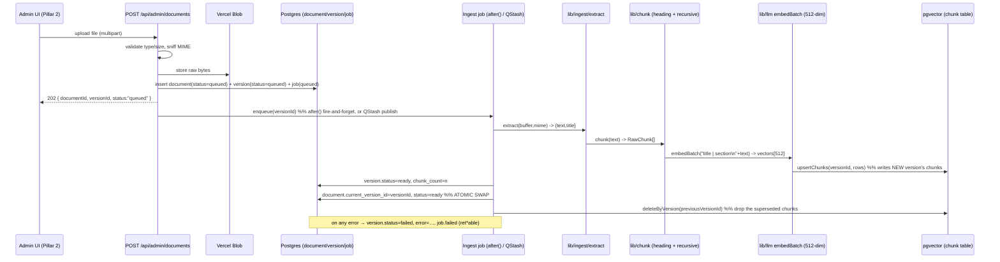
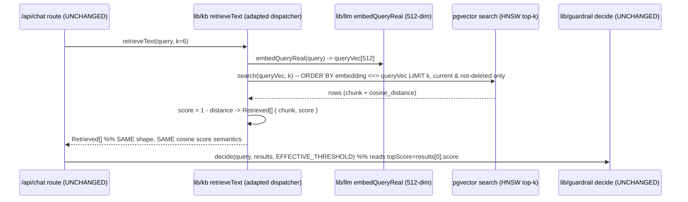

# File Embedding & Ingestion

> **Pillar 1 of the platform: the ingestion backend.** This document specifies the evolution from the current **build-time, single-artifact** RAG (`scripts/embed.ts` → `data/embeddings.json` → in-memory cosine) to a **runtime upload → vector store** pipeline so the knowledge base changes **without a redeploy**. It is the backend that **Pillar 2 (the admin surface)** drives; the interface it exposes to that pillar is defined in [§Interface exposed to Pillar 2](#8-interface-exposed-to-pillar-2-admin).
>
> **Design ethos (unchanged):** right-sized, not over-engineered. Every new component earns its place. We add exactly one external service (a serverless Postgres with `pgvector`) and one durable blob store, and only because the product requirement — *docs must change at runtime* — makes the bundled read-only artifact structurally insufficient. See [`ARCHITECTURE.md`](../../ARCHITECTURE.md) §8, which already anticipated this trigger ("KB must update without a redeploy → add a runtime ingestion path + a real store").
>
> **Contract preservation is the prime directive.** The retrieval seam (`retrieveText → Retrieved[]`, cosine `score`, `topScore`) and the guardrail contract (`decide`) do **not** change. Only what sits *behind* `retrieveText` changes. See [§7 Migration & contract preservation](#7-migration--contract-preservation).

---

## What changes, in one paragraph

Today: authors edit `content/*.md`; `pnpm build` runs `scripts/embed.ts`, which chunks by heading, prepends `"title | section"`, embeds with `text-embedding-3-small` (dim 512), and writes a read-only `data/embeddings.json` that `lib/kb.ts` statically imports for in-memory `cosineSimilarity` top-k. New docs require a code change + redeploy. Tomorrow: a non-engineer uploads a file (md / txt / PDF / docx) through the admin surface; the file is parsed, chunked (the **same** chunker, extended with a recursive fallback for headingless files), embedded (the **same** embedder), and **upserted** into a `pgvector` table. `retrieveText` runs an ANN top-k against that table instead of scanning the bundle. The bundle path stays behind a feature flag as the offline/zero-key fallback. Nothing downstream of `retrieveText` — the guardrail, the prompt, the route, the evals — is aware the store changed.

---

## Architecture

### 1. Pipeline components

Two pipelines share one chunker and one embedder: an **ingestion** pipeline (write path, admin-triggered, asynchronous) and a **retrieval** pipeline (read path, per chat turn, synchronous). C4-L3, one job per module. New modules are marked **new**; reused/adapted modules cite the existing file.

| Module | Status | One job | In → Out |
|---|---|---|---|
| `app/api/admin/documents/route.ts` | **new** | Accept upload (multipart), validate, persist raw file, create `document` + `document_version` rows (status `queued`), enqueue ingest. | `POST multipart` → `{ documentId, versionId, status }` |
| `lib/ingest/extract.ts` | **new** | Format-dispatched text extraction (md/txt/PDF/docx) → normalized markdown-ish text + detected `title`. | `{ buffer, mime, filename }` → `{ text, title }` |
| `lib/chunk.ts` | **reuse + extend** | Heading-based chunking (existing `chunkMarkdown`). Add `chunkText` recursive/character fallback for headingless docs; keep table/code atomicity and the token bounds. | `text` → `RawChunk[]` = `{ section, text }[]` |
| `lib/ingest/embed.ts` | **new (thin)** | Orchestrate: prepend `"title \| section"`, call the existing `embedBatch` (real `text-embedding-3-small`, dim 512), map to store rows. | `RawChunk[]` + meta → `ChunkRow[]` |
| `lib/llm.ts` | **reuse** | The embedder seam. `embedBatch(texts)` / `embedQueryReal(text)` already produce 512-dim vectors and are the same at build and query time. **Unchanged.** | texts → `number[][]` |
| `lib/store/vectors.ts` | **new** | Repository over `pgvector`: `upsertChunks`, `deleteByDocument`, `search(queryVec, k)`, `stats`. All SQL lives here. | vectors/queries → rows |
| `lib/store/documents.ts` | **new** | Repository over document/version/job tables: CRUD + status transitions + reconcile helpers. | — → `DocumentRow[]`, `JobRow` |
| `lib/ingest/pipeline.ts` | **new** | The orchestrator job: extract → chunk → embed → upsert → flip version to `ready` (atomic swap), or `failed` with an error. Idempotent per `versionId`. | `versionId` → status transition |
| `lib/kb.ts` | **reuse + adapt** | `retrieveText(query, k)` now dispatches to the active backend (`pgvector` \| `bundle`). **Signature and `Retrieved[]` return shape unchanged.** | `query` → `Retrieved[]` |
| `lib/retrieval.ts` | **reuse** | Pure cosine math + `isWeak`. Still used verbatim by the `bundle` fallback and by unit tests. **Unchanged.** | vectors → `Retrieved[]` |
| `lib/guardrail.ts` | **reuse** | `decide(query, results, threshold)`. Consumes `Retrieved[]` only. **Unchanged.** | `Retrieved[]` → `Decision` |
| `scripts/embed.ts` | **reuse + repurpose** | Still builds the bundle for offline/eval. Gains a `--target=pgvector` mode to **seed** the store from `content/*.md` (migration + reproducible reset). | `content/*.md` → artifact or store rows |
| Raw blob store (Vercel Blob) | **new (external)** | Durable landing zone for the original uploaded bytes (ephemeral FS can't keep them) — needed for re-index and audit. | file bytes → blob URL |
| `pgvector` on serverless Postgres (Neon) | **new (external)** | The runtime vector store: chunks + vectors + metadata, ANN top-k, metadata filtering. | vectors/rows → ANN results |

**The seam that makes this safe:** everything above the dashed line (`retrieveText` and up) is **new or a repository**; everything below it (`retrieval.ts`, `guardrail.ts`, `prompt.ts`, `route.ts`) is **untouched**. The vector store is an implementation detail hidden behind `lib/kb.ts` and `lib/store/*`.

### 2. Data model

Four tables. `document` is the logical doc; `document_version` is an immutable content snapshot (a new upload of the same doc = a new version); `chunk` holds the vectors and is **owned by a version** (this is what makes re-index an atomic swap); `ingest_job` tracks async work and powers the admin's live/stale view. Versioning is the mechanism behind [§5 Live vs stale](#5-live-vs-stale-doc-view).

```sql
-- Requires: CREATE EXTENSION IF NOT EXISTS vector;   (pgvector)

CREATE TABLE document (
  id            uuid PRIMARY KEY DEFAULT gen_random_uuid(),
  source        text NOT NULL,              -- stable slug / filename, e.g. "services.md"
  title         text NOT NULL,
  tags          text[] NOT NULL DEFAULT '{}',
  current_version_id uuid,                  -- FK set once a version is `ready` (nullable during first ingest)
  status        text NOT NULL DEFAULT 'queued',  -- queued|ingesting|ready|stale|failed  (derived, see §5)
  deleted_at    timestamptz,               -- soft delete (retrieval filters these out)
  created_at    timestamptz NOT NULL DEFAULT now(),
  updated_at    timestamptz NOT NULL DEFAULT now()
);

CREATE TABLE document_version (
  id            uuid PRIMARY KEY DEFAULT gen_random_uuid(),
  document_id   uuid NOT NULL REFERENCES document(id) ON DELETE CASCADE,
  version       int  NOT NULL,             -- monotonic per document (1,2,3…)
  content_hash  text NOT NULL,             -- sha256 of extracted text; dedupes no-op re-uploads
  raw_blob_url  text,                      -- Vercel Blob URL of the original file (for re-parse/audit)
  extracted_text text,                     -- normalized text the chunker ran on (audit/re-chunk)
  embed_model   text NOT NULL,             -- "text-embedding-3-small"  (guards against dim/model drift)
  dimensions    int  NOT NULL,             -- 512
  chunk_count   int  NOT NULL DEFAULT 0,
  status        text NOT NULL DEFAULT 'queued',  -- queued|ingesting|ready|failed
  error         text,                      -- failure reason (surfaced to admin)
  created_at    timestamptz NOT NULL DEFAULT now(),
  UNIQUE (document_id, version)
);

CREATE TABLE chunk (
  id            text PRIMARY KEY,          -- `${source}#v${version}#${index}`  (stable, version-scoped)
  document_id   uuid NOT NULL REFERENCES document(id) ON DELETE CASCADE,
  version_id    uuid NOT NULL REFERENCES document_version(id) ON DELETE CASCADE,
  chunk_index   int  NOT NULL,
  text          text NOT NULL,             -- FULL chunk body, already prefixed "title | section\n…"
  section       text NOT NULL,
  tags          text[] NOT NULL DEFAULT '{}',
  embedding     vector(512) NOT NULL
);

CREATE TABLE ingest_job (
  id            uuid PRIMARY KEY DEFAULT gen_random_uuid(),
  version_id    uuid NOT NULL REFERENCES document_version(id) ON DELETE CASCADE,
  state         text NOT NULL DEFAULT 'queued',  -- queued|running|succeeded|failed
  attempts      int  NOT NULL DEFAULT 0,
  last_error    text,
  started_at    timestamptz,
  finished_at   timestamptz,
  created_at    timestamptz NOT NULL DEFAULT now()
);

-- ANN index: cosine, HNSW (pgvector's high-recall / low-latency graph index).
CREATE INDEX chunk_embedding_hnsw
  ON chunk USING hnsw (embedding vector_cosine_ops);

-- Retrieval only ever scans READY chunks of non-deleted docs → partial-filter friendly.
CREATE INDEX chunk_version_idx ON chunk (version_id);
CREATE INDEX document_status_idx ON document (status) WHERE deleted_at IS NULL;
```

**Why chunks are version-scoped, not document-scoped.** Re-indexing writes the *new* version's chunks alongside the old, then atomically flips `document.current_version_id`. Retrieval always filters `version_id = current_version_id`, so a query never sees a half-written re-index — there is no window where the KB is empty or mixed. The old version's chunks are deleted after the flip. This is the crux of a safe [reconcile flow](#5-live-vs-stale-doc-view).

### 3. Data flow

#### 3.1 Ingestion (write path — async, admin-triggered)



#### 3.2 Retrieval (read path — per chat turn, synchronous, contract-frozen)



The route calls the **exact same** `retrieveText(query)` and gets the **exact same** `Retrieved[]`. Cosine similarity is reconstructed as `1 - (embedding <=> queryVec)` (pgvector's `<=>` is cosine *distance*), so `score`, `topScore`, and the `EFFECTIVE_THRESHOLD` gate keep their meaning and calibration (~0.35 for real embeddings).

### 4. Vector-store choice

**Recommendation: `pgvector` on Neon (serverless Postgres), with Supabase as a drop-in alternative.** Both are the same extension; the choice between them is operational, not architectural.

**Why this is the right evolution — and why it isn't a contradiction of the current design:**

- The current in-memory brute-force cosine was correct *because the corpus was small and static*. The product requirement removed "static." Once docs change at runtime on an **ephemeral filesystem**, you cannot persist an updated index in-process — you need a store that outlives a function invocation. That is the trigger, not vector count. (See [`ARCHITECTURE.md`](../../ARCHITECTURE.md) §8: "Freshness → add a runtime ingestion path + a real store.")
- **Neon scales compute to zero when idle**, so the "zero standing infra cost" ethos survives: you pay for storage (pennies at this scale) and for the seconds a query actually runs. pgvector itself is free; you pay only for the Postgres instance. [Encore][enc], [pgvector-2026][kg]
- **One store, no sync.** Documents, versions, jobs, *and* vectors live in the same Postgres. Transactional consistency means the atomic version-swap in §3.1 is a real `BEGIN…COMMIT`, not eventual reconciliation between two systems. A dedicated vector DB would force us to keep the relational document/version/job model *somewhere else anyway* and sync the two. [Encore][enc]
- **Metadata filtering is SQL.** `WHERE deleted_at IS NULL AND version_id = current_version_id AND tags && $tags` is native and indexed — exactly the retrieval-time filtering, tag scoping, and stale-exclusion this design needs.
- **HNSW is built in.** pgvector ships HNSW (`vector_cosine_ops`); query latency is single-digit-to-low-double-digit ms under 1M vectors — orders of magnitude more headroom than a support KB will ever use. [Encore][enc]
- **Serverless-native driver.** `@neondatabase/serverless` (HTTP/WebSocket) avoids the connection-pool exhaustion that plagues TCP Postgres in serverless. Neon is available as a first-party Vercel Marketplace integration (env vars wired automatically). [pgvector-2026][kg]
- **The embedder does not change.** pgvector stores whatever 512-dim vector we give it; we keep `text-embedding-3-small` @ dim 512, so all existing calibration and the `Chunk`/`EmbeddingsFile` model carry over.

#### Rejected alternatives

| Rejected | Why not (defensible in review) |
|---|---|
| **Stay in-memory bundled artifact** | Fails the core requirement: cannot change docs without a redeploy on an ephemeral FS. This is the whole reason for the pillar. |
| **Pinecone / hosted vector DB** | Two stores to keep in sync (vectors *there*, document/version/job model *here*) plus a plan minimum (~$50/mo Standard; usage billed as storage + read/write units) for horizontal scale to hundreds of millions of vectors we do not have. Namespace/multi-tenant isolation is unused. Zero operational payoff at a support-KB corpus. [Encore][enc], [pgvector-2026][kg], [top15][top15] |
| **Qdrant / Weaviate (self- or cloud-hosted)** | Excellent at scale, but another service to run/pay for and sync against the relational model. Same "no payoff below ~5M vectors" verdict. [top15][top15] |
| **Local/embedded vector DB** (Chroma, LanceDB, FAISS-on-disk) | The serverless ephemeral-FS problem again: no durable local disk between invocations, and cold-start load cost. Structurally the same dead-end as the bundle. |
| **Supabase over Neon** | Not rejected — a valid swap (managed Postgres + pgvector + auth + storage). Neon is the default only for its scale-to-zero economics and clean Vercel integration; if the admin pillar wants Supabase Auth/RLS, prefer Supabase. [pgvector-comparison][dev] |

#### Tradeoff matrix

| Option | Setup | Idle cost | Latency (≤ few k vectors) | Recall | Sync burden | Fit |
|---|---|---|---|---|---|---|
| In-memory bundle | trivial | $0 | sub-ms | exact | n/a | **Correct until "runtime updates" required — now insufficient** |
| **pgvector / Neon** | low | ~$0 (scale-to-zero) | single-digit ms | high (HNSW, tunable) | **none (one store)** | **Chosen** |
| pgvector / Supabase | low | low (no scale-to-zero) | single-digit ms | high | none | Alternative |
| Pinecone / hosted VDB | low-med | plan minimum (~$50/mo) | ms + network | high | **high (2 stores)** | Rejected (no payoff at this scale) |

#### When does in-memory cosine actually stop being viable?

This is the threshold the README anticipated. Two independent triggers; **either** fires the migration:

1. **Freshness (the real trigger here).** The moment docs must change without a redeploy, the bundled read-only artifact is disqualified regardless of size — you have already crossed the line. **This is why we migrate now, even at ~8–10 docs.**
2. **Scale (the size trigger, for completeness).** A 512-dim vector serialized in JSON is ~6–10 KB per chunk. Practical ceilings for the in-memory bundle:
   - **> ~500 chunks** (roughly a few MB artifact): cold-start JSON parse + resident memory become noticeable per invocation.
   - **Artifact > ~5 MB**: bundle bloat and cold-start cost outweigh brute-force's simplicity.
   - **Sustained concurrent QPS** where per-invocation re-scan/re-parse shows up in p95 latency.

   Below these, brute force is exact (100% recall) and sub-ms. Above, an ANN index (HNSW in pgvector) is the answer — which is exactly what we adopt.

### 5. Live vs stale doc view

The admin surface must show, per document, whether what the bot retrieves reflects the latest source. That is a **derived status** over the version model:

| Status | Meaning | How it's derived |
|---|---|---|
| `queued` | Uploaded, ingest not started. | `ingest_job.state = queued` and no `ready` version yet. |
| `ingesting` | Extract/chunk/embed/upsert in progress. | `ingest_job.state = running`. |
| `ready` | **Live.** `current_version_id` points at a fully-embedded version whose `content_hash` matches the latest upload. | version `ready` **and** `document.current_version_id = version.id`. |
| `stale` | Source changed (a newer version exists or the raw file's hash differs) but its re-embedding hasn't completed. The bot is still serving the **previous** `ready` version. | a newer `document_version` exists with status ∈ {`queued`,`ingesting`,`failed`} while `current_version_id` still points at an older `ready` one. |
| `failed` | Latest ingest errored; bot still serves the last `ready` version (graceful degrade). | latest version `failed`; `current_version_id` unchanged. |

**"Stale" is precisely: the source moved but the vectors haven't.** Because retrieval only ever reads `current_version_id`, **stale never means wrong answers** — it means *not-yet-updated* answers. The bot degrades to the last good version rather than to nothing. The admin sees the amber "stale" chip and can retry.

**Reconcile / re-index flow:**

1. **Detect drift.** On any (re)upload, compute `content_hash` of the extracted text. If it equals the current version's hash → **no-op** (dedupe; return `ready` immediately). Otherwise create version `n+1` (`queued`) → document becomes `stale`.
2. **Ingest the new version** (§3.1) into its own version-scoped chunks. The live version keeps serving throughout.
3. **Atomic swap** (single transaction): `UPDATE document SET current_version_id = new, status = 'ready'` then `DELETE FROM chunk WHERE version_id = old`. Retrieval flips from old→new between one query and the next with no empty window.
4. **Reconcile job (periodic, optional).** A `reconcile()` in `lib/store/documents.ts` scans for anomalies — versions stuck `ingesting` past a timeout (crashed job → requeue), orphan chunks whose version isn't current (sweep), documents `ready` with zero chunks (flag). Callable on-demand from the admin ("Rebuild index") and safe to run repeatedly (idempotent). A full **reseed** from `content/*.md` is `scripts/embed.ts --target=pgvector`.

### 6. Security

| Surface | Control |
|---|---|
| **Upload validation** | Allowlist extensions (`.md .txt .pdf .docx`) **and** sniff magic bytes (never trust the client MIME); hard size cap (e.g. 10 MB); reject empty/oversized fast at the route boundary with Zod. |
| **Auth** | All `/api/admin/*` ingestion routes require the admin session that Pillar 2 owns. Ingestion endpoints must never be public — enforce auth in the route *and* in middleware. |
| **Prompt-injection via document text** | Unchanged posture: retrieved chunk text is framed as **data, not instructions** in the system prompt (`lib/prompt.ts`). Uploading a doc that says "ignore your rules" changes retrieved context, not the model's instructions. This is why the retrieval gate is deterministic and upstream of the model. |
| **Storage of raw files** | Original bytes in Vercel Blob with non-guessable keys; access via signed/authenticated reads only. Extracted text in Postgres. No user file is ever served to the public chat client. |
| **Secrets** | `DATABASE_URL` (Neon), `BLOB_READ_WRITE_TOKEN`, embeddings key — server-side env only, never bundled, never in URLs. `.env*` stays git-ignored; `.env.example` documents the shape. |
| **Injection / path traversal** | Parameterized SQL only (repository layer; no string-built queries). `source` slugs sanitized; blob keys derived from UUIDs, not filenames. |
| **SSRF** | Uploads are bytes, not URLs — no server-side fetch of user-supplied locations. If "ingest from URL" is ever added, it becomes an allowlist/again-untrusted-content decision, out of scope here. |
| **Rate limiting / cost** | Cap concurrent ingests and embed batch size; ingest is authenticated + admin-only, so abuse surface is small. Embedding cost is bounded by the size cap. |
| **Failure isolation** | An ingest failure sets `failed` and keeps serving the last `ready` version. A store outage at query time → `retrieveText` throws → the route's existing `catch` escalates gracefully (already implemented in `app/api/chat/route.ts`). |

### 7. Migration & contract preservation

The migration is safe because the **frozen interfaces do not move**. Restating the invariants from [`ARCHITECTURE.md`](../../ARCHITECTURE.md) §4 and confirming each still holds:

- **`retrieveText(query, k): Promise<Retrieved[]>`** — same signature. Internally dispatches on `RETRIEVAL_BACKEND` (`pgvector` | `bundle`).
- **`Retrieved = { chunk: Chunk; score: number }`, `score` = cosine similarity** — preserved. pgvector returns cosine *distance* via `<=>`; we return `score = 1 - distance`. Range and calibration match the bundle path (real embeddings ≈ 0.35 threshold).
- **`topScore = results[0].score`** — preserved: we `ORDER BY embedding <=> queryVec` (ascending distance = descending similarity) so `results[0]` is the best match, exactly as `rankChunks` sorted it.
- **`decide(query, results, threshold)`** — **untouched.** It reads `results[0].score`, `r.chunk.meta.source` (citations), and tokenizes `r.chunk.text` (coverage). We therefore **must** return the full prefixed `chunk.text`, `meta.source/title/section`, and `meta.tags` from the store — which the schema stores verbatim.
- **`Chunk.embedding: number[]`** — the type is honored by returning `embedding: []` from the store path (query-time code never reads the retrieved vector back; only the ingest path needs vectors). This keeps the type intact without shipping 512 floats per chunk over the wire. Documented explicitly so a future reader doesn't "fix" it.
- **`Chunk.id`** — becomes version-scoped `` `${source}#v${version}#${index}` `` (still stable, still unique, still what the retrieval trace cites). The prior `` `${source}#${index}` `` remains valid in the bundle path.
- **Embedder identity** — `embedQueryReal` (query) and `embedBatch` (ingest) are the same `text-embedding-3-small` @ 512 used at build time. `document_version.embed_model` + `dimensions` are persisted so a future model/dim change is detected, not silently mismatched.

**Backend flag & fallback.** `RETRIEVAL_BACKEND=bundle` keeps today's behavior verbatim (offline dev, evals with zero keys, and the lexical embedder path all still work). `RETRIEVAL_BACKEND=pgvector` (default in production once `DATABASE_URL` is set) uses the store. If the store is unreachable at boot, `lib/kb.ts` can fall back to the bundle so the bot never hard-fails. This means the migration is reversible with an env var.

**Migration steps** are enumerated in [§Implementation Plan → Rollout & migration](#rollout--migration).

### 8. Interface exposed to Pillar 2 (admin)

Pillar 1 is a backend; Pillar 2 (the read-mostly admin) drives it. The contract between them is these **typed service functions** (in `lib/store/*` and `lib/ingest/*`) and the **HTTP routes** that wrap them. Pillar 2 calls functions, not raw SQL.

```ts
// lib/store/documents.ts  — the Pillar-2-facing document API
type DocStatus = "queued" | "ingesting" | "ready" | "stale" | "failed";

type DocumentSummary = {
  id: string; source: string; title: string; tags: string[];
  status: DocStatus; version: number; chunkCount: number; updatedAt: string;
};

type DocumentDetail = DocumentSummary & {
  versions: { version: number; status: string; chunkCount: number;
              contentHash: string; error?: string; createdAt: string }[];
  chunks: { id: string; section: string; preview: string }[];  // preview = first N chars
};

listDocuments(): Promise<DocumentSummary[]>;
getDocument(id: string): Promise<DocumentDetail>;
deleteDocument(id: string): Promise<void>;          // soft delete → excluded from retrieval
reindexDocument(id: string): Promise<{ jobId: string }>;
reconcile(): Promise<{ requeued: number; swept: number; flagged: string[] }>;

// lib/ingest/pipeline.ts
ingest(versionId: string): Promise<void>;           // the async job body (idempotent)
getJob(jobId: string): Promise<{ state: string; error?: string; attempts: number }>;

// Retrieval trace for the admin's "why did the bot say that" view — reuses Retrieved[].
// No new shape: it is exactly what /api/chat already computes.
```

**HTTP routes** (all admin-authed):

| Route | Method | Does | Returns |
|---|---|---|---|
| `/api/admin/documents` | `POST` | Upload → create doc+version, enqueue ingest | `202 { documentId, versionId, status }` |
| `/api/admin/documents` | `GET` | List with live/stale status | `DocumentSummary[]` |
| `/api/admin/documents/:id` | `GET` | Detail: versions, chunks, errors | `DocumentDetail` |
| `/api/admin/documents/:id` | `DELETE` | Soft-delete (drops from retrieval) | `204` |
| `/api/admin/documents/:id/reindex` | `POST` | Re-embed current source | `202 { jobId }` |
| `/api/admin/ingest/:jobId` | `GET` | Poll job state (for the upload UI) | `{ state, error?, attempts }` |
| `/api/admin/reconcile` | `POST` | Sweep stuck/orphan/empty | `{ requeued, swept, flagged }` |

The **KB-gap / retrieval-trace** views the admin plan already envisions consume `Retrieved[]` and `Decision` directly — no new interface. Pillar 2 renders; Pillar 1 owns state and mutation.

---

## Implementation Plan

Phased, each phase independently shippable and behind the `RETRIEVAL_BACKEND` flag so `main` is never broken. TDD per repo rules: the retrieval-contract tests are the safety net — they must pass identically against both backends.

### Phase 0 — Contract lock & test net (0.5 day)

- Freeze the interfaces in [§8](#8-interface-exposed-to-pillar-2-admin) and the `score = 1 - distance` rule in a short `DECISIONS.md` entry.
- **Write the backend-parity test first (RED):** a fixture query must produce the *same* `Retrieved[]` ordering and comparable `topScore` from `bundle` and from a seeded `pgvector` (Testcontainers/local Postgres+pgvector). This test is the definition of "migration didn't break anything."
- Add `RETRIEVAL_BACKEND` to `lib/config.ts` (default `bundle`).

### Phase 1 — Store & repositories (1 day)

- **Deps:** `@neondatabase/serverless` (or `pg` for local), `drizzle-orm` **or** hand-rolled SQL (prefer thin SQL to stay lean — no ORM unless it earns it). Add `CREATE EXTENSION vector`.
- Apply the DDL (§2) via a `scripts/migrate.ts` (idempotent `CREATE TABLE IF NOT EXISTS`).
- Implement `lib/store/vectors.ts` (`upsertChunks`, `deleteByVersion`, `search`, `stats`) and `lib/store/documents.ts` (CRUD, status derivation, `reconcile`).
- Unit-test repositories against local Postgres+pgvector.

### Phase 2 — Extraction & chunking (1 day)

- **Deps / parsers:**
  - **md / txt:** read as UTF-8 (no dep).
  - **PDF:** **`unpdf`** — pure-JS, zero native deps, serverless-safe. Explicitly **not** `pdf-parse`/`pdfjs-dist`, which break under Vercel's bundler (native `canvas`, sync test-file reads). [unpdf-vs-pdfparse][unpdf], [vercel-pdf][matija]
  - **docx:** **`mammoth`** (`extractRawText`) — the industry-standard DOCX text extractor for Node. [logrocket-pdf][lr]
  - (Excel/pptx explicitly **out** — declare the cut; add `office-text-extractor` later if ever needed. [office-text-extractor][ote])
- **Reject `unstructured`** (Python service / hosted API): heavyweight, off-stack, unjustified at this scope. Note it as the upgrade path if OCR / scanned-PDF / layout-aware parsing is ever required.
- `lib/ingest/extract.ts`: dispatch on sniffed type → `{ text, title }` (title from docx heading / PDF metadata / md frontmatter / filename fallback).
- **Extend `lib/chunk.ts`:** add `chunkText(text)` — a recursive/character splitter fallback for **headingless** docs (PDF/txt often have no `#` headings). Split on the most natural boundary first (paragraph → line → sentence → word), target ~400–512 tokens with ~50–100 token (≈15%) overlap, keep tables/code atomic. Recursive-character splitting at ~512 tokens is the validated default (highest end-to-end accuracy in the Feb-2026 FloTorch benchmark). [firecrawl-chunking][fc], [denser-chunking][den] `chunkMarkdown` stays primary when headings exist; `chunkText` is the fallback. `RawChunk` shape unchanged. Keep the **`"title | section"` prefix** (section = the heading, or `"Overview"` for headingless).

### Phase 3 — Ingest pipeline & routes (1.5 days)

- `lib/ingest/embed.ts` (prefix + `embedBatch`) and `lib/ingest/pipeline.ts` (`ingest(versionId)`: extract→chunk→embed→upsert→atomic swap; idempotent; sets `ready`/`failed`).
- **Async execution:** default to Next.js **`after()`** (available on `next@15.5`) for fire-and-forget after the 202 — **no new infra**, fits the ethos. Document **QStash** as the durable upgrade (retries, >function-timeout budget, survives crashes) for when ingests get large or must be guaranteed. [upstash-qstash][qstash], [vercel-timeout][vt] Note the constraint: `after()`/Fluid Compute give extended duration but aren't a durable queue; QStash's 60s endpoint timeout suits per-doc ingests. [vercel-timeout][vt]
- Routes from [§8](#8-interface-exposed-to-pillar-2-admin): `POST/GET/DELETE /api/admin/documents`, `:id/reindex`, `ingest/:jobId`, `reconcile`. Zod validation + admin auth on every one. Raw bytes → Vercel Blob.
- `runtime = "nodejs"` for ingest routes (parsers need Node APIs; not Edge).

### Phase 4 — Wire retrieval to the store (0.5 day)

- Adapt `lib/kb.ts` `retrieveText`: when `RETRIEVAL_BACKEND=pgvector`, `embedQueryReal(query)` → `vectors.search(vec, k)` → map to `Retrieved[]` with `score = 1 - distance` and `embedding: []`. Filter `current_version_id`, `deleted_at IS NULL`.
- Keep the `bundle` path byte-for-byte for fallback/offline.
- **Phase-0 parity test now runs GREEN against `pgvector`.** `decide`, `route`, `prompt`, evals untouched — prove by running the existing suite unchanged.

### Phase 5 — Seed, reconcile, polish (0.5 day)

- `scripts/embed.ts --target=pgvector`: reuse the existing chunk+embed pipeline to seed the store from `content/*.md` (this is also the migration importer and the reproducible reset).
- Implement `reconcile()` sweeps; expose `/api/admin/reconcile`.
- Docs: update `ARCHITECTURE.md` §8 (freshness trigger now realized) and `DECISIONS.md` (Claude-generated vs modified, per repo rule).

### Testing

| Level | What |
|---|---|
| **Unit** | `chunkText` boundaries/overlap/table-atomicity; `extract` per format (fixture PDF/docx/txt/md); `score = 1 - distance` mapping; status derivation (`ready`/`stale`/`failed`). |
| **Integration** | Repositories against local Postgres+pgvector (Testcontainers); atomic-swap leaves no empty window (concurrent read during re-index); soft-delete excludes from retrieval; dedupe on identical `content_hash`. |
| **Contract/parity (the gate)** | Same fixture query → equivalent `Retrieved[]` ordering + `topScore` from `bundle` vs `pgvector`. The existing `tests/retrieval.test.ts`, `tests/guardrail.test.ts`, and `evals/golden.json` **must pass unchanged** on the pgvector backend. |
| **E2E** | Playwright: admin uploads a PDF → status `queued→ingesting→ready` → new fact is retrievable in chat within one turn → re-upload changed source shows `stale` then `ready` → delete removes it from answers. |

### Rollout & migration

1. **Provision** Neon (Vercel Marketplace) + Vercel Blob; set `DATABASE_URL`, `BLOB_READ_WRITE_TOKEN`. `RETRIEVAL_BACKEND` stays `bundle` in prod.
2. **Migrate schema:** `scripts/migrate.ts` (creates `vector` extension + tables + HNSW index).
3. **Seed:** `scripts/embed.ts --target=pgvector` imports the current KB. Verify `chunk` count matches the bundle.
4. **Shadow-verify:** run the Phase-0 parity test and `pnpm eval` against `RETRIEVAL_BACKEND=pgvector` in preview. Confirm `topScore` distributions and golden-set verdicts match.
5. **Flip:** set `RETRIEVAL_BACKEND=pgvector` in prod. The bundle remains as automatic fallback if the store is unreachable at boot.
6. **Enable admin ingestion** (Pillar 2) once retrieval is proven on the store.
7. **Rollback** is a single env var back to `bundle` — the artifact still ships. De-risked by design.

**Sequencing:** Phase 0 → 1 → (2 ∥ nothing) → 3 → 4 → 5. Phase 2 (parsers/chunker) can run in parallel with Phase 1 (store) since they don't touch each other. Phase 4 depends on 1+2; Phase 3 depends on 1+2. Ship after Phase 4 (retrieval on the store, admin can come next).

---

## Sources

- [Encore — pgvector vs Pinecone: Which Vector Database to Choose in 2026][enc]
- [pgvector vs Pinecone 2026 (kunalganglani)][kg]
- [PostgreSQL as a Vector Database: pgvector vs Pinecone vs Weaviate (DEV)][dev]
- [Top 15 vector databases in 2026 (production decision guide)][top15]
- [Best Chunking Strategies for RAG (and LLMs) in 2026 — Firecrawl][fc]
- [RAG Chunking Strategies 2026: 8 Methods Compared — Denser][den]
- [Using pdf-parse on Vercel Is Wrong — unpdf vs pdf-parse (DEV)][unpdf]
- [Process PDFs on Vercel: Reliable Serverless Guide 2026 (buildwithmatija)][matija]
- [Parsing PDFs in Node.js — LogRocket][lr]
- [office-text-extractor — npm][ote]
- [Upstash QStash: Serverless Background Jobs (DEV)][qstash]
- [What can I do about Vercel Functions timing out? — Vercel KB][vt]

[enc]: https://encore.dev/articles/pgvector-vs-pinecone
[kg]: https://www.kunalganglani.com/blog/pgvector-vs-pinecone
[dev]: https://dev.to/polliog/postgresql-as-a-vector-database-when-to-use-pgvector-vs-pinecone-vs-weaviate-4kfi
[top15]: https://medium.com/@pratik-rupareliya/top-15-vector-databases-in-2026-a-production-decision-guide-from-100-enterprise-deployments-dd58a04f51a5
[fc]: https://www.firecrawl.dev/blog/best-chunking-strategies-rag
[den]: https://denser.ai/blog/rag-chunking-strategies/
[unpdf]: https://dev.to/chudi_nnorukam/serverless-pdf-processing-why-unpdf-beats-pdf-parse-2jji
[matija]: https://www.buildwithmatija.com/blog/process-pdfs-on-vercel-serverless-guide
[lr]: https://blog.logrocket.com/parsing-pdfs-node-js/
[ote]: https://www.npmjs.com/package/office-text-extractor
[qstash]: https://dev.to/whoffagents/upstash-qstash-serverless-background-jobs-without-the-infrastructure-pain-ic8
[vt]: https://vercel.com/kb/guide/what-can-i-do-about-vercel-serverless-functions-timing-out
