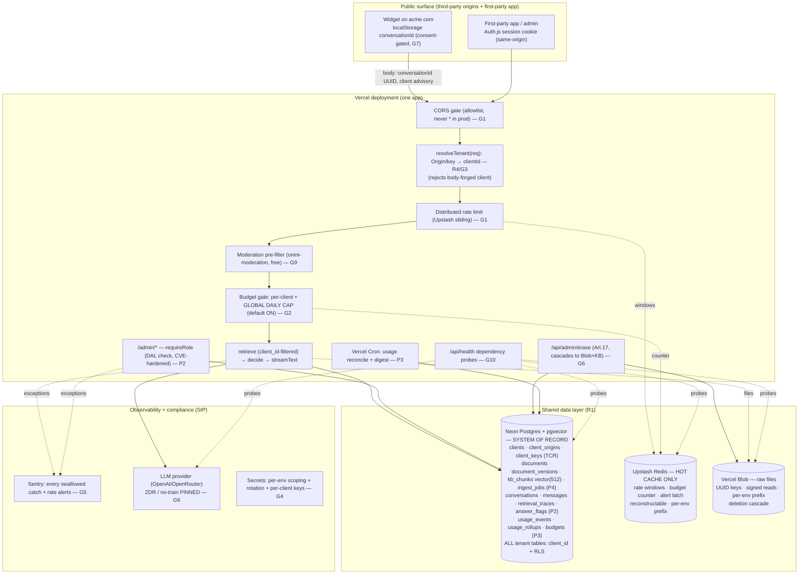

# Shared Infrastructure, Tenancy, Security & Compliance

> **The reconciling pillar.** Four sibling pillars each planned a product surface — the
> embeddable [widget](./widget.md) (P1), the [admin dashboard](./admin-dashboard.md) (P2),
> [usage & cost](./usage-and-cost.md) (P3), and [file embedding / ingestion](./file-embedding.md)
> (P4). The [gaps review](./deployment-gaps.md) found that, read together, they collide in five
> places (**R1–R5**) and leave eleven deployment-critical concerns owned by nobody (**G1–G11**).
>
> This document **closes every one of them.** For each R and G item it gives a full **architecture
> description**, a full **implementation plan**, an explicit **owning workstream**, and a
> **severity**. It then ties everything into one **target architecture**, a **phased rollout** from
> today's single-tenant core to a multi-tenant product, and a **coverage matrix** proving nothing
> deployment-critical is left uncovered.
>
> **Reads-against reality (2026-07-23).** CORS + per-IP rate limiting were *just implemented* in
> [`lib/cors.ts`](../../lib/cors.ts) and [`lib/ratelimit.ts`](../../lib/ratelimit.ts) and wired into
> [`app/api/chat/route.ts`](../../app/api/chat/route.ts). This pillar reflects that — and is candid
> that both ship in a **launch-unsafe default posture** (allow-all `*` CORS; in-memory per-instance
> limiter), so the abuse/DoS gaps (G1/G2) **still stand**.

---

## New workstreams this document creates

The gaps review named two homeless workstreams; this document formally stands them up and assigns
every orphaned item to one of them (or back to a pillar):

| Workstream | Owns | Lead artifact |
|---|---|---|
| **Shared Infra / Platform** (SIP) | `lib/config.ts` + `.env.example`, secrets & rotation, CI/CD + migrations + preview isolation, observability + health + alerting, backups/DR, the data-layer decision, and the compliance surface (DPA/erasure/LLM-pinning) | this doc |
| **Tenancy / Client Registry** (TCR) | the client registry, Origin→clientId binding, `client_id` on every tenant-scoped table, per-client KB partition + config + budgets + keys, row-level isolation | this doc |
| Pillars 1–4 | their surface, consuming SIP/TCR primitives through frozen seams | their docs |

Both new workstreams live in this document. Where a pillar is the natural home, the item stays with
the pillar and SIP/TCR only provides the shared primitive it consumes.

---

## Cross-Pillar Reconciliation (R1–R5)

Five collisions. Each is resolved with a single authoritative decision, so the pillars stop
designing the same thing two incompatible ways.

### R1 — One data story: Neon Postgres = system of record; Upstash Redis = disposable hot cache; Vercel Blob = files

**Severity: Blocker (architectural coherence).** **Owner: SIP.**

**The conflict.** P3 puts the billing ledger + budgets in **Upstash Redis** ("the one justified
service"); P2 and P4 put conversations, traces, docs, versions, and the KB vector store in **Neon
Postgres + pgvector**; P1 reaches for Redis again for its Tier-1 limiter; P4 adds **Vercel Blob**
for raw file bytes. Run all four and you operate three stateful services, and — worse — a
*financial ledger lives in a cache* that is not durable, backed up, or joinable to conversations.

**Architecture (the decision).**

```
┌───────────────────────────────────────────────────────────────────────────┐
│ NEON POSTGRES (+ pgvector)  ── SYSTEM OF RECORD (durable, backed up, joins) │
│                                                                             │
│  Tenancy (TCR, NEW):  clients · client_origins · client_keys               │
│  P4 (ingestion):      documents · document_versions · kb_chunks vector(512) │
│                       · ingest_jobs                                         │
│  P2 (admin):          conversations · messages · retrieval_traces           │
│                       · retrieval_chunks · answer_flags · users + Auth.js    │
│  P3 (usage):          usage_events · usage_rollups · budgets  ◀ MOVED here   │
│  EVERY tenant-scoped table carries  client_id  (RLS-enforced, R4/G3)         │
└───────────────────────────────────────────────────────────────────────────┘
        ▲ joins: invoicing · per-conversation cost · GDPR erasure · DR
        │  (Redis is reconstructable FROM this; it is never the truth)
┌───────┴───────────────────┐        ┌────────────────────────────────────────┐
│ UPSTASH REDIS              │        │ VERCEL BLOB                             │
│ (optional, recommended)    │        │ original uploaded file bytes (P4 only)  │
│ HOT CACHE ONLY:            │        │ • UUID keys, signed/authed reads        │
│ • rate-limit windows (G1)  │        │ • deletion cascades on tenant delete    │
│ • pre-request budget count │        │ • per-env path prefix (G8)              │
│ • alert NX latch (P3)      │        │ object storage, a genuinely distinct    │
│ reconstructable · TTL'd    │        │ job — kept                              │
└────────────────────────────┘        └────────────────────────────────────────┘
```

**The final call, and why:**

1. **Neon Postgres is the single system of record for everything durable — including usage rollups
   and budgets.** Postgres does atomic counters fine (`INSERT … ON CONFLICT … DO UPDATE SET
   col = col + excluded.col`), and a billing ledger for a paying multi-client product **must** be
   durable, backed up, and **joinable** to conversations (for invoicing and the per-conversation
   cost view). Moving the ledger out of Redis collapses R1, and makes tenant deletion (G6) and
   backups (G11) *one* story instead of three.
2. **Upstash Redis is kept as an optional-but-recommended hot cache** for the two genuinely
   hot-path, high-write concerns and nothing else: **distributed rate-limit windows** (G1 — the
   in-memory limiter is a per-instance no-op on serverless, so this is the one place Redis earns its
   keep) and the **synchronous pre-request budget counter** (G2), plus the alert NX latch. It is
   **reconstructable from Postgres** and never the source of truth. Upstash's HTTP client and
   purpose-built [`@upstash/ratelimit`](https://github.com/upstash/ratelimit-js) sliding-window
   limiter are exactly right for this; a `prefix` per environment gives preview isolation for free.
   At this bot's low QPS, a Postgres-only variant (budget/limit check against PG) is *also*
   defensible — an extra ~10–30 ms is noise next to a 2–5 s LLM call — so **Redis is a
   latency/contention optimization, not a dependency to fear.** Recommendation: **add Redis for the
   distributed limiter specifically** (it is the cleanest fix for G1), keep everything else in
   Postgres.
3. **Vercel Blob stays** for raw uploaded file bytes — object storage, not a datastore; a 10 MB PDF
   does not belong in a Postgres row. A genuinely distinct third dependency, and that is fine.

So the answer to "Redis alongside Postgres?" is: **not as a second database. The ledger is in
Postgres; Redis is a cache that fixes the distributed-rate-limit gap and could otherwise be dropped.**

**Implementation plan.**
- SIP publishes `lib/db/client.ts` (Neon serverless driver + Drizzle) and the canonical schema
  (R2). All pillars import repositories, never raw SQL.
- P3's `UsageRepository` gains a **`PostgresUsageRepository`** as the system-of-record
  implementation; the `UpstashUsageRepository` is demoted to an optional write-through counter used
  only by `checkBudget`'s hot path. `InMemoryUsageRepository` stays for tests/offline.
- Redis, when present, is written **through** to Postgres (or reconciled by the daily cron), so a
  Redis flush loses at most the current window, never the ledger.
- `.env.example` documents `DATABASE_URL` as required for Tier-1; `UPSTASH_*` as optional hot cache;
  `BLOB_READ_WRITE_TOKEN` for uploads.

### R2 — Doc management designed once: P4 owns the schema, flag, and backend; P2 consumes its interface

**Severity: Blocker (schema collision on day one). Owner: SIP freezes the names; P4 owns the backend; P2 consumes.**

**The conflict.** P2 and P4 specify the *same* four tables, the *same* cutover flag, and the *same*
ingest interface with **incompatible** shapes (`documents` vs `document`; `halfvec(512)` vs
`vector(512)`; `KB_SOURCE` vs `RETRIEVAL_BACKEND`; markdown-body ingest vs file-bytes ingest; two
migration philosophies).

**Architecture / the frozen canonical decision.** **P4's model wins** (file upload, Blob-backed raw
bytes, immutable versions, version-scoped chunks with atomic swap). P2 **drops** its duplicate
schema and drives P4 through typed service functions. SIP records these canonical names once, and
they are frozen before parallel build:

| Concern | **Canonical (frozen)** | Notes |
|---|---|---|
| Table names | `documents`, `document_versions`, `kb_chunks`, `ingest_jobs` | Plural, conventional; P4 owns them |
| Vector column | **`vector(512)`** | Canonical for launch simplicity. `halfvec(512)` is a documented *storage optimization* (half the bytes, ~same recall at 512 dims) to apply **later** if artifact size matters — not the default. |
| Retrieval flag | **`RETRIEVAL_BACKEND=bundle\|pgvector`** | One flag, one DB `retrieveText` path. `KB_SOURCE` is retired. |
| Chunk id | `` `${source}#v${version}#${index}` `` | Version-scoped, stable; the retrieval trace cites this |
| Ingest model | **file bytes** (P4): `ingest(versionId)` reads Blob, extracts PDF/docx | P2's markdown-body edit is an *optional* second version source (`document_versions.body`) only if the edit-in-textarea UX is actually wanted — decided explicitly, not shipped as a half-model |
| Data access | **Drizzle ORM + drizzle-kit** (one tool, see R5) | P4's `scripts/migrate.ts` becomes a **data-seed** step, not schema DDL |

**Implementation plan.**
- SIP writes the canonical `lib/db/schema.ts` (Drizzle) covering all of R2's tables **plus** the
  tenancy tables (R4) **plus** the `client_id` column on `documents`/`kb_chunks` (G3). One
  `drizzle/0000_init` migration.
- P4 implements `lib/store/vectors.ts` + `lib/store/documents.ts` + `lib/ingest/pipeline.ts` against
  that schema and exposes the frozen interface from [file-embedding.md §8](./file-embedding.md):
  `listDocuments`, `getDocument`, `deleteDocument`, `reindexDocument`, `reconcile`, `ingest`,
  `getJob`.
- P2 deletes its `lib/db/repositories/documents` + `kbChunks` duplicates and imports P4's functions
  for the `app/admin/docs` UI. P2 keeps only what is genuinely its own: `conversations`, `messages`,
  `retrieval_traces`, `retrieval_chunks`, `answer_flags`.
- The retrieval-parity test ([file-embedding.md Phase 0](./file-embedding.md)) is the gate:
  identical `Retrieved[]` ordering from `bundle` and `pgvector`.

### R3 — One conversation identity: a client-namespaced UUID in the request body (never a cookie)

**Severity: Blocker (correctness — the cookie is silently broken cross-origin). Owner: SIP decides; P2 + P1 consume.**

**The conflict.** P1 uses a `conversationId` in localStorage sent in the body; P3 uses a body/minted
id echoed in a header; **P2 uses a server-set `cadre_sid` httpOnly `SameSite=Lax` cookie** — which
is **not sent on cross-site subrequests**, so every widget turn on `acme.com` logs as a brand-new
conversation. Making it work needs `SameSite=None; Secure`, i.e. a third-party cookie — blocked by
default in Safari/Firefox and gated in Chrome 2026. A cookie is the wrong identity mechanism for an
embedded widget on someone else's origin.

**Architecture.** Standardize on a **client-generated `conversationId` (UUID v4) supplied in the
request body** — the only scheme identical for the first-party app, the widget, and curl. It is a
**grouping key, not a security identifier**, so client-supplied is acceptable, but it is:
- `z.string().uuid()`-validated at the route boundary (prevents key-injection into Redis/PG keys), and
- **namespaced by `clientId`** in storage (`(<client_id>, <conversation_id>)` composite) so ids
  cannot collide or be enumerated across tenants.

`clientId` for grouping/billing is **not** taken from this body value — it is derived server-side
from the Origin binding (R4). The cookie survives only for the **first-party admin/app session**
(Auth.js), where same-origin `SameSite=Lax` is correct.

**Implementation plan.**
- Extend `BodySchema` in `route.ts`: `conversationId: z.string().uuid().optional()` (mint one
  server-side if absent; echo it in an `x-cadre-conversation` response header for the widget to
  persist).
- P2 rewrites `logTurn` to take `{ clientId, conversationId }` from the request context instead of
  the `cadre_sid` cookie. The `conversations` table's PK becomes `(client_id, conversation_id)`.
- P1's `session.ts` already stores a `conversationId` in localStorage per host origin — keep it;
  drop any reliance on a cross-site cookie.

### R4 — Bind Origin → clientId so the billing/tenancy identity cannot be forged (the multi-tenancy keystone)

**Severity: Blocker. Owner: TCR.**

**The conflict.** P1 sends `client` in the body and states it is "for logging and tenant routing,
*not* for security." P3 needs `clientId` to be **server-authoritative** or budgets mean nothing, and
flags the hole itself. **Nothing binds Origin → clientId**, so a hostile embed can attribute spend
to a competitor, exhaust a competitor's budget (targeted **DoS-by-billing**), or pollute their
dashboard. The Origin allowlist does not close this: it asks "is this origin allowed *at all*,"
never "does this origin own this clientId," and Origin is forgeable by non-browser callers.

**Architecture — the server-side client registry + derivation.**

```
Request  ──▶  resolveTenant(req)                         (lib/tenant.ts, TCR)
              1. key path:   Authorization: Bearer <publishable key>
                             → client_keys.lookup(hash(key)) → client_id     [strongest]
              2. origin path: normalize(Origin)
                             → client_origins.lookup(origin) → client_id     [browser default]
              3. neither / mismatch:
                   • no Origin & no key  → "public" bucket, strictest limits
                   • body.client ≠ resolved client_id → 403 (forgery rejected)
              ⇒ returns a TRUSTED clientId; the body `client` is advisory only
```

Two tables back it (`clients` holds config/budget; `client_origins` maps origins to a client;
`client_keys` holds per-client publishable keys — see G3/G4). For billing and enforcement the code
**ignores the body value** and uses the resolved `clientId`. If a body `client` is present and
disagrees with the resolved id, the request is rejected `403` before any cost is incurred.

**Implementation plan.**
- `lib/tenant.ts`: `resolveTenant(req): Promise<{ clientId: string; source: "key"|"origin"|"public" }>`.
- Wire it at the very top of `route.ts`, immediately after the CORS gate and before rate-limit,
  retrieval, and budget. The rate-limit bucket and budget scope both key off the **resolved**
  `clientId`, not the body.
- Replace P3's `resolveClientId` stub with this; P1's body `client` becomes advisory metadata only.
- Until per-client keys exist, the Origin binding is the enforcement mechanism for browser traffic
  and non-browser callers fall to the `public` bucket with the strictest limits + the global spend
  cap (G2) as backstop. Publishable-key issuance (G4) upgrades non-browser callers to a real
  identity. This directly implements the [publishable-vs-secret-key guidance](https://docs.stripe.com/keys-best-practices.md):
  embed a **publishable** key client-side, keep secret keys server-only.

### R5 — Single owner for migrations, config surface, and the env manifest

**Severity: High. Owner: SIP.**

**The conflict.** P2 uses drizzle-kit (numbered SQL, Neon branch per PR, rollback); P4 uses
`scripts/migrate.ts` with `CREATE TABLE IF NOT EXISTS` and **no down-migrations** — two mechanisms
against one DB guarantee drift. Config is sprawling across pillars with no consolidated
`.env.example` owner, and the widget doc even referenced a `WIDGET_ALLOWED_ORIGINS` var that the
shipped code calls `ALLOWED_ORIGINS`.

**Architecture / decision.**
- **One migration tool: drizzle-kit.** Real up/down migrations, and the Auth.js Drizzle adapter
  needs it anyway. P4's `scripts/migrate.ts` is repurposed to a **data-seed** step
  (`scripts/embed.ts --target=pgvector` seeds `kb_chunks` from `content/*.md`) — never schema DDL.
- **One config owner: SIP owns `lib/config.ts` + `.env.example`.** Every pillar adds its env reads
  through a PR against that single manifest. Canonical names are frozen here (below), retiring the
  drift (`ALLOWED_ORIGINS` is canonical, not `WIDGET_ALLOWED_ORIGINS`; `RETRIEVAL_BACKEND` is
  canonical, not `KB_SOURCE`).

**The canonical env manifest (frozen; SIP-owned).**

| Var | Owner | Status today | Purpose |
|---|---|---|---|
| `AI_CHAT_API_KEY`, `AI_CHAT_BASE_URL`, `AI_MODEL` | core | shipped | chat LLM |
| `EMBEDDINGS_API_KEY`, `EMBEDDINGS_BASE_URL` | core | shipped | embeddings |
| `RETRIEVAL_THRESHOLD` | core | shipped | guardrail knob |
| `ALLOWED_ORIGINS` | P1/SIP | shipped (default allow-all — **lock down**) | CORS allowlist |
| `RATE_LIMIT_PER_MIN` | P1/SIP | shipped (in-memory — **make distributed**) | per-IP cap |
| `DATABASE_URL` | SIP | Tier-1 | Neon SoR |
| `BLOB_READ_WRITE_TOKEN` | P4 | Tier-1 | Vercel Blob |
| `UPSTASH_REDIS_REST_URL`/`_TOKEN` | SIP | Tier-1 (optional) | hot cache |
| `NEXTAUTH_SECRET`, `NEXTAUTH_URL`, OAuth id/secret, `ADMIN_EMAILS` | P2 | Tier-1 | admin auth |
| `RETRIEVAL_BACKEND=bundle\|pgvector` | P4 | Tier-1 (default `bundle`) | KB cutover |
| `USAGE_TRACKING_ENABLED`, `USAGE_DEFAULT_MONTHLY_CEILING_USD`, `USAGE_SOFT_BLOCK`, `USAGE_ALERT_WEBHOOK_URL` | P3 | Tier-1 | usage/budgets |
| `GLOBAL_DAILY_SPEND_CAP_USD` | SIP/P3 | **NEW, default ON** | pre-model DoS cap (G2) |
| `SENTRY_DSN` | SIP | **NEW** | error monitoring (G5) |
| `MODERATION_ENABLED` | P1 | **NEW, default ON in prod** | input safety (G9) |
| `LLM_ZDR_CONFIRMED` | SIP | **NEW** | asserts the no-retention posture is set (G6) |
| `DATA_REGION` | SIP | **NEW** | store region pin (G6) |

---

## Gap Remediation (G1–G11)

Severity is ranked against a **multi-client production launch**. Each item gives architecture,
implementation plan, owner, and severity. Several are already *partially* implemented — that is
called out precisely so the residual work is unambiguous.

### G1 — Public unauthenticated money-spending endpoint: real abuse controls, on at launch

**Severity: Blocker. Owner: P1 + SIP (Platform/Abuse).**

**What's true today.** `route.ts` calls `corsHeaders`/`isOriginAllowed` (from `lib/cors.ts`) and a
per-IP `rateLimit` (from `lib/ratelimit.ts`). But: (a) `lib/cors.ts` **defaults to allow-all and
emits `Access-Control-Allow-Origin: *`** when `ALLOWED_ORIGINS` is unset — the exact CORS
anti-pattern the widget doc warned against; (b) `isOriginAllowed(null)` returns `true`, so a
no-Origin curl/server caller **skips the gate entirely**; (c) `rateLimit` is an **in-memory
per-instance** map — on serverless each cold instance has its own memory and cold starts reset it,
so it is effectively a no-op across the fleet; (d) it is **per-IP only** — no per-client bucket.
Net: at the Tier-0 default the endpoint has *near-zero* effective abuse protection against a
non-browser or distributed caller.

**Architecture.** Two independent controls, both live before the first public embed goes GA:
1. **Origin lockdown.** In production, `ALLOWED_ORIGINS` **must** be set (no wildcard). `corsHeaders`
   never emits `*` in prod; a present-but-disallowed Origin still 403s pre-model. This is browser
   access control only — it is *paired with*, not a substitute for, the limiter.
2. **Distributed per-request limiter** keyed on the **resolved tenant** (R4) and IP, backed by
   Upstash `@upstash/ratelimit` sliding window with a per-environment `prefix`. Buckets:
   `public`/unknown Origin → strictest; known client → its configured bucket. Fail-open on Redis
   timeout (never block chat on a limiter outage), with a structured warn (G5).

```
POST /api/chat
  ├─ CORS gate (prod: allowlist, never *)                     403 if disallowed browser origin
  ├─ resolveTenant(req)  → clientId (R4)
  ├─ ratelimit.limit(`${clientId}:${ip}`)  [Upstash sliding]  429 if exceeded (pre-model)
  ├─ checkBudget(clientId) + global daily cap (G2)            escalate if over (pre-model)
  └─ retrieve → decide → stream
```

**Implementation plan.**
- Add `@upstash/ratelimit` + `@upstash/redis`; introduce `lib/ratelimit-distributed.ts` behind the
  same `rateLimit(key)` seam so the route shape is unchanged. Keep the in-memory limiter as the
  offline/no-Redis fallback.
- Change `lib/cors.ts`: in `NODE_ENV=production`, treat unset `ALLOWED_ORIGINS` as **deny-by-default
  for cross-origin** (same-origin app still allowed) and never emit `*`.
- Key the limiter on `resolveTenant` output, not raw body `client`.
- Tests: allowed origin 200; disallowed browser origin 403 pre-model; over-limit → 429; Redis-down →
  fail-open + logged; `public` bucket stricter than a known client.
Sources: [Upstash ratelimit-js](https://github.com/upstash/ratelimit-js),
[Upstash edge rate limiting](https://upstash.com/blog/edge-rate-limiting),
[Redis Next.js edge rate limiting (2026)](https://oneuptime.com/blog/post/2026-03-31-redis-nextjs-edge-rate-limiting/view).

### G2 — Cost-runaway / DoS: an enabled-by-default global daily spend cap, enforced pre-model

**Severity: Blocker. Owner: P3 + SIP.**

**Architecture.** The per-request limiter (G1) bounds *request rate*; this bounds *dollars*. Ship an
**enabled-by-default hard global daily spend cap** (`GLOBAL_DAILY_SPEND_CAP_USD`, default a
conservative number, e.g. $25/day) checked **pre-model** — before embedding and `streamText` — so an
over-cap request incurs zero further token cost and degrades to the existing escalation path
(`reason: "budget_exceeded"`). It is independent of per-client calibration: P3 keeps
"measurement-before-enforcement" for *per-client* ceilings, but the *global* cap defaults to
**protected**, not measuring. `USAGE_TRACKING_ENABLED=false` remains the kill-switch that reverts
the gate.

**Implementation plan.**
- Add the global cap to `checkBudget` as a `scope: "global"` check that runs even when per-client
  soft-block is off. Counter lives in Redis (hot) + reconciled to `usage_rollups` (truth).
- Place the check between `resolveTenant` and `retrieveText` in `route.ts`.
- The daily counter resets by date-keyed rollup; the cron (P3) reconciles and sends a digest.
- Tests: global counter over cap → escalation, no embed/model call; per-client under cap but global
  over → still blocked; kill-switch reverts.

### G3 — Multi-tenancy built, not just claimed: isolation of KB, config, budgets, logs

**Severity: Blocker [GA-blocker; for the take-home, declare single-tenant]. Owner: TCR.**

**What's true today.** No table has a tenant column. There is **one shared KB** for all clients;
P2's config/doc CRUD is not tenant-scoped; conversations are only *tagged* with a forgeable `client`.
"Multi-client" today means "one shared bot that logs a forgeable client tag."

**Architecture — three layers of isolation.**

1. **Registry (system of record for identity, config, budget, keys):**
   ```sql
   CREATE TABLE clients (
     id            text PRIMARY KEY,            -- "acme"
     name          text NOT NULL,
     config        jsonb NOT NULL DEFAULT '{}', -- color/greeting/theme, per-client widget config
     created_at    timestamptz NOT NULL DEFAULT now(),
     deleted_at    timestamptz                  -- tenant soft-delete (G6 erasure)
   );
   CREATE TABLE client_origins (                -- Origin → clientId binding (R4)
     origin        text PRIMARY KEY,            -- "https://acme.com"
     client_id     text NOT NULL REFERENCES clients(id) ON DELETE CASCADE
   );
   CREATE TABLE client_keys (                   -- per-client publishable keys (G4)
     id            uuid PRIMARY KEY DEFAULT gen_random_uuid(),
     client_id     text NOT NULL REFERENCES clients(id) ON DELETE CASCADE,
     key_hash      text NOT NULL,               -- store only a hash; show the key once at issue
     kind          text NOT NULL DEFAULT 'publishable',
     created_at    timestamptz NOT NULL DEFAULT now(),
     revoked_at    timestamptz
   );
   ```
2. **`client_id` on every tenant-scoped table** — `documents`, `kb_chunks`, `conversations`,
   `messages`, `retrieval_traces`, `answer_flags`, `usage_events`, `usage_rollups`, `budgets`.
   Retrieval filters `WHERE client_id = $tenant AND deleted_at IS NULL AND version_id =
   current_version_id`, giving each client a **partition of the shared KB** (Acme's docs never
   answer on Beta's widget). At this scale a per-tenant `client_id` filter on the shared HNSW index
   is correct; a schema-per-tenant split is the documented upgrade if a client demands physical
   isolation.
3. **Row-Level Security (defense-in-depth).** Enable Postgres RLS on every tenant table; the app
   connects as a least-privilege role and sets the tenant per request with `set_config('app.client_id',
   $1, true)` inside the transaction, so isolation is **enforced in the database even if application
   code has a bug** — the now-standard pattern for multi-tenant Postgres.

**Implementation plan.**
- TCR adds the registry tables + `client_id` columns to the `drizzle/0000_init` migration and
  RLS policies in a follow-on migration.
- `resolveTenant` (R4) sets `app.client_id`; repositories run inside a transaction that applies it.
- P4's `search` and P2's `logTurn` gain the `client_id` filter/column; P3's rollup keys already
  include `clientId` — they just move to Postgres with a real FK.
- **Take-home stance:** ship single-tenant and **declare it a cut in the README** rather than
  implying multi-client is built. The registry + `client_id` columns are the GA unlock.
Sources: [Postgres RLS for multi-tenant apps (2026)](https://nerdleveltech.com/postgres-row-level-security-multi-tenant-nodejs-tutorial),
[AWS: multi-tenant isolation with RLS](https://aws.amazon.com/blogs/database/multi-tenant-data-isolation-with-postgresql-row-level-security),
[Multi-tenant search in Postgres with RLS](https://www.pedroalonso.net/blog/postgres-multi-tenant-search/).

### G4 — Secrets management: inventory, rotation, per-environment scoping, per-client keys

**Severity: High. Owner: SIP (keys with TCR).**

**Architecture.** Two problems: no rotation discipline, and **one shared LLM key** for all clients
(so per-client cost is a fiction against one bill, and a key leak blasts every client). The registry
(`client_keys`, G3) makes per-client billing identity real; secret hygiene is a runbook.

**Implementation plan.**
- **Secret inventory** (the R5 manifest table is the source): every secret, its owner, its store
  (Vercel env, per-environment), and its blast radius.
- **Per-environment scoping in Vercel:** distinct values for Production / Preview / Development, so a
  leaked preview secret is never a prod secret. Never in git (repo rule already forbids `.env`).
- **Rotation runbook:** documented procedure per secret (LLM key, `DATABASE_URL`, `BLOB_*`,
  `UPSTASH_*`, `NEXTAUTH_SECRET`) — rotate on suspicion, on staff change, quarterly for long-lived
  keys. `NEXTAUTH_SECRET` rotation invalidates JWTs (acceptable given the 1 h expiry).
- **Per-client publishable keys:** issued from `client_keys`, hashed at rest, shown once at issue,
  revocable via `revoked_at`. Embedded client-side ([publishable, never secret](https://docs.stripe.com/keys-best-practices.md));
  they upgrade non-browser callers from the `public` bucket to a real tenant (ties G1/G3).
- **Signed widget sessions (hardening):** for high-value embeds, a short-lived HMAC/JWT session
  token minted server-side and bound to the client + origin, with explicit expiry and a revocation
  strategy per [token best practices](https://auth0.com/docs/secure/tokens/token-best-practices).
  Deferred behind the publishable-key path; documented as next hardening.

### G5 — Observability: stop failing silently (Sentry + structured logs + alerting)

**Severity: High. Owner: SIP (Observability).**

**What's true today.** The route degrades gracefully and is **blind to operators**: `retrieveText`
throws → `embed_error` escalation, *no log*; `streamText` throws → `grounded_fallback`, *no log*;
mid-stream error in `iterableStream` → swallowed, *no log*; P2 `logTurn`, P3 `recordUsage` both
swallow. A systemic embeddings outage or 429 storm is invisible — the bot returns polite escalations
while nobody is paged.

**Architecture.** Operational observability (distinct from P2's product observability, which
correctly declines Langfuse):
1. **Sentry** across the chat route, ingest jobs (P4), admin (P2), and the cron (P3), wired via
   Next.js `instrumentation.ts` (+ `sentry.server.config.ts`, `withSentryConfig`), with source-map
   upload from Vercel builds and cron-monitor checks for the daily rollup job.
2. **A structured event on every swallowed `catch`** with a stable event name
   (`chat.embed_error`, `chat.model_fallback`, `chat.stream_truncated`, `log.write_failed`,
   `usage.record_failed`, `ingest.failed`) + a request id — so "swallowed" no longer means "silent."
3. **Rate-based alerting**: 5xx rate, elevated escalation %, `embed_error` %,
   `logTurn`/`recordUsage` failure %.

**Implementation plan.**
- Add `@sentry/nextjs`; run the wizard to generate the config files; set `SENTRY_DSN` per env.
- Replace bare `catch {}` in `route.ts`, `lib/trace.ts`, `lib/usage/record.ts`, and
  `lib/ingest/pipeline.ts` with `catch (e) { captureException(e, {tags:{event:"…"}}); }` — behavior
  (graceful degrade) is unchanged; only the silence is removed.
- Adopt a `requestId` (crypto.randomUUID) set at route entry, attached to every log/span.
Sources: [Sentry + Next.js guide (2026)](https://stacknotice.com/blog/sentry-nextjs-complete-guide-2026),
[Sentry Next.js docs](https://sentry.io/for/nextjs/),
[Error tracking for Vercel apps (2026)](https://netwarden.com/blog/error-tracking-for-vercel-apps/).

### G6 — PII / GDPR / retention / the "black-box your data" promise

**Severity: Blocker (legal). Owner: SIP (compliance) + P2 (deletion UI).**

**Architecture.** P2 has time-based retention (90 d default), role-gated access, no-secrets-in-logs.
That is necessary but insufficient for a multi-client, GDPR-facing, "black-box your data" product.
Five sub-items:

1. **Right-to-erasure API (Art. 17).** Retention prune is *time-based*; erasure is *request-based*.
   Add `deleteData({ scope: "tenant"|"conversation"|"session", id })` that hard-deletes the matching
   rows across `conversations`/`messages`/`retrieval_traces`/`retrieval_chunks`/`usage_events` **and
   cascades to Vercel Blob** (P4's raw files may hold a client's confidential docs) **and** the KB
   partition on tenant delete. Keyed by `client_id` / `conversation_id` / session.
2. **Subprocessor disclosure + DPA.** Conversations flow to Neon, optionally Upstash, files to Blob,
   and **every query to the LLM provider**. Publish a **subprocessor list** (Vercel, Neon, Upstash,
   Vercel Blob, OpenAI/OpenRouter) and a **DPA template** for clients.
3. **Pin the LLM path to no-retention — the mechanism behind the brand promise.** The "black-box
   your data" claim is *contradicted* unless the LLM path is pinned:
   - **OpenAI API:** inputs/outputs are **not used for training by default**, retained ~30 days for
     abuse monitoring; **Zero Data Retention** is available for eligible accounts and is
     **approval-gated via sales** — request it and set `LLM_ZDR_CONFIRMED=true` only once granted.
     Execute OpenAI's DPA.
   - **OpenRouter:** does not log prompts by default, but **downstream provider** behavior varies —
     enforce **ZDR / data-policy filtering** account-wide or per request so conversations stay out of
     provider logs/training.
   Document *which* is in use as the concrete backing for the promise; a "we'll ask subprocessors to
   delete" posture with no architectural guarantee is not sufficient.
4. **End-user notice.** A privacy-notice link in the widget panel (ties G7): visitors are told the
   chat is logged and sent to a third-party LLM.
5. **Data-residency pin.** `DATA_REGION` pins Neon/Upstash/Blob region; EU clients will ask.

**Implementation plan.**
- P2 builds the erasure endpoint (`app/api/admin/erase`, `requireRole("admin")`, audit-logged) + a
  "delete this conversation / this tenant" admin action.
- SIP writes the subprocessor list + DPA template into `docs/`, executes provider DPAs, sets the ZDR
  posture, and adds a startup assertion that logs a warning if `LLM_ZDR_CONFIRMED` is unset in prod.
- **Take-home stance:** at minimum, *state the LLM-provider data flow* in the README; erasure +
  subprocessor disclosure are GA-blockers.
Sources: [Enterprise privacy at OpenAI](https://openai.com/enterprise-privacy/),
[OpenAI GDPR/ZDR setup (2026)](https://www.januscompliance.co.uk/blog/gdpr-compliant-chatgpt-api-setup-guide-2026),
[AI data retention for GDPR & EU AI Act](https://techgdpr.com/blog/reconciling-the-regulatory-clock/).

### G7 — Widget consent & cookie legality on third-party sites

**Severity: High. Owner: P1.**

**Architecture.** The widget drops `localStorage` on `acme.com`; on a third-party site that triggers
**ePrivacy / cookie-consent** obligations *for the client*. P2's httpOnly cookie is also broken
cross-site (R3). Provide a **consent-deferred storage** model: a `data-consent` attribute /
`window.CadreChat.consent` gate that defers *all* storage (localStorage conversationId + history)
until the host signals consent; before consent, the widget runs stateless (each turn is ephemeral).
Add a **privacy-notice link** in the panel (ties G6) and **documented storage disclosure** for the
client's own cookie policy. Per R3, use the body-`conversationId` from localStorage, never a
cross-site cookie.

**Implementation plan.**
- P1 `config.ts`: add `consent: boolean | "deferred"`; `session.ts`: no writes until consent true.
- Widget panel: privacy-notice link (configurable URL, defaults to Cadre's).
- Integration docs: cookie/storage disclosure paragraph clients paste into their cookie policy.
Source: [third-party cookie status 2026](https://cookie-script.com/news/new-future-of-cookies-user-choice-vs-browser-deprecation).

### G8 — CI/CD, one migration story, and preview isolation for *all* stateful services

**Severity: High. Owner: SIP + P2.**

**Architecture.**
- **Merge gate:** a required GitHub Actions check on every PR runs `pnpm typecheck && pnpm build &&
  pnpm test && pnpm eval`. The repo mandates 80% coverage + eval-first; make it enforced, not
  aspirational.
- **One migration mechanism (R5):** drizzle-kit, applied as a **deploy/release step** (Vercel build
  runs `drizzle-kit migrate` against the target branch DB), not silent build-time DDL, with
  documented rollback (revert migration + redeploy; `RETRIEVAL_BACKEND=bundle` as the instant KB
  rollback).
- **Preview isolation for every stateful service, not just Neon:** a **Neon branch per PR** (the
  Neon↔Vercel integration wires a branch DB per preview and drops it on PR close) **plus** an Upstash
  `prefix` per environment **plus** a Vercel Blob path prefix per environment — so a preview
  deployment can never read/write **production** Redis counters, Blob objects, or DB rows.

**Implementation plan.**
- `.github/workflows/ci.yml`: the merge gate above.
- Vercel: enable the Neon integration (branch-per-preview); set `drizzle-kit migrate` in the deploy
  command; parameterize the Upstash `prefix` and Blob path from `VERCEL_ENV`.
- Document the rollback runbook in `docs/`.
Sources: [Neon + Vercel preview branches](https://neon.com/blog/branching-with-preview-environments),
[Automate Neon schema changes with Drizzle + GitHub Actions](https://clerk.com/blog/automate-neon-schema-changes-with-drizzle-and-github-actions).

### G9 — Input safety: content moderation + prompt-injection at scale

**Severity: Medium–High. Owner: P1 (public surface).**

**Architecture.** P4 handles document-borne injection (retrieved text framed as data; deterministic
gate upstream of the model). Two gaps remain: no **content moderation** on user input/output (the
public widget can be steered off-brand/unsafe or abused as a **free LLM proxy**), and injection
attempts are unlogged. Add OpenAI's **free `omni-moderation-latest`** endpoint as a cheap pre-filter
on input (and optionally output): flagged input short-circuits to a safe refusal before the model
runs; the deterministic scope guardrail stays as the *topicality* gate (moderation is the *safety*
gate — they are different). Log flagged turns (ties G5).

**Implementation plan.**
- `lib/moderation.ts`: `moderate(text): Promise<{ flagged, categories }>` calling the free endpoint;
  `MODERATION_ENABLED` (default on in prod, off offline). Fail-open with a logged warn on error.
- Call it in `route.ts` after `resolveTenant`, before retrieval; flagged → deterministic safe
  refusal, no model call ($0).
- Log flagged/injection turns with a stable event name for abuse-pattern visibility.
Sources: [OpenAI omni-moderation (free)](https://developers.openai.com/api/docs/models/moderation),
[OpenAI safety best practices](https://developers.openai.com/api/docs/guides/safety-best-practices),
[AI content moderation 2026](https://www.digitalapplied.com/blog/ai-content-moderation-2026-llm-trust-safety-guide).

### G10 — Health checks / SLA / uptime

**Severity: Medium. Owner: SIP (Observability).**

**Architecture.** No `/api/health`, no dependency probe, no uptime target — a dependency outage
(Neon down, embeddings 401) surfaces only as rising escalations that nobody watches without G5. Add
`app/api/health/route.ts`: a liveness check + **shallow** dependency probes (DB `SELECT 1`, Blob
head, Redis ping, LLM key presence) returning `{ status, checks }`. Wire an external uptime monitor
to it and to Sentry alerting. State an SLO ("best-effort, 99% monthly" is better than silence).

**Implementation plan.**
- `app/api/health/route.ts` (nodejs, `dynamic`, short timeout per probe, never throws).
- Uptime monitor (e.g. the Vercel/Upstash/UptimeRobot integration) → alert channel.
- Write the SLO into `docs/`.

### G11 — Backups / disaster recovery

**Severity: Medium. Owner: SIP.**

**Architecture.** No stated backup/restore policy. Neon provides **point-in-time recovery up to 30
days** (LSN-granular, restores in seconds); choose the retention window and **rehearse a restore**.
For business-continuity / regulatory needs beyond 30 days, add scheduled `pg_dump` to external
object storage (Neon documents an S3 + GitHub Action pattern). Blob needs a redundancy/versioning
decision. Redis, kept as a *cache* (R1), is reconstructable from Postgres and needs no backup — a
further argument for not making it the ledger.

**Implementation plan.**
- Set Neon PITR retention (30 d on Scale); document RPO/RTO; run **one documented restore drill** on
  a Neon branch and record it in `docs/`.
- Add a scheduled `pg_dump`→object-storage job if a client requires >30 d retention.
- Decide Blob redundancy/versioning; confirm Redis is reconstructable (write-through or cron
  reconcile).
Sources: [Neon point-in-time restore](https://neon.com/blog/announcing-point-in-time-restore),
[Neon backup & restore docs](https://neon.com/docs/guides/backup-restore),
[Automate pg_dump backups](https://neon.com/docs/manage/backup-pg-dump-automate).

---

## Target Architecture

One picture tying together the shared data layer, the tenancy model, the two auth paths (public
widget vs first-party admin), the secrets/config model, the observability stack, and the compliance
posture.



**Reading the diagram.**
- **Data layer:** Postgres is the only source of truth; Redis is a rebuildable cache; Blob is object
  storage. One durable store to back up (G11), join for invoicing/cost (R1), and erase from (G6).
- **Tenancy:** `resolveTenant` derives a trusted `clientId` from Origin/key (never the forgeable body
  value), which scopes rate limits, budgets, retrieval, and every row via `client_id` + RLS.
- **Auth, two paths:** the **public widget path** is unauthenticated-but-bounded (CORS + tenant
  binding + distributed limit + moderation + global cap); the **admin path** is Auth.js with a
  Data-Access-Layer `requireRole` check in every route (CVE-2025-29927-hardened, per P2).
- **Secrets/config:** one SIP-owned manifest, per-environment scoping, rotation runbook, per-client
  publishable keys.
- **Observability:** Sentry on every previously-silent `catch`, `/api/health` probes, rate alerts.
- **Compliance:** LLM path pinned to no-retention as the concrete backing for "black-box your data";
  erasure cascades to Blob + KB; subprocessors disclosed.

---

## Phased Rollout

From today's single-tenant core to a multi-tenant, compliance-ready product. Each phase is
independently shippable; the take-home ships Phase A (+ the honest declared cuts) and Phase B.

| Phase | Theme | Delivers | Gate to exit |
|---|---|---|---|
| **A — Today (single-tenant core)** | what exists | Streaming RAG chat; CORS + per-IP in-memory limiter (allow-all default); bundled KB; offline fallback | Works; but abuse controls are launch-unsafe by default — **declare single-tenant + advisory limits in README** |
| **B — Safe single-tenant GA** | abuse + eyes on | Lock `ALLOWED_ORIGINS` (no `*`); **distributed** Upstash limiter (G1); **global daily spend cap on by default** (G2); Sentry + structured events on every catch (G5); `/api/health` + uptime + SLO (G10); moderation pre-filter (G9); secret inventory + per-env scoping (G4); state LLM data flow (G6 partial) | Endpoint cannot be trivially drained; outages page someone; moderation live |
| **C — Data layer + persistence** | one store | Neon SoR + drizzle-kit (R5); canonical schema frozen (R2); P2 logging + P3 usage ledger **in Postgres** (R1); KB→pgvector behind `RETRIEVAL_BACKEND` (P4); body-UUID conversation identity (R3); CI merge gate + preview isolation for Neon+Redis+Blob (G8); Neon PITR + restore drill (G11) | Golden eval passes on `pgvector`; preview never touches prod state; restore rehearsed |
| **D — Multi-tenancy** | isolation | Client registry `clients`/`client_origins`/`client_keys` (G3); `resolveTenant` Origin→clientId binding, body forgery rejected (R4); `client_id` on every table + RLS (G3); per-client KB partition + config + budgets; per-client publishable keys (G4); tenant-scoped limits/budgets | Acme's docs never answer on Beta's widget; a forged `client` cannot bill/DoS another tenant |
| **E — Compliance GA** | legal | Right-to-erasure API with Blob+KB cascade (G6); subprocessor list + DPA; LLM ZDR/no-train pinned + `LLM_ZDR_CONFIRMED` (G6); consent-deferred widget storage + privacy notice (G7); `DATA_REGION` pin; signed widget sessions (G4 hardening) | Erasure works end-to-end; the "black-box your data" promise is architecturally backed |

Dependency order: **A → B** (independent of the DB), then **C** (stands up Postgres), then **D**
(needs C's schema), then **E** (needs D's registry for tenant erasure + keys). B can ship before C —
the abuse/observability controls do not require the database.

---

## Coverage Matrix

Every R1–R5 and G1–G11 item, its **owning workstream/doc**, and its **status**:
**planned** (designed here, not yet built), **partially-implemented** (some code exists),
**needs-infra** (requires provisioning a service before it can be built).

| Item | What | Owner (workstream / doc) | Status |
|---|---|---|---|
| **R1** | Neon SoR · Redis hot-cache only · Blob for files; ledger→Postgres | **SIP** (this doc) + P3 | planned · needs-infra (Neon/Upstash) |
| **R2** | Canonical doc schema/flag/vector; P4 owns backend, P2 consumes | **SIP** freezes · **P4** owns · P2 consumes | planned |
| **R3** | One identity: client-namespaced body UUID; drop cross-site cookie | **SIP** decides · P2 + P1 consume | planned (P1 localStorage id partially-implemented) |
| **R4** | Origin→clientId binding; reject forged body `client` | **TCR** (this doc) | planned · needs-infra (registry tables) |
| **R5** | One migration tool (drizzle-kit) + one config/env owner | **SIP** (this doc) | planned (env vars partially-implemented in `lib/config.ts`) |
| **G1** | Public-endpoint abuse controls live at launch (distributed limit, tenant buckets) | **P1** + **SIP** | **partially-implemented** (CORS + in-memory per-IP shipped; allow-all default + non-distributed — needs lockdown + Upstash) |
| **G2** | Enabled-by-default global daily spend cap, pre-model | **SIP** + P3 | planned (P3 per-client budget seam exists; global cap NEW) |
| **G3** | Multi-tenancy: client_id everywhere + KB partition + RLS + registry | **TCR** (this doc) | planned · needs-infra |
| **G4** | Secret inventory + rotation + per-env scoping + per-client keys | **SIP** (keys with TCR) | planned (env-only secrets partially-implemented) |
| **G5** | Sentry + structured event on every swallowed catch + rate alerts | **SIP** (Observability) | planned · needs-infra (Sentry) |
| **G6** | Erasure API + subprocessor/DPA + LLM no-retention pin + region | **SIP** (compliance) + **P2** (UI) | planned (P2 time-based retention partially-implemented) |
| **G7** | Consent-deferred widget storage + privacy notice | **P1** | planned |
| **G8** | CI merge gate + one migration + preview isolation (Neon+Redis+Blob) | **SIP** + P2 | planned · needs-infra |
| **G9** | Moderation on input/output + log injection attempts | **P1** (public surface) | planned |
| **G10** | `/api/health` + dependency probes + uptime + SLO | **SIP** (Observability) | planned |
| **G11** | Neon PITR retention + restore drill + Blob redundancy + Redis reconstructable | **SIP** | planned · needs-infra |

---

## Closing statement

**Every deployment-critical item the gaps review surfaced now has an owning plan.** R1–R5 are each
resolved by a single authoritative decision (Postgres as system of record with Redis demoted to a
rebuildable cache; P4's canonical doc schema/flag/vector with P2 as a consumer; a client-namespaced
body-UUID conversation identity replacing the cross-site cookie; an Origin→clientId binding that
kills the forgeable-tenant hole; and one migration tool plus one config owner). G1–G11 are each
assigned an architecture, an implementation plan, an explicit owner (the new **Shared Infra /
Platform** and **Tenancy / Client Registry** workstreams absorb the six cross-cutting items no pillar
owned; the rest return to their natural pillar), and a severity. The **target architecture** unifies
them into one data layer, one tenancy model, two auth paths, one secrets/config model, one
observability stack, and one compliance posture; the **phased rollout** carries the product from
today's single-tenant core to a multi-tenant, GDPR-ready deployment; and the **coverage matrix**
records the owner and status of all sixteen items.

Two honest caveats remain, both about *sequencing*, not *coverage*: G1 is **partially-implemented**
(CORS + a per-IP limiter ship today, but in a launch-unsafe default posture that Phase B hardens),
and G3/G4/G6/G8/G11 are **needs-infra** (they require provisioning Neon/Upstash/Blob/Sentry before
the planned code can run). With those provisioned and the phases executed, **nothing
deployment-critical is left uncovered.**

---

### Sources

- Postgres multi-tenant isolation / RLS: [Postgres RLS for multi-tenant apps (2026)](https://nerdleveltech.com/postgres-row-level-security-multi-tenant-nodejs-tutorial), [AWS: multi-tenant isolation with RLS](https://aws.amazon.com/blogs/database/multi-tenant-data-isolation-with-postgresql-row-level-security), [Multi-tenant search in Postgres with RLS](https://www.pedroalonso.net/blog/postgres-multi-tenant-search/), [Mastering PostgreSQL RLS](https://ricofritzsche.me/mastering-postgresql-row-level-security-rls-for-rock-solid-multi-tenancy/).
- Rate limiting with Upstash: [upstash/ratelimit-js](https://github.com/upstash/ratelimit-js), [Upstash edge rate limiting](https://upstash.com/blog/edge-rate-limiting), [Redis Next.js edge rate limiting (2026)](https://oneuptime.com/blog/post/2026-03-31-redis-nextjs-edge-rate-limiting/view).
- Sentry on Next.js/Vercel: [Sentry + Next.js guide (2026)](https://stacknotice.com/blog/sentry-nextjs-complete-guide-2026), [Sentry for Next.js](https://sentry.io/for/nextjs/), [Error tracking for Vercel apps (2026)](https://netwarden.com/blog/error-tracking-for-vercel-apps/).
- GDPR / retention / LLM data flow: [Enterprise privacy at OpenAI](https://openai.com/enterprise-privacy/), [OpenAI GDPR-compliant API setup (2026)](https://www.januscompliance.co.uk/blog/gdpr-compliant-chatgpt-api-setup-guide-2026), [AI data retention for GDPR & EU AI Act](https://techgdpr.com/blog/reconciling-the-regulatory-clock/).
- Content moderation: [OpenAI omni-moderation](https://developers.openai.com/api/docs/models/moderation), [OpenAI safety best practices](https://developers.openai.com/api/docs/guides/safety-best-practices), [AI content moderation 2026 trust & safety guide](https://www.digitalapplied.com/blog/ai-content-moderation-2026-llm-trust-safety-guide).
- Auth / keys / tokens: [Stripe API keys best practices](https://docs.stripe.com/keys-best-practices.md), [Auth0 token best practices](https://auth0.com/docs/secure/tokens/token-best-practices), and the CVE-2025-29927 middleware-bypass lesson already cited in [admin-dashboard.md](./admin-dashboard.md).
- CI/CD + migrations + preview isolation: [Neon + Vercel preview branches](https://neon.com/blog/branching-with-preview-environments), [Automate Neon schema changes with Drizzle + GitHub Actions](https://clerk.com/blog/automate-neon-schema-changes-with-drizzle-and-github-actions), [Full-stack preview deployments with Vercel + Neon](https://neon.com/blog/neon-vercel-integration).
- Backups / DR: [Neon point-in-time restore](https://neon.com/blog/announcing-point-in-time-restore), [Neon backup & restore docs](https://neon.com/docs/guides/backup-restore), [Automate pg_dump backups](https://neon.com/docs/manage/backup-pg-dump-automate).
- Third-party cookie status: [third-party cookies 2026](https://cookie-script.com/news/new-future-of-cookies-user-choice-vs-browser-deprecation).
