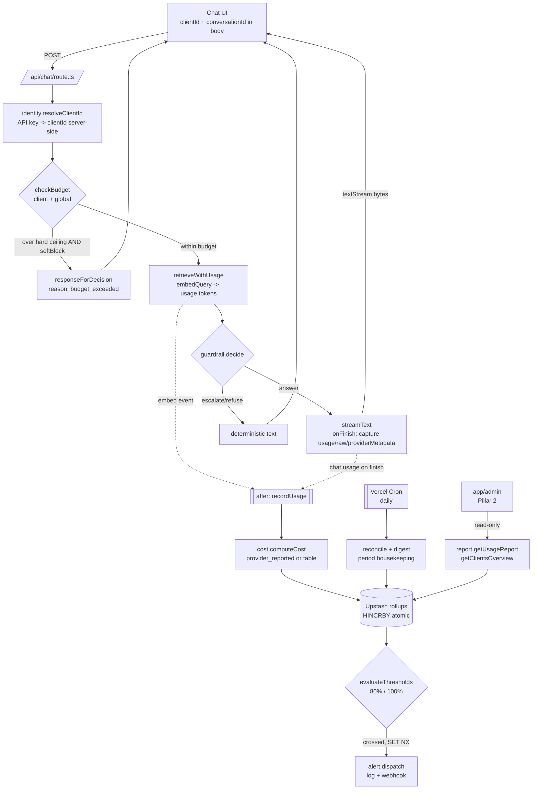

# Usage & Cost

Product plan for **usage & cost tracking** in the Cadre AI support chatbot: capture every
token the app spends (chat completions **and** query embeddings), attribute it to a
**client** and a **conversation**, convert tokens to dollars against whichever key is in
use (OpenAI direct **or** OpenRouter), enforce per-client and global budget ceilings with
alerts and optional soft-block, and expose the numbers to the Pillar 2 admin dashboard as a
read-only data contract.

This document is both (1) a full **architecture description** and (2) a full **implementation
plan**. It builds on the shipped code — `app/api/chat/route.ts`, `lib/llm.ts`, `lib/config.ts`
— and on the persistence decision already made for Tier 1 (Upstash Redis, the single justified
external service; see `CLAUDE.md`, `TRADEOFFS.md`, `SPEC.md`).

---

## SDK reality check (read before you code)

The task brief and much online material describe the older Vercel AI SDK usage shape
(`promptTokens` / `completionTokens` / `totalTokens`). **The installed SDK is `ai@7.0.35`,
and the field names changed.** Verified against `node_modules/ai/dist/index.d.ts`:

- `LanguageModelUsage` (d.ts L320–370) is:
  ```ts
  type LanguageModelUsage = {
    inputTokens: number | undefined;            // was promptTokens
    inputTokenDetails: {
      noCacheTokens: number | undefined;
      cacheReadTokens: number | undefined;      // cached-input reads (discounted)
      cacheWriteTokens: number | undefined;
    };
    outputTokens: number | undefined;           // was completionTokens
    outputTokenDetails: {
      textTokens: number | undefined;
      reasoningTokens: number | undefined;      // o-series / reasoning models
    };
    totalTokens: number | undefined;
    raw?: JSONObject;                            // provider's own usage shape, verbatim
  };
  ```
  Every numeric field is `number | undefined` — **never assume presence; coalesce to 0.**
- `EmbeddingModelUsage` (d.ts L374–379) is simply `{ tokens: number }`. Embeddings are billed
  on **input tokens only** (there is no completion side).
- `StreamTextResult` (d.ts L2549+) exposes, as promises that resolve **after** the stream
  finishes: `usage: PromiseLike<LanguageModelUsage>` (L2644), `totalUsage: PromiseLike<…>`
  (L2653, the sum across steps — use this if tool-calling steps are ever added),
  `providerMetadata: PromiseLike<ProviderMetadata | undefined>` (L2703). There is also an
  `onFinish` callback that receives `{ usage, totalUsage, providerMetadata, response, … }`.
- `embed`/`embedMany` results expose `usage: EmbeddingModelUsage` and `providerMetadata`
  synchronously with the result.

**Consequence:** OpenRouter returns extra fields (`cost`, `cost_details`) that are *not* part
of the standard `LanguageModelUsage`. In v7 those land in `usage.raw` (the verbatim provider
usage object). The cost path (below) reads `usage.raw`, with `providerMetadata` and the
`/generation` endpoint as fallbacks. **Confirm the exact `raw` key path once against a live
OpenRouter response** — it is the one thing that depends on provider-mapping details rather
than a typed contract.

---

## Architecture

### Design stance

Usage tracking is **observability, not a feature of the answer**. It must obey the rule already
written into `TRADEOFFS.md`: *a logging write must never break a chat response.* Every capture
and record path is wrapped in `try/catch`, is fire-and-forget, and runs **after** the bytes are
streamed to the user. The only thing that is allowed to affect the response is the *pre-request*
budget check, and even that degrades to the existing escalation path rather than an error.

The design reuses three things that already exist:
1. **Upstash Redis** — already chosen and justified for Tier 1; no new external service.
2. **The escalation path** — a budget block is just another escalation `reason`, so it flows
   through `responseForDecision(...)` with zero new UI.
3. **The `x-cadre-*` header seam** — the route already emits per-response metadata; usage adds a
   parallel, admin-only record (it does **not** leak cost to the end-user client).

### Components

| Module | Responsibility | Depends on |
|---|---|---|
| `lib/usage/types.ts` | `UsageEvent`, `Budget`, `RollupSnapshot`, `CostBreakdown`, `BudgetStatus`, `Alert` type definitions | — |
| `lib/pricing.ts` | Static per-model rate tables (OpenAI direct) + OpenRouter `/models` cache; `rateFor(modelId, mode)` | `types` |
| `lib/usage/cost.ts` | Pure `computeCost(...)` — provider-reported cost when present, else `tokens × rate`; nano-USD integer math | `pricing`, `types` |
| `lib/usage/repo.ts` | `UsageRepository` interface + `UpstashUsageRepository` + `InMemoryUsageRepository` (tests/offline) | `@upstash/redis` |
| `lib/usage/record.ts` | `recordUsage(event)` — atomic rollup increments, returns post-increment `RollupSnapshot` | `repo`, `cost` |
| `lib/usage/budget.ts` | `checkBudget(scope)` (pre-request), `evaluateThresholds(snapshot, budget)` (post-record) | `repo` |
| `lib/usage/alert.ts` | `dispatchAlert(alert)` — log + webhook (+ optional email); SET-NX de-dupe | `repo` |
| `lib/usage/identity.ts` | Resolve `clientId` from API key/header (server-authoritative), mint/echo `conversationId` | `config` |
| `lib/usage/report.ts` | Read-only `getUsageReport(...)`, `getClientsOverview()`, `getConversationCosts(...)` for the admin | `repo` |
| `app/api/cron/usage-rollup/route.ts` | Daily reconcile + digest + period-boundary housekeeping (Vercel Cron) | `repo`, `alert` |

Everything lives under `lib/usage/*` (small, cohesive files per the repo's file-organization
rule; each well under the 500-line cap).

### Data model — usage events

A **usage event** is content-free by design (no prompt/response text — that keeps it out of PII
scope; message text, if ever logged, belongs to the separate Tier-1 conversation log with its
own retention). One event per billable model call:

```ts
type UsageKind = "chat" | "embedding";

interface UsageEvent {
  id: string;                 // ulid/uuid
  ts: number;                 // epoch ms
  clientId: string;           // server-resolved billing identity (never client-asserted)
  conversationId: string;
  kind: UsageKind;
  provider: "openai" | "openrouter" | "lexical"; // lexical = offline embedder, $0
  model: string;              // e.g. "gpt-4o-mini" or "openai/gpt-4o-mini"
  inputTokens: number;
  outputTokens: number;       // 0 for embeddings
  cachedInputTokens: number;  // from inputTokenDetails.cacheReadTokens
  reasoningTokens: number;    // from outputTokenDetails.reasoningTokens
  costNanoUsd: number;        // integer nano-dollars (1e-9 USD)
  costSource: "provider_reported" | "table_estimated";
}
```

**Cost is stored as an integer in nano-USD (1e-9 USD).** This is deliberate: Redis `INCRBY`/
`HINCRBY` are atomic on integers, and integer accumulation across millions of tiny increments
never drifts the way repeated float addition does. Formatting to `$` happens only at display
time. (One `gpt-4o-mini` output token = $0.60 / 1e6 = 600 nano-USD — comfortably an integer.)

#### Redis key schema (Upstash)

Rollups are the **source of truth for aggregation**; the raw event log is optional drill-down.

| Key | Type | Purpose | Ops |
|---|---|---|---|
| `usage:rollup:{clientId}:{YYYY-MM-DD}` | Hash | per-client daily rollup | `HINCRBY` fields: `inputTokens`, `outputTokens`, `embedTokens`, `cachedTokens`, `requests`, `costNanoUsd` |
| `usage:rollup:{clientId}:{YYYY-MM}` | Hash | per-client monthly rollup (budget period) | same fields |
| `usage:rollup:global:{YYYY-MM}` | Hash | global monthly rollup | same fields |
| `usage:bymodel:{clientId}:{YYYY-MM}` | Hash | cost split by model id | `HINCRBY` field=`{model}` value=costNanoUsd |
| `usage:conv:{conversationId}` | Hash | per-conversation totals | `HINCRBY` tokens/cost; `HSET` clientId, firstTs, lastTs |
| `usage:conv-index:{clientId}` | Sorted set | recent conversations | `ZADD` score=ts member=conversationId |
| `usage:clients` | Set | client registry (for the overview) | `SADD` clientId |
| `usage:evt:{clientId}:{YYYY-MM-DD}` | List (capped) | raw events for drill-down | `LPUSH` + `LTRIM 0 999`; key `EXPIRE` per retention |

Retention: daily rollups + event lists carry a TTL (default 90 days). Monthly rollups are kept
longer (default 400 days) for year-over-year reporting — set via `EXPIRE` at first write.

### Data model — budgets

```ts
interface Budget {
  scope: "client" | "global";
  clientId?: string;                 // omitted for global
  monthlyCeilingNanoUsd: number;     // 0 = unlimited
  dailyCeilingNanoUsd: number;       // 0 = unlimited (optional guard)
  warnPct: number;                   // default 80
  softBlock: boolean;                // block further model calls once over 100%
  alertWebhookUrl?: string;          // per-client override of the global webhook
}
```

| Key | Type | Purpose |
|---|---|---|
| `budget:{clientId}` | Hash | per-client ceiling + flags |
| `budget:global` | Hash | org-wide ceiling + flags |
| `alert:{scope}:{period}:{threshold}` | String w/ TTL | de-dupe guard, written with `SET … NX` so each threshold fires **once** per period |

Budget config is **server-only** — it reveals commercial terms and must never be sent to the
end-user client.

### Data flow + diagram



**Timing that matters:** `checkBudget` is the *only* synchronous, pre-response step. Token
capture (`onFinish`) fires when the stream completes; the actual Redis write is deferred to
`after(...)` (Next.js 15 `import { after } from "next/server"`) so it runs **after** the response
is flushed and Vercel keeps the function alive for it — a plain fire-and-forget promise can be
killed when the lambda freezes.

### Cost-calculation design

Two provider realities, one function.

#### Rates in use (per 1M tokens, USD, standard tier — as of 2026-07-23)

| Model | Input | Output | Notes |
|---|---:|---:|---|
| `gpt-4o-mini` (project default) | $0.15 | $0.60 | cached input ≈ $0.075 |
| `gpt-4o` | $2.50 | $10.00 | legacy rate, grandfathered |
| `gpt-4.1` | $2.00 | $8.00 | |
| `gpt-4.1-nano` | $0.10 | $0.40 | cheapest chat option |
| `gpt-5 mini` | ≈ $0.25 | ≈ $2.00 | family/tier-dependent — verify at lock-in |
| `text-embedding-3-small` | $0.02 | n/a | **input-only**; the app's embedder |

Sources: OpenAI pricing roundups accessed 2026-07-23 —
CloudZero (<https://www.cloudzero.com/blog/openai-pricing/>),
pecollective (<https://pecollective.com/tools/openai-api-pricing/>),
valueaddvc (<https://valueaddvc.com/blog/openai-api-pricing-2026-gpt-4o-o3-and-gpt-5-cost-breakdown-for-developers>).
**Figures move; the table is dated and must carry `asOf`/`source` per entry.**

Worked example (one grounded answer on `gpt-4o-mini`): ~1,500 input (system + retrieved context
+ trimmed history) + ~250 output tokens → `1500×0.15/1e6 + 250×0.60/1e6 = $0.000225 + $0.000150
= $0.000375`. The query embedding (~20 tokens × $0.02/1e6 ≈ $0.0000004) is negligible. So a
typical turn is ≈ **$0.00038** — roughly **2,600 turns per $1**. Budgets are therefore expressed
in dollars/month, and the interesting ceilings are tens-to-hundreds of dollars per client.

#### Pricing config (`lib/pricing.ts`)

```ts
interface Rate { inputPerMTok: number; outputPerMTok: number; source: string; asOf: string; }

// OpenAI direct — keyed by bare model id. Hand-maintained, dated.
const OPENAI_RATES: Record<string, Rate> = {
  "gpt-4o-mini":            { inputPerMTok: 0.15, outputPerMTok: 0.60, source: "openai", asOf: "2026-07-23" },
  "gpt-4o":                 { inputPerMTok: 2.50, outputPerMTok: 10.0, source: "openai", asOf: "2026-07-23" },
  "gpt-4.1":                { inputPerMTok: 2.00, outputPerMTok: 8.00, source: "openai", asOf: "2026-07-23" },
  "gpt-4.1-nano":           { inputPerMTok: 0.10, outputPerMTok: 0.40, source: "openai", asOf: "2026-07-23" },
  "text-embedding-3-small": { inputPerMTok: 0.02, outputPerMTok: 0.00, source: "openai", asOf: "2026-07-23" },
};
```

#### The decision: prefer provider-reported cost

**OpenRouter already computes the exact charged amount** and returns it on every response — do
not recompute what the provider tells you. OpenRouter's response `usage` object contains
(<https://openrouter.ai/docs/use-cases/usage-accounting>, accessed 2026-07-23):

- `prompt_tokens`, `completion_tokens`, `total_tokens`
- `cost` — total charged to your account, in credits (USD)
- `cost_details.upstream_inference_cost` — upstream provider's cost (BYOK only; else 0/null)
- `prompt_tokens_details.cached_tokens`, `completion_tokens_details.reasoning_tokens`

Two important OpenRouter facts: full usage is now **always** included (the old
`usage: { include: true }` request flag is deprecated and has no effect), and OpenRouter applies
**no per-token markup** — per-token rates match the underlying provider; it charges a flat 5.5%
fee on credit purchases. So `usage.cost` is authoritative for what you were actually billed.

`computeCost` therefore layers:

```ts
function computeCost(ev: RawUsage): CostBreakdown {
  // 1. Provider-reported (OpenRouter): read usage.raw.cost (verbatim provider usage).
  const reported = ev.raw?.cost;              // number in USD; CONFIRM key path on a live call
  if (typeof reported === "number") {
    return { costNanoUsd: Math.round(reported * 1e9), source: "provider_reported" };
  }
  // 2. Table estimate (OpenAI direct, or OpenRouter fallback keyed by provider-prefixed id).
  const rate = rateFor(ev.model);
  const nonCached = Math.max(0, ev.inputTokens - ev.cachedInputTokens);
  const nano =
    nonCached          * rate.inputPerMTok  * 1e3 +   // per-MTok $ → nano-USD/token = $/1e6 × 1e9 = ×1e3
    ev.cachedInputTokens * (rate.inputPerMTok * 0.5) * 1e3 + // cached ≈ 50% (model-specific)
    ev.outputTokens    * rate.outputPerMTok * 1e3;
  return { costNanoUsd: Math.round(nano), source: "table_estimated" };
}
```

Provider detection is by base URL: `AI_CHAT_BASE_URL` / `EMBEDDINGS_BASE_URL` containing
`openrouter.ai` ⇒ OpenRouter mode (model ids are provider-prefixed, e.g. `openai/gpt-4o-mini`);
otherwise OpenAI direct (bare ids). The **offline lexical embedder is $0** (`provider: "lexical"`)
and is recorded with zero cost so the admin can see request volume without a key.

For OpenRouter, the fallback table can be **auto-populated** from `GET /models` (each model's
`pricing` object exposes `prompt`, `completion`, `request`, `input_cache_read`,
`input_cache_write`, `internal_reasoning`, … as USD-per-token strings). Fetch once at build or
on cold start and cache; never per request. But because `usage.cost` is present on every
OpenRouter response, the table is only a safety net there — the primary path is
`provider_reported`.

### Alerting design

- **Thresholds:** `warnPct` (default **80%**) and hard **100%**. Both per-client and global;
  a request must clear *both* its client ceiling and the global ceiling.
- **Evaluation timing — two tiers:**
  1. **Per-request, synchronous, free.** `HINCRBY` returns the *post-increment* total atomically.
     `recordUsage` therefore gets the new period total with no extra read, and
     `evaluateThresholds` compares it to the ceiling right there. Crossing detection is
     effectively free.
  2. **Cron reconcile (defense-in-depth).** A daily Vercel Cron job recomputes/reconciles,
     sends a digest, and handles period boundaries. It is not on the request hot path.
- **Soft-block** is decided at *request start*, not at record time: `checkBudget(clientId)`
  reads the current month rollup vs ceiling; if over 100% **and** `softBlock` is on, the route
  short-circuits — no embedding, no model call, zero further cost — to the existing escalation
  path with `reason: "budget_exceeded"` ("I've hit a usage limit for now — let me connect you to
  the team"). Default `softBlock` is **off**; measurement ships before enforcement.
- **Alert channel:** structured **log** always (zero-dep baseline), plus **webhook** POST to
  `USAGE_ALERT_WEBHOOK_URL` (Slack-compatible). **Email is optional** and, per the repo's rules,
  is left as a webhook-driven or Resend-behind-env add-on rather than wired directly.
- **De-dupe:** `SET alert:{scope}:{period}:{threshold} 1 NX EX <periodTtl>` — the alert fires
  exactly once per threshold per period; the NX guard is the concurrency-safe latch.

### Interfaces

```ts
// identity.ts — clientId must be server-authoritative for billing/enforcement to mean anything.
function resolveClientId(req: Request): string;          // API key -> clientId map; "public" default
function conversationIdFrom(body: unknown, req: Request): string; // body value or minted (echoed in header)

// cost.ts (pure, unit-tested)
function computeCost(ev: RawUsage): CostBreakdown;
function toUsd(nano: number): number;

// record.ts
function recordUsage(ev: UsageEvent): Promise<RollupSnapshot>;   // atomic increments; returns post-increment totals

// budget.ts
function checkBudget(scope: { clientId: string }): Promise<BudgetStatus>; // { blocked, usedNanoUsd, ceilingNanoUsd, pct }
function evaluateThresholds(snap: RollupSnapshot, budget: Budget): Alert[];

// alert.ts
function dispatchAlert(a: Alert): Promise<void>;         // log + webhook; NX de-dupe

// report.ts (admin read path — Pillar 2 contract)
function getUsageReport(q: { clientId?: string; from: string; to: string }): Promise<UsageReport>;
function getClientsOverview(): Promise<ClientUsageRow[]>;
function getConversationCosts(clientId: string, limit: number): Promise<ConversationCostRow[]>;

// repo.ts — Repository pattern (per patterns.md); swap Upstash <-> in-memory for tests/offline.
interface UsageRepository {
  incrRollup(keys: RollupKeys, deltas: RollupDeltas): Promise<RollupSnapshot>;
  getRollup(clientId: string, period: string): Promise<RollupSnapshot | null>;
  getBudget(scope: string): Promise<Budget | null>;
  setBudget(b: Budget): Promise<void>;
  claimAlert(scope: string, period: string, threshold: number): Promise<boolean>; // SET NX
  indexConversation(clientId: string, conversationId: string, ts: number): Promise<void>;
  listRecentConversations(clientId: string, limit: number): Promise<string[]>;
  listClients(): Promise<string[]>;
  appendEvent(ev: UsageEvent): Promise<void>;
}
```

### Reporting — admin data contract (Pillar 2)

This plan **does not build the admin UI** (that is the Tier-1 `app/admin/` surface already
described in `ARCHITECTURE.md`/`IMPLEMENTATION_PLAN.md`). It defines the read contract the new
"Usage & Cost" panel consumes, alongside the existing conversations / escalations / retrieval-
trace / KB-gap panels:

```ts
interface UsageReport {
  scope: string;                    // clientId or "global"
  perDay: Array<{ date: string; inputTokens: number; outputTokens: number;
                  embedTokens: number; requests: number; costUsd: number }>;
  totals: { inputTokens: number; outputTokens: number; requests: number; costUsd: number };
  byModel: Array<{ model: string; costUsd: number }>;
  budget: { ceilingUsd: number; usedUsd: number; pct: number; status: "ok" | "warn" | "over" };
}
interface ClientUsageRow { clientId: string; monthCostUsd: number; pct: number;
                           status: "ok" | "warn" | "over"; lastActiveTs: number; }
interface ConversationCostRow { conversationId: string; clientId: string;
                                turns: number; costUsd: number; lastTs: number; }
```

All report functions are **read-only** (they only `HGETALL`/`ZRANGE`), keeping the admin's
"never mutates state" invariant. Cost is converted from nano-USD to USD **only at this
boundary**.

### Tech choices, rejected alternatives, tradeoffs

| Decision | Chosen | Rejected | Why |
|---|---|---|---|
| **Store** | **Upstash Redis** (serverless HTTP) | Postgres/Timescale; local vector/embedded DB; write-to-file artifact | Upstash is already the one justified service; HTTP client sidesteps serverless connection-pool pain; **atomic `HINCRBY` is purpose-built for rollups** (no read-modify-write races). Postgres = overkill + pooling headaches at this scale; the plan explicitly rejects a DB here. The RAG artifact is read-only (ephemeral FS) — can't be written at runtime. |
| **Cost source** | **Provider-reported** (`usage.cost`) for OpenRouter; dated **table** for OpenAI | Recompute everything from a table; scrape `/models` per request | OpenRouter already returns the exact billed amount incl. its fee — trust it. `/models` scraping adds latency/rate-limit risk; cache it as a fallback only. |
| **Cost unit** | Integer **nano-USD** | Float USD | Atomic integer `INCRBY`; no float drift across millions of increments. |
| **Threshold timing** | **Per-request** atomic-counter check **+** cron reconcile | Pure cron; per-request full scan | Cron alone is too laggy to soft-block; a per-request scan is expensive. The post-increment return value gives crossing detection for free. |
| **Deferred write** | Next 15 **`after()`** (+ `onFinish`) | Bare fire-and-forget promise; block response on `await result.usage` | Bare promises get killed on lambda freeze; blocking delays the user's bytes. `after()` runs post-flush with the function kept alive. |
| **Identity** | **Server-resolved** clientId (API key → id) | Trust `clientId` from the request body | A client-asserted id lets one client bill/evade another's ceiling. Body value is accepted **only** as a default `"public"` bucket when unauthenticated (noted as a gap). |
| **Metering platform** | Build in-repo | Helicone / Langfuse / OpenMeter proxy | For this scope, an ~8-doc bot, a proxy SaaS is more infra than warranted. **This is the clean graduation path** when multi-tenant billing hardens — note it, don't adopt it now. OpenRouter's own dashboard is a zero-effort cross-check in the meantime. |

**Tradeoffs accepted:** the OpenAI rate table is hand-maintained and will drift (mitigated by
`asOf` stamps + a cron staleness warning + preferring provider-reported cost); `text-embedding`
build-time cost is a one-off and is *not* attributed to any client (only per-query embeddings
are); token counts are provider-reported and trusted (no independent tokenizer re-count —
`tiktoken` re-counting is possible but unnecessary given the SDK/provider already report usage).

### How it hooks into the current route

`app/api/chat/route.ts` today: validate body → `retrieveText(query)` → `decide(...)` →
non-answer returns deterministic text; answer path calls `streamText({ model, system, messages })`
and streams `result.textStream`. Four surgical changes, all additive:

1. **Body + identity.** Extend `BodySchema` with optional `conversationId` (uuid). Resolve
   `clientId = resolveClientId(req)` (server-side, from an API key header). Echo the
   conversationId in a response header (reuse the `x-cadre-*` convention); **do not** add cost
   to end-user headers.
2. **Pre-request budget gate.** Before `retrieveText`, `const b = await checkBudget({ clientId })`.
   If `b.blocked` → return the existing escalation via `streamed(responseForDecision({ mode:
   "escalate", reason: "weak_retrieval", … }), { …, reason: "budget_exceeded" })`. Placing it
   before retrieval means an over-limit client incurs **zero** further token cost.
3. **Embedding usage.** Introduce `retrieveWithUsage(query)` returning `{ results, embedTokens,
   provider }` (the real path reads `embed`/`embedMany` `usage.tokens`; the lexical path reports
   0 with `provider: "lexical"`). Record an embedding `UsageEvent` via `after(...)`.
4. **Chat usage.** Add `onFinish` to `streamText` and defer the write:
   ```ts
   const result = streamText({
     model, system: buildSystem(results), messages: buildConversation({ query, history }),
     onFinish: ({ usage, providerMetadata }) => {
       after(() => recordUsage(toChatEvent({
         clientId, conversationId, model: CHAT_MODEL,
         inputTokens:  usage.inputTokens  ?? 0,
         outputTokens: usage.outputTokens ?? 0,
         cachedInputTokens: usage.inputTokenDetails?.cacheReadTokens ?? 0,
         reasoningTokens:   usage.outputTokenDetails?.reasoningTokens ?? 0,
         raw: usage.raw, providerMetadata,
       })).catch(() => {}));   // never let a metering write surface to the user
     },
   });
   return new Response(iterableStream(result.textStream, groundedStub(results)),
                       { headers: metaHeaders(meta) });
   ```
   `onFinish` fires when the stream drains even though the route consumes `result.textStream`
   manually — capture is independent of how the bytes are delivered. All of `recordUsage` is
   `try/catch`-wrapped internally so a Redis hiccup can never break chat.

`lib/config.ts` gains the pricing/budget defaults and `USAGE_TRACKING_ENABLED`; `CHAT_MODEL`
and `EMBED_MODEL` (already there) are the pricing keys.

### Security & privacy of usage data

- **Content-free events.** Usage events store token counts, cost, model id, and the two ids —
  **never** prompt/response text. This keeps the usage store out of PII scope; conversation text
  (if logged at all) is a separate Tier-1 concern with its own retention.
- **Server-authoritative billing identity.** `clientId` for billing/enforcement is derived from
  an authenticated API key server-side. A raw body/header `clientId` is honored only as an
  unauthenticated `"public"` bucket. **Known gap for the take-home:** without real API-key auth,
  ceilings are advisory — call this out explicitly wherever multi-client billing is claimed.
- **Budget config is server-only.** `budget:*` reveals commercial terms; never serialize it to
  the client. Cost is likewise never placed in end-user response headers — only the admin read
  path exposes dollars.
- **Admin access control.** The Pillar 2 dashboard exposes cost data and must sit behind at least
  a shared-secret / basic-auth gate before it is reachable (the current `app/admin/` has none —
  a prerequisite, not optional, once cost is shown).
- **Secrets.** `UPSTASH_REDIS_REST_URL` / `UPSTASH_REDIS_REST_TOKEN` and
  `USAGE_ALERT_WEBHOOK_URL` are env-only (`.env.local`, Vercel envs); never committed.
- **Input validation at the boundary.** `conversationId` and any client-supplied field pass
  through the existing Zod schema; malformed ids are rejected before any Redis key is built
  (prevents key injection).

---

## Implementation Plan

Phased, measurement-before-enforcement, each phase shippable and testable on its own. Milestone
ids continue the `IMPLEMENTATION_PLAN.md` scheme (`M-U*` = usage milestones, slotting under the
Tier-1 admin work `M7`).

| Milestone | Deliverable | Done when |
|---|---|---|
| **M-U0** | Types + pricing + pure cost calc | `lib/usage/types.ts`, `lib/pricing.ts`, `lib/usage/cost.ts`; unit tests green for table + provider-reported + nano-USD rounding + undefined-token handling. **No wiring.** |
| **M-U1** | Identity | `clientId` resolved server-side; `conversationId` in `BodySchema` + echoed header; `"public"` default. Route still behaves identically. |
| **M-U2** | Capture + store | `UsageRepository` (Upstash + in-memory); `recordUsage` with atomic rollups; `retrieveWithUsage`; `onFinish` + `after()` wired. **Record-only, no alerts, no block.** Numbers reconcile against the OpenRouter dashboard. |
| **M-U3** | Budgets + alerts | `budget.ts`, `alert.ts`; `checkBudget` pre-request; `evaluateThresholds` on record; log + webhook; NX de-dupe. Soft-block **flag default off**. |
| **M-U4** | Reporting contract | `report.ts` read functions; admin "Usage & Cost" panel wired to the contract (UI is Tier-1 admin work). |
| **M-U5** | Cron + rollout | `app/api/cron/usage-rollup/route.ts` (Vercel Cron) for reconcile + digest; enable alerts, then soft-block, behind the flag. |

### Where to instrument the route (recap)

Single file, four additive touch-points, in order: **(1)** identity + body at the top; **(2)**
`checkBudget` gate *before* `retrieveText`; **(3)** embedding event from `retrieveWithUsage` via
`after`; **(4)** chat event from `streamText` `onFinish` via `after`. No change to the streaming
protocol, the guardrail, or the offline behavior.

### Schema (recap)

Redis keys per the tables above: `usage:rollup:*` (Hash, `HINCRBY`), `usage:bymodel:*`,
`usage:conv:*` + `usage:conv-index:*` (Sorted set), `usage:clients` (Set), `usage:evt:*`
(capped List), `budget:*` (Hash), `alert:*` (String `SET NX EX`). Nano-USD integers; TTLs on
dailies/events (90d) and monthlies (400d).

### Dependencies

- **`@upstash/redis`** — the REST client (serverless-safe). This is the **only** new package,
  and it is the already-planned Tier-1 dependency — **no new external service**.
- **`next` `after`** — `import { after } from "next/server"` (built in to Next 15.5; no install).
- Optional later: `@vercel/functions` `waitUntil` (equivalent to `after`); a transactional-email
  SDK (e.g. Resend) only if email alerts are adopted.

New env (add to `.env.example`, all optional/off by default):
`UPSTASH_REDIS_REST_URL`, `UPSTASH_REDIS_REST_TOKEN` (already stubbed for Tier 1),
`USAGE_TRACKING_ENABLED`, `USAGE_ALERT_WEBHOOK_URL`, `USAGE_DEFAULT_MONTHLY_CEILING_USD`,
`USAGE_SOFT_BLOCK` (default `false`).

### Sequencing

M-U0 is pure and parallelizable (no I/O). M-U1 and the repo half of M-U2 are independent and can
proceed in parallel. M-U2 capture depends on M-U1 (needs ids) + repo. M-U3 depends on M-U2 (needs
rollups). M-U4 depends on M-U2 (reads rollups). M-U5 depends on M-U3. Ship M-U2 to production in
**record-only** mode and verify totals against OpenRouter's dashboard before touching M-U3.

### Testing

Per the repo's TDD/80%-coverage rules (`testing.md`), and eval-first per `plan.md`:

- **Unit (`vitest`):** `computeCost` — OpenAI table path, OpenRouter provider-reported path,
  cached-input discount, nano-USD rounding, and every-field-`undefined` usage (must yield 0, not
  `NaN`). `evaluateThresholds` — crossing 80% then 100%, and *not* re-firing within a period.
- **Integration:** `UpstashUsageRepository` against a Redis mock or the `InMemoryUsageRepository`
  — concurrent `HINCRBY` sums correctly; `claimAlert` (`SET NX`) returns `true` exactly once.
- **Route integration:** mock `streamText` to invoke `onFinish` with a known `usage` → assert
  `recordUsage` called with the right client/conversation/model/tokens and the response is
  unaffected; over-budget + `softBlock` → escalation path with `reason: "budget_exceeded"` and
  **no** model call; a thrown Redis error in `recordUsage` → chat response still 200 and streamed.
- **Eval golden set:** add a `budget_exceeded` escalation case to `evals/golden.json` so the
  block message is held to the same "correct" bar as the other escalation scenarios.

### Rollout

1. **Ship M-U0/M-U1** (inert) — no behavior change.
2. **Enable M-U2 record-only** in production behind `USAGE_TRACKING_ENABLED`; let it run, then
   reconcile the rollups against OpenRouter's dashboard / OpenAI usage export to validate the
   cost math before trusting it.
3. **Enable alerts (M-U3)** — log + webhook, `softBlock=false`. Watch that 80%/100% fire once.
4. **Enable soft-block last**, per-client, once ceilings are calibrated from real M-U2 data.
5. **Add the cron (M-U5)** for the daily digest and reconcile; keep the per-request check as the
   authoritative fast path.

Kill-switch: `USAGE_TRACKING_ENABLED=false` disables capture, alerts, and the gate in one flip —
the route reverts to today's behavior with no code change.

---

### Sources (accessed 2026-07-23)

- OpenAI API pricing — CloudZero <https://www.cloudzero.com/blog/openai-pricing/>;
  pecollective <https://pecollective.com/tools/openai-api-pricing/>;
  valueaddvc <https://valueaddvc.com/blog/openai-api-pricing-2026-gpt-4o-o3-and-gpt-5-cost-breakdown-for-developers>.
- OpenRouter usage accounting (`usage.cost`, `cost_details`, deprecated `include`, `/generation`)
  — <https://openrouter.ai/docs/use-cases/usage-accounting>.
- OpenRouter `/models` pricing object + no-markup / 5.5% credit fee — OpenRouter models overview
  <https://openrouter.ai/docs/guides/overview/models>; layer3labs
  <https://www.layer3labs.io/guides/openrouter-pricing>.
- AI SDK v7 usage shapes — verified in-repo against `node_modules/ai/dist/index.d.ts`
  (`LanguageModelUsage` L320–370, `EmbeddingModelUsage` L374–379, `StreamTextResult.usage`/
  `totalUsage`/`providerMetadata` L2644/L2653/L2703).
